# 1.1.计算逻辑单元ALU

计算机的起点是一个计算器，任何计算都可以表达为加法，CPU至少要支持加法、计数及判断。

这一节分五步来解决以上问题。

## 1.任何数字都可以表达为二进制形式并运算

### 二进制

任何一个数字D可以表示为

$D = b_n×2^n+ b_{n-1}×2^{n-1}+…+b_0×2^0+b_{-1}×2^{-1}+…+b_{-m}×2^{-m}$

二进制形式：$(b_nb_{n-1}b_0b_{-1}b_{-m})_2$  

​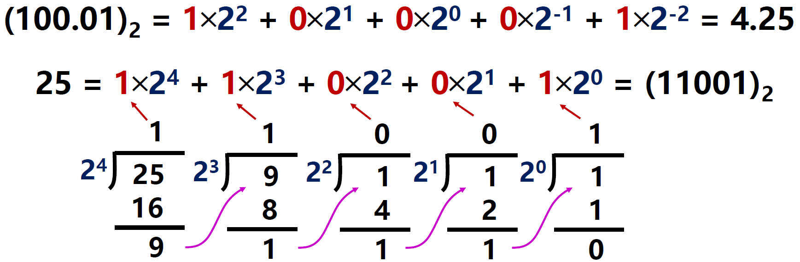​

## 2.晶体管可以组成表达二进制逻辑的门电路

### 晶体管

​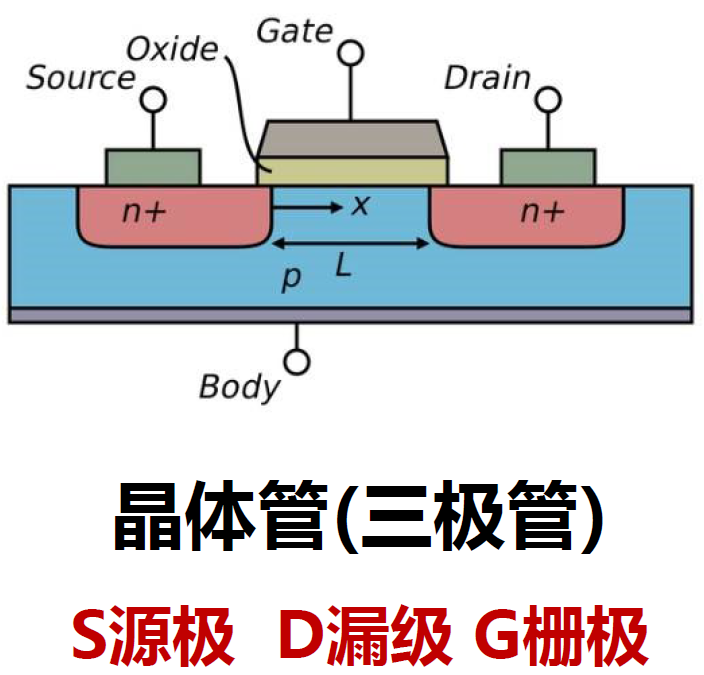​

‍

​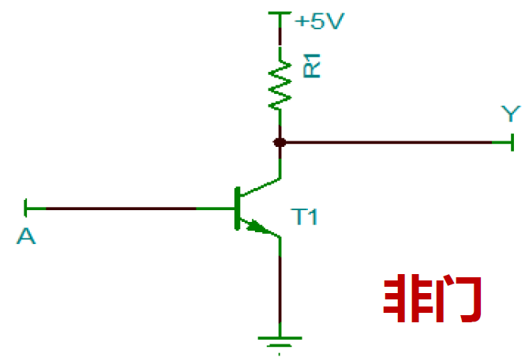​

​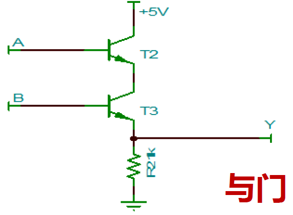​

​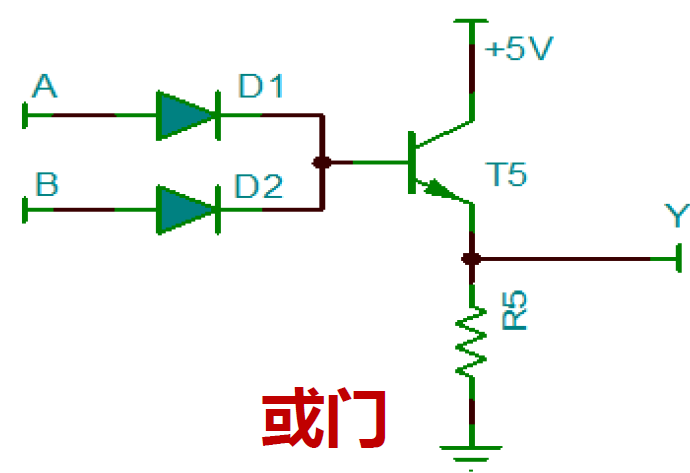​

### 逻辑门电路

​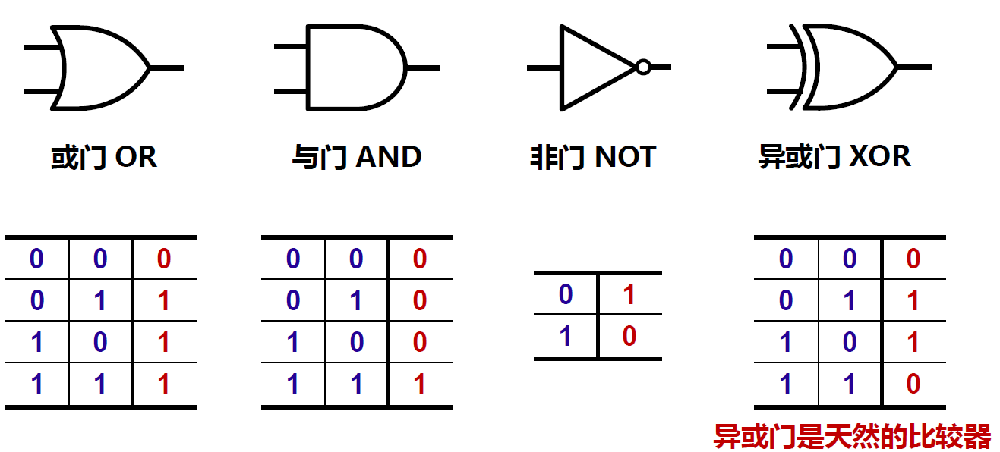​

## 3.门电路运用布尔代数可以组成多位加法器

### 加法器

加法器：计算A+B的逻辑结构

定义：

$$
A = a_{n-1}a_{n-2}…a_i…a_0\\
B = b_{n-1}b_{n-2}…b_i…b_0
$$

第i位加法：

$$
a_i+b_i+c_{i-1}=s_i+c_i
$$

$S_i$是第i位运算的本位和，$C_i$是第i位运算的进位(S=Summary, C=Carrier)

#### 1位半加器

​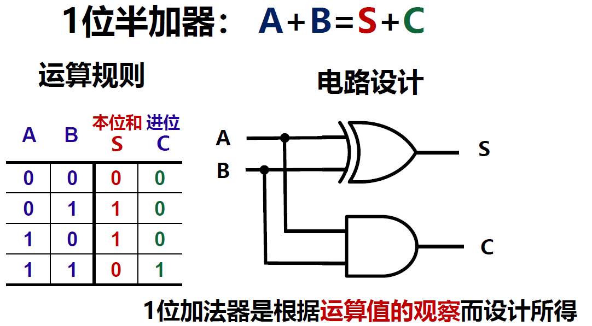​

​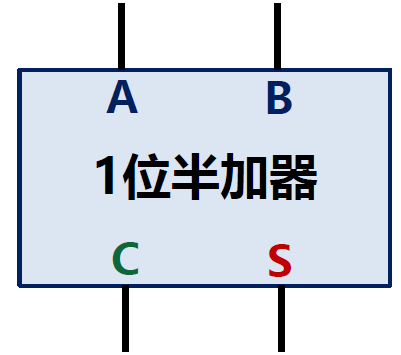​

#### 1位全加器

​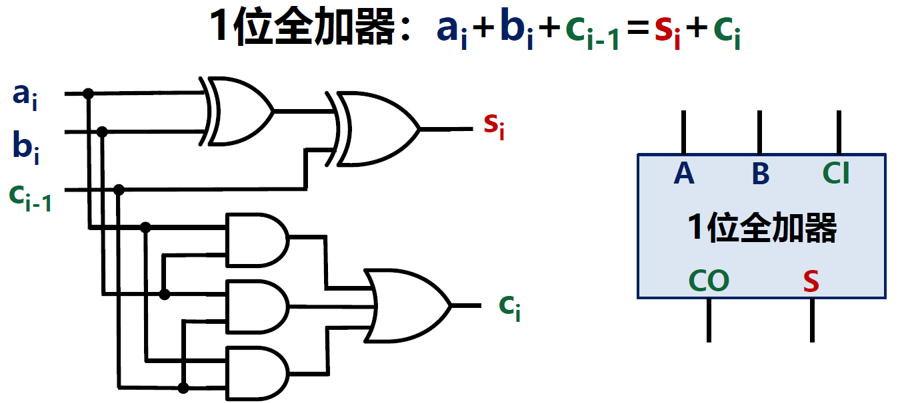​

设计思路：输入中有一个或三个1，则S为1；有两个及以上1，则C为1。

#### 多位加法器

加法可以看作多位并行加法的结果

​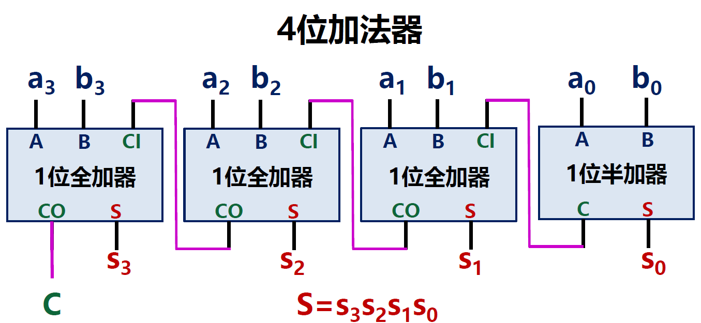​

​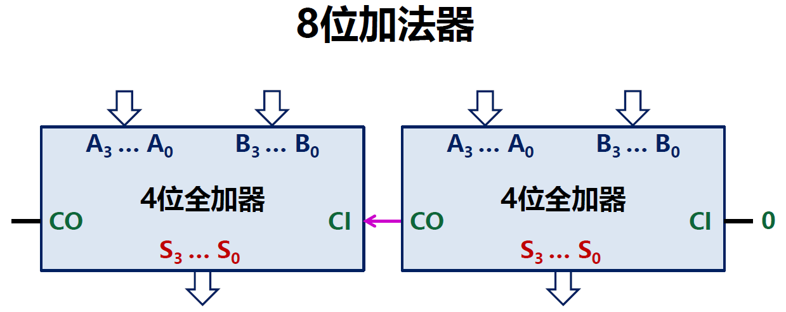​

## 4.计算的通用性描绘了ALU的总体设计要求

让N位加法器从能用到更好用：

* 通用性：适用于所有的二进制整数运算，要考虑整数的表示
* 灵活性：可以灵活控制加法器完成不同类型的运算操作
* 集成性：集成更多（简单）功能，发挥加法器更大价值

### 带符号整数的表示

约束：整数的二进制有宽度限制，因为内存有宽度，被称为：字长  
符号位：字的最左位，表示正负符号，MSB（Most Significant Bit）最高有效位

​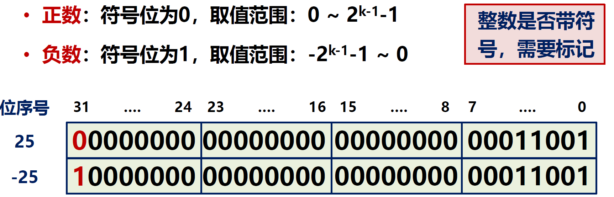​

### ALU

ALU：算数逻辑单元（Arithmetic Logic Unit）  
定位：一种执行算数、逻辑运算的通用单元，通用性是关键

功能：

* 算术运算

  * 加ADD
  * 减SUB
* 逻辑运算

  * 与AND
  * 或OR
  * 或非NOR
* 比较运算

  * 小于SLT

​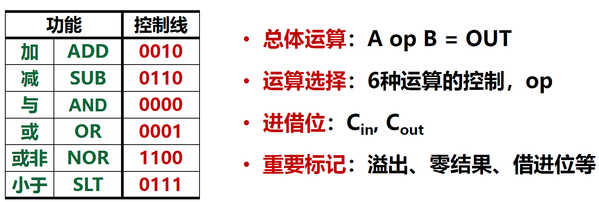​

结构：

​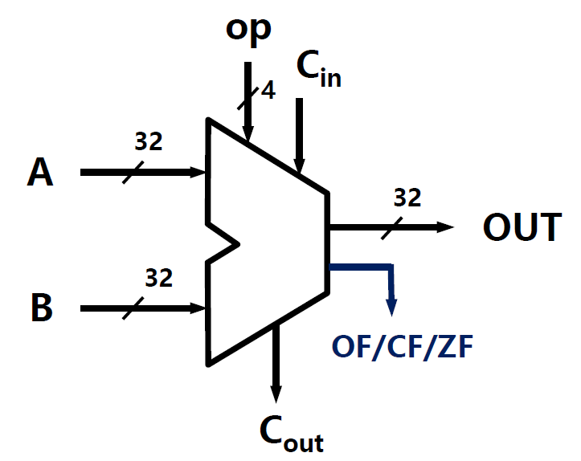​

* OF：Overflow Flag，溢出标志

  * 有符号数运算发生下列溢出情况时置1，否则置0

    * 两个MSB为0的数相加，结果MSB为1
    * 两个MSB为1的数相加，结果MSB为0
* CF：Carry Flag，进位标志

  * 运算结果的MSB向更高位进位或借位时置1，否则置0
* ZF：Zero Flag，零标志

  * 如果OUT为0，则标志置1
  * 如果OUT为1，则标志置0

## 5.计算机有了能够进行通用计算的单元ALU

​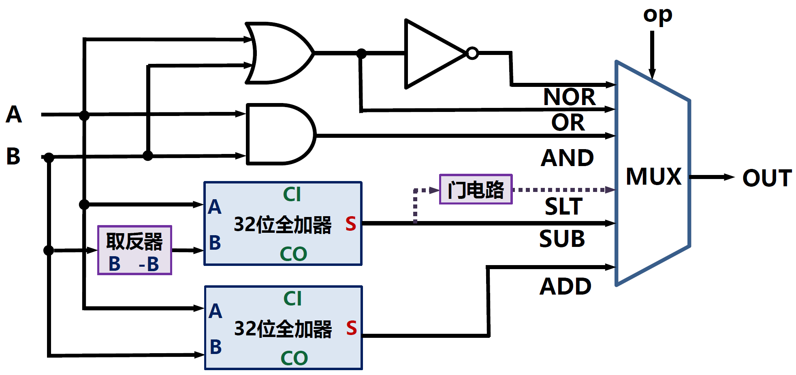​

‍
