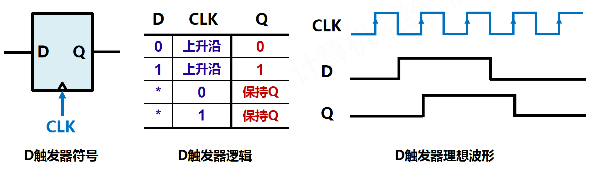
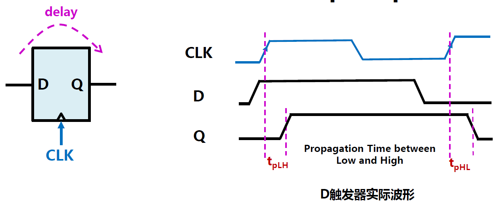
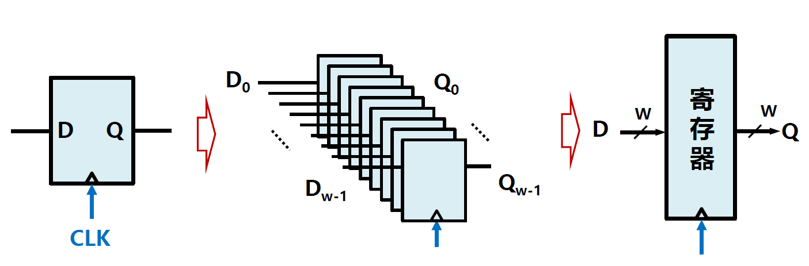

# 1.2.1.寄存器Register

寄存器是一种小型的存储用时序逻辑器件，用来暂时存放运算或操作用的数据，与其他部件共享一个时钟保持同步。

寄存器的宽度一般为字长，与计算部件匹配。

## 寄存器的实现

### D触发器

**D触发器（Data Flip-Flop）** 是一个具有记忆功能的时序存储器件。

​​

理想情况下，D触发器的输出信号Q应立即响应输入信号D的变化而发生变化，但实际上会存在延迟，称为传输延迟时间，用$t_{pLH}$和$t_{pHL}$表示。

​​

W个D触发器组合，就形成了W位宽的寄存器。

​​

‍
