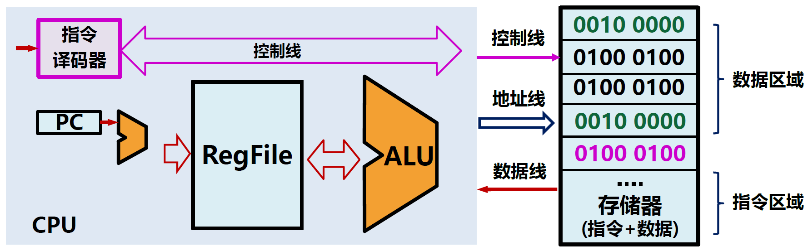
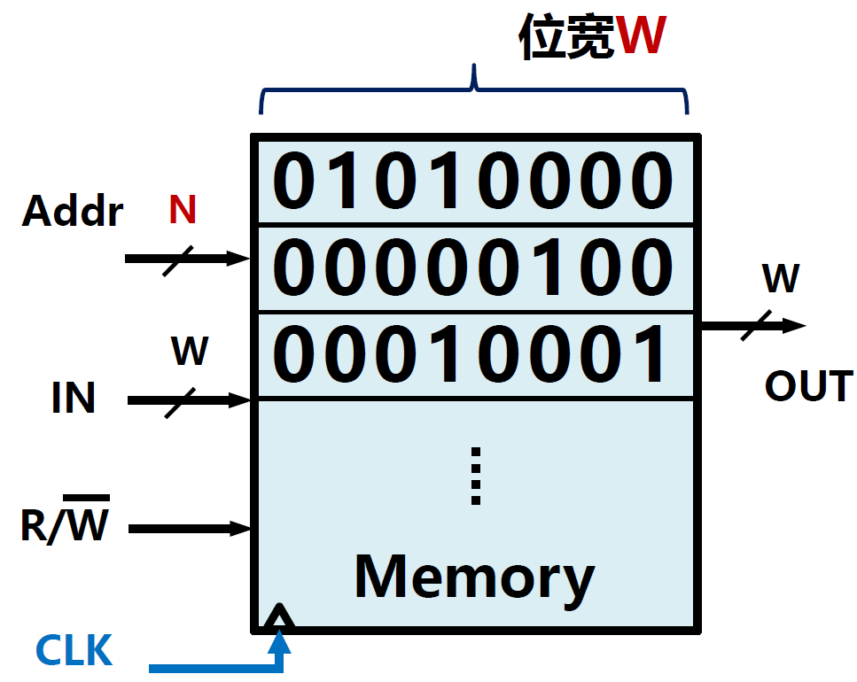
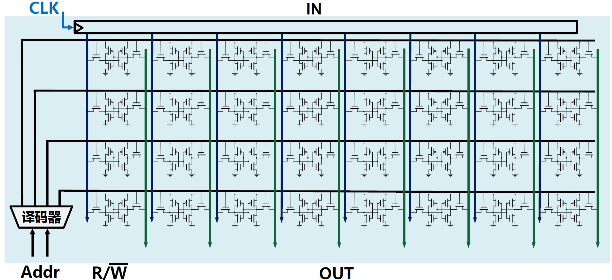
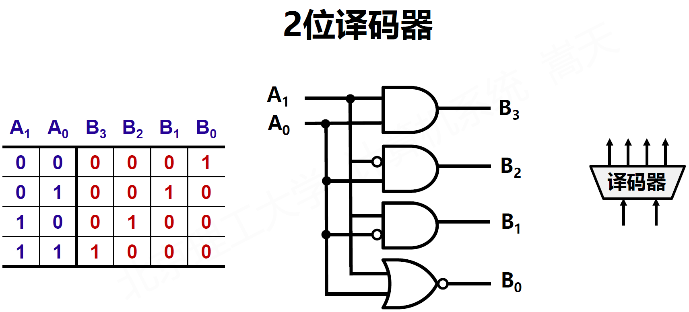
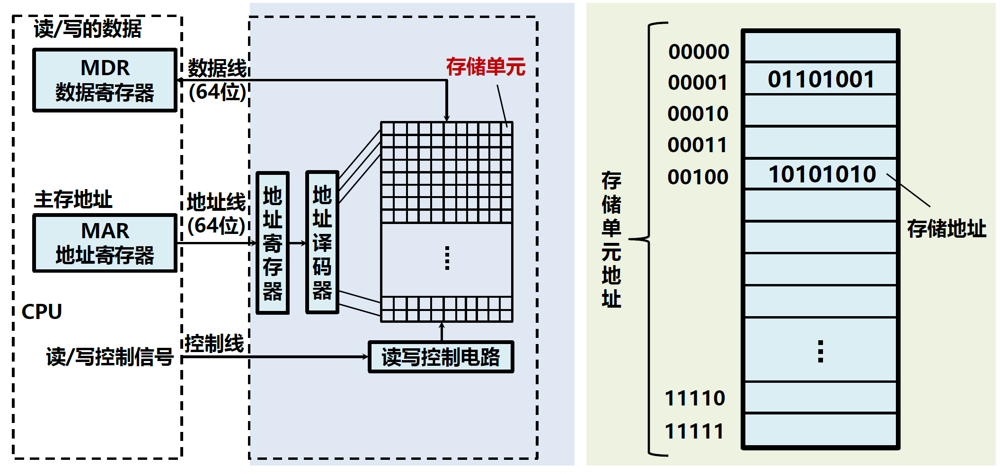
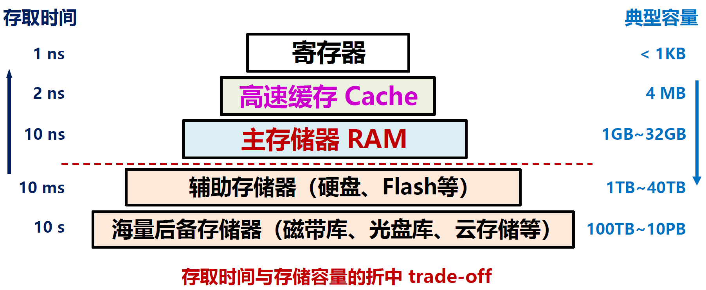

# 1.2.存储器

## 存储器

存储器是能够存储数据的结构的统称。

存储器是阵列结构，集中存放数据。

地址Addr：用来访问存储器单元  
输入IN：以W位为一组输入数据  
输出OUT：以W位为一组输出数据  
位宽W：存储器单元的宽度  
$\textsf{R/}\overline{\textsf{W}}$：控制存储器读/写，1是读，0是写  
CLK：存储器时钟

存储器的容量一般是$C=2^N×W$（bits）

存储器的读**可以**是**组合逻辑**

存储器的写**必须**是**时序逻辑**

存储器是存储程序的必要模块。

* 每次访问可读可写
* 通过地址访问数据
* 每次读写一个位宽
* 写入数据用CLK控制

## 存储器的组成

## 存储器的层次化结构

CPU的设计目标是高速计算，而存储器的设计目标是大容量存储，两者设计目标不同、实现方法不同，就会产生器件上的分离，计算机体系结构需要适应这种器件分离，获得折中。

为了兼顾存储容量与存储时间两个因素，我们设计了具有不同特长的存储器，他们组成了存储器的层次化结构。

各存储器的不同设计动机：

* 寄存器：CPU可见，数量极少、速度快、采用D触发器
* 高速缓存：CPU不可见，数量少、速度快、有一定设计结构
* 主存储器：CPU可见，数量多、速度慢、兼顾成本

CPU可见：存在地址或编号，可以直接访问

### 存储器的分类

* 存储器

  * 按存储原件分类

    * 半导体存储器
    * 磁表面存储器

      * 磁盘存储器
      * 磁带存储器
    * 光盘存储器
  * 按存取方式分类

    * 随机存取存储器（RAM）
    * 顺序存取存储器（SAM）
    * 直接存取存储器（DAM）
    * 按内容访问存储器（CAM）
  * 按信息的可更改性分类

    * 可读可写存储器
    * 只读存储器（ROM）
  * 按断电后信息的可保存性分类

    * 非易失性存储器
    * 易失性存储器
  * 按功能/容量/速度/所在位置分类

    * 寄存器
    * 高速缓存
    * 主存储器
    * 辅助存储器

‍
