# 1.3.存储管理单元MMU

​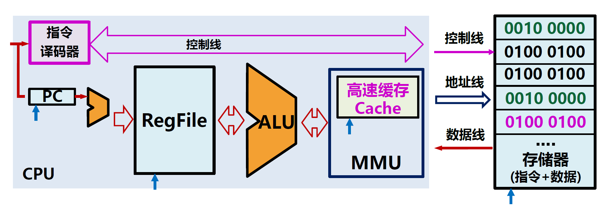​

由于存储器具有重要作用，CPU通过**MMU（Memory Management Unit，存储管理单元）** 管理存储器。

## 存储管理单元MMU

MMU是CPU负责响应访存请求的计算机硬件。

MMU包括三个功能：

* 高速缓存Cache
* 虚拟存储管理Virtual Memory Management
* 存储特权管理Privileged Memory Management

​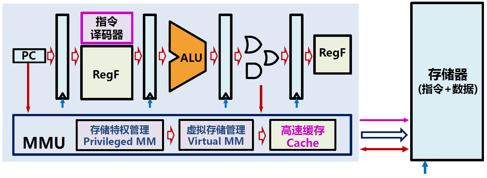​

## 虚拟存储技术

对于单程序来说，各种计算机的主存容量不同并且受限，程序无法预知主存结构和容量；对于多程序来说，并发运行是常态，多程序共用具有单一地址空间的主存。那么如何让程序不受物理主存制约？如何让多程序共享主存？

我们为了解决以上问题，提出了虚拟存储技术。

#### 虚拟存储技术

**虚拟存储技术**是内存空间扩充的相关技术，在传统存储管理方式的基础上，结合内存扩充技术，**从逻辑上**扩充内存容量。

> （操作系统知识扩充）
>
> 传统存储管理方式的缺点：
>
> * 一次性：作业必须一次性全部装入内存后才能开始运行，造成两个问题：①作业很大时，不能全部装入内存②当大量作业要求运行时，无法容纳所有作业，只有少量作业能运行，导致多道程序并发度下降。
> * 驻留性：一旦作业被装入内存，就会一直驻留在内存中，直至作业运行结束。但在一个时间段内，只需要访问作业的一小部分数据即可正常运行，这就导致了内存中会驻留大量的、暂时用不到的数据，浪费了宝贵的内存资源。
>
> 上述问题可以通过虚拟存储技术解决，可以只装入部分程序到内存就开始运行，虚拟存储技术是基于程序的局部性原理的。
>
> 虚拟内存技术实际上就是建立了“内存——外存”的两级存储器的结构，利用局部性原理实现髙速缓存。

* 思想：程序员在不受物理内存空间限制的逻辑空间编写程序，且该空间容量巨大
* 实现：把当前执行的部分程序和数据调入主存参与运算
* 现实：主存有限，但辅助存储器更大

虚拟存储技术为程序设置虚拟地址空间，与存储器物理地址空间进行映射。

​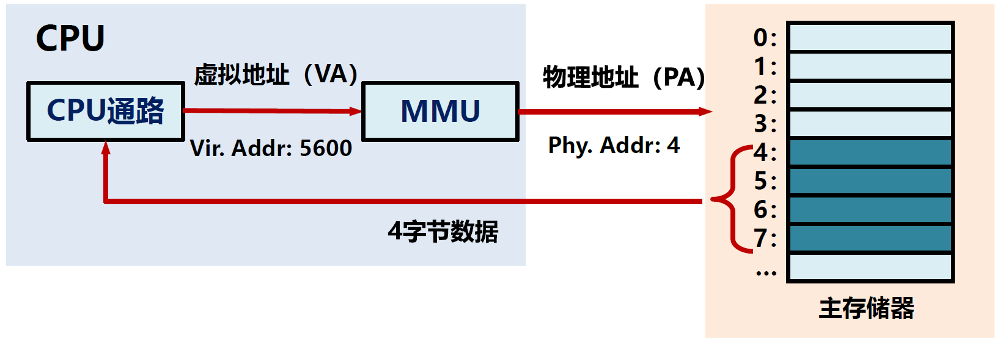​

​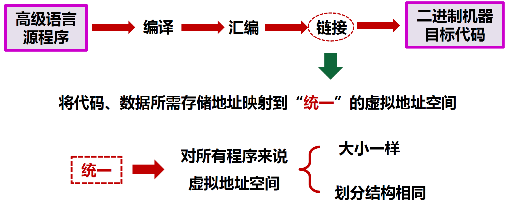​

#### Linux进程的地址空间

Linux进程的地址空间遵循**System V ABI规范**，堆区、栈区相向生长，栈从高地址往低地址生长。

​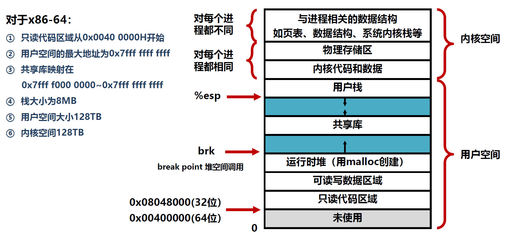​

​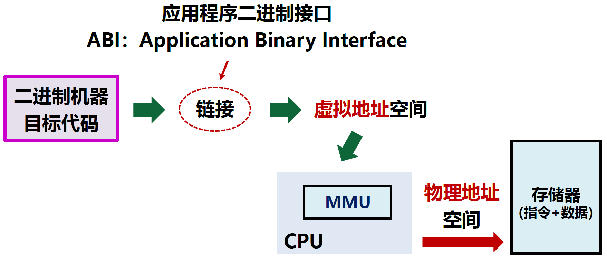​

> **System V Application Binary Interface** 是一组规范，详细介绍了 [调用约定](http://osdev.foofun.cn/index.php?title=Calling_Conventions "Calling Conventions")、[ 目标文件格式](http://osdev.foofun.cn/index.php?title=Object_Files "Object Files")、[ 可执行文件格式](http://osdev.foofun.cn/index.php?title=Executable_Formats "Executable Formats")、动态链接语义，对于符合 “X/Open通用应用程序环境规范” 和 “系统V接口定义” 的系统，以及还有更多内容。 如今，它是主要Unix操作系统（如Linux、BSD系统和许多其他系统）使用的标准ABI。 [Executable and Linkable Format](http://osdev.foofun.cn/index.php?title=Executable_and_Linkable_Format "Executable and Linkable Format")(ELF)是System V ABI的一部分。
>
> ABI被组织为可移植的基础文档，以特定于平台的补充填补空白。 非官方的新体系结构处理器补充已经发布，因为该格式已经适应了[X86-64](http://osdev.foofun.cn/index.php?title=X86-64 "X86-64")等新平台。 该标准是可扩展的，并且随着Unix供应商添加新功能，该格式也在不断发展。 由于许多非官方的补充规范和Unix操作系统的混乱历史，目前的情况是System V ABI已经成为一个非官方的草案规范家族，而没有真正的中央管理机构。
>
> 动态链接等许多高级功能都是可选的，加载简单的静态链接[ELF](http://osdev.foofun.cn/index.php?title=ELF "ELF")程序非常简单。 该标准的早期版本更加雄心勃勃，试图标准化软件包安装格式和X11细节，而这些过时的细节今天已被忽略了。 常见的操作系统开发工具 (例如 [Binutils](http://osdev.foofun.cn/index.php?title=Binutils "Binutils") 和 [GCC](http://osdev.foofun.cn/index.php?title=GCC "GCC")) 可以很好地理解ABI。 诸如i686 elf gcc之类的工具链根据这个ABI生成代码和可执行文件。

## 虚拟存储器架构

### 虚拟存储管理

虚拟存储管理负责虚拟地址和物理地址的相互映射，由CPU硬件和操作系统共同解决。

虚拟存储管理要考虑三个主要方面：

* 地址转换：虚拟地址与物理地址
* 存储调入：主存空间与扩展存储空间
* 快速执行：优化整体执行效率

### 地址转换

​​

地址转换的基本思路：

* 为保证空间利用有效性，地址映射不存在统一转换规则
* 转换应该以块或一个存储区域为单位，降低转换代价
* 地址映射本质是一个表结构，需要考虑查找问题

### 分页式虚拟存储

​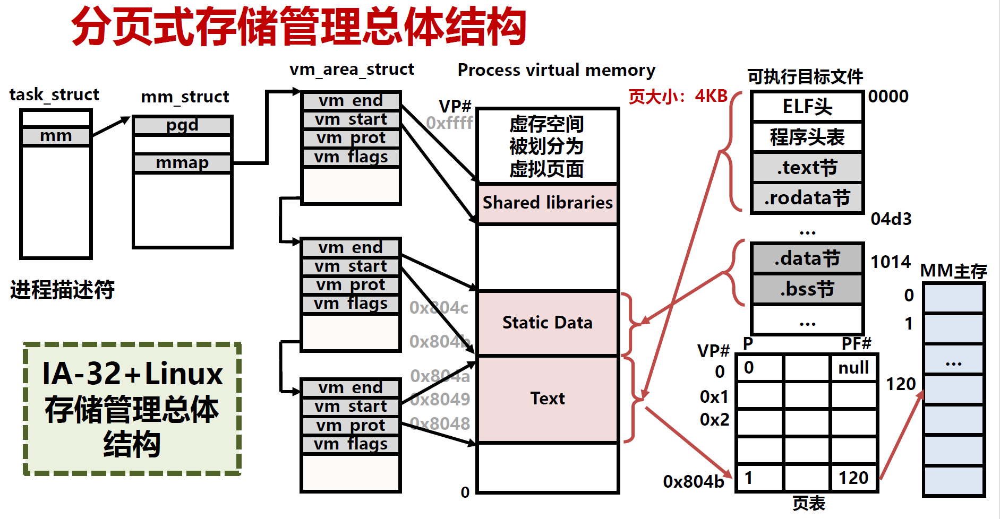​

​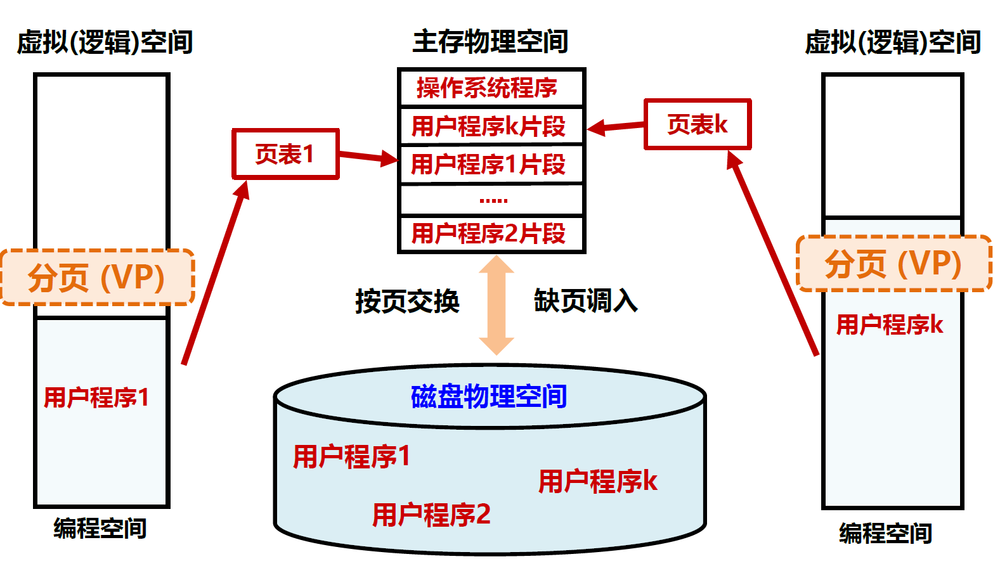​

“请求分页”方法：

* 每次访问指令或数据仅将当前需要的页面从硬盘调入主存
* 虚拟地址空间划分为大小相等的页面Page
* 主存储器被划分为同样大小的页帧PF（Page Frame）
* 使用页表Page Table来进行地址转换及调入管理

#### 页面类型

* 未分配页：没有和任何内容相关联的页
* 已分配页：代码和数据区域所关联的页面

  * 缓存页：已调入主存的页面
  * 未缓存页：未调入主存而存在外存上的页

#### 页表

页表用来描述虚拟页与所存放的主存页框号或磁盘存储位置的关系。

页表是进程控制信息，存储在虚拟地址空间的内核空间，页表在存储器的首地址记录在页表基址寄存器中。

每个进程（程序）需要维护一个页表：

​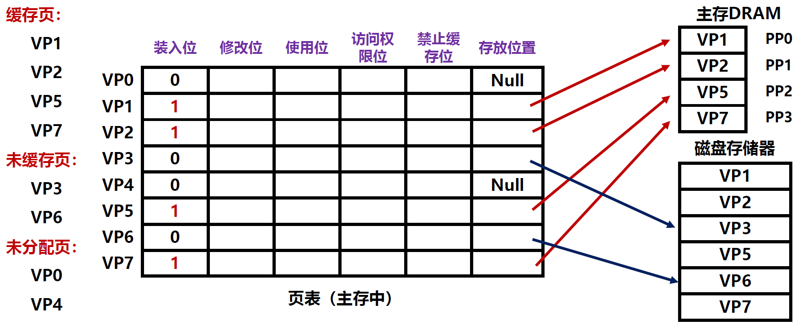​

页表的项数由虚拟地址空间大小决定。

> 例如：
>
> 在IA-32系统中，虚拟地址为32位，页面大小为4KB。
>
> ​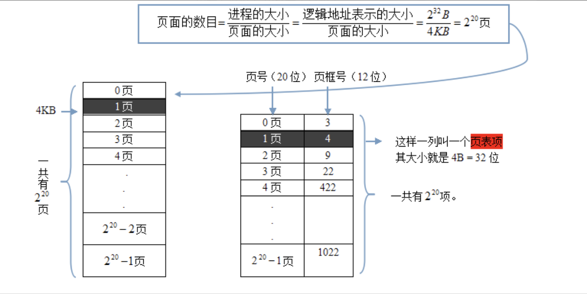​
>
> 那么一个进程有$2^{32}$/$2^{12}$=$2^{20}$个页面，每个页表项占32位，因此一个页表的大小为4MB。

而这么大的页表全部放在主存中是不合适的，因此有人提出了解决办法：

* 限制大小的一级页表
* 多级页表
* 采用哈希方式的倒置页表

#### 分页式虚拟存储器的地址转换

若没有发生缺页，那么一次存储器引用要访问两次内存：第一次，访问内存中的页表，利用虚拟地址中的虚拟页号查找到物理页号，与虚拟地址中的页内地址拼接形成物理地址；第二次，得到物理地址后，再一次访问内存，存取指令或者数据。

​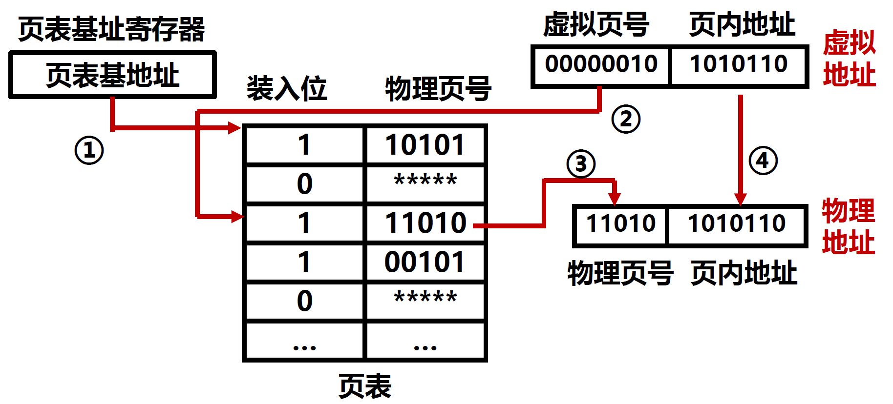​

​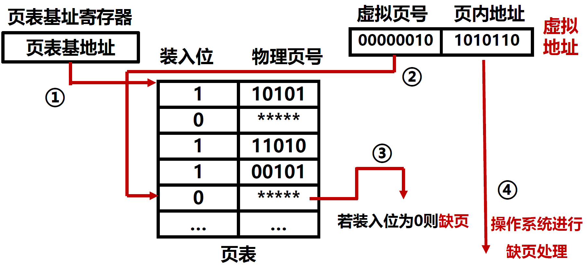​

## 快速查找表优化

### 快表

**快表（Translation Lookaside Buffer，TLB）** 是提高页表访问速度的一种策略，利用缓存原理，把页表中最活跃的内容复制到Cache中，形成快表，主存中的页表被称为慢表。

​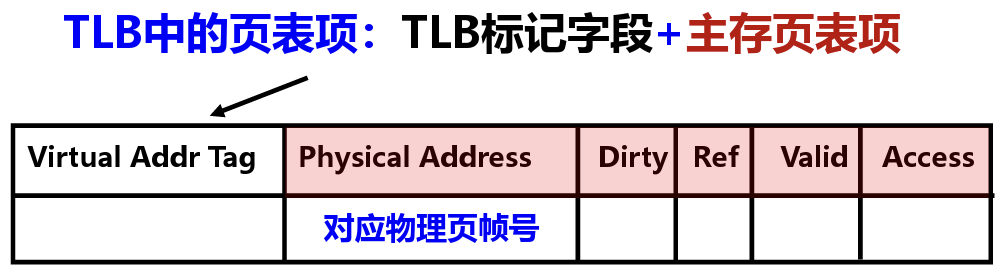​

**TLB标记字段（VA Tag）** 表示该页表项取自页表中哪个虚拟页对应的页表项：

* 全相联下，TLB标记是该页表项对应的虚拟页号
* 组相联下，对应虚拟页号中的高位部分，虚拟页号的低位部分作为TLB组索引

### CPU访存过程

​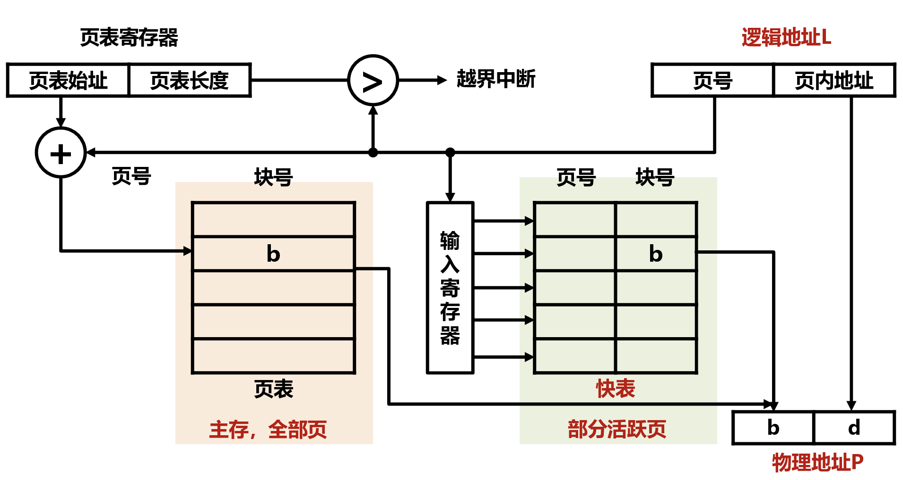​

在引入快表后，CPU的访存过程可能有三种miss的情况：

​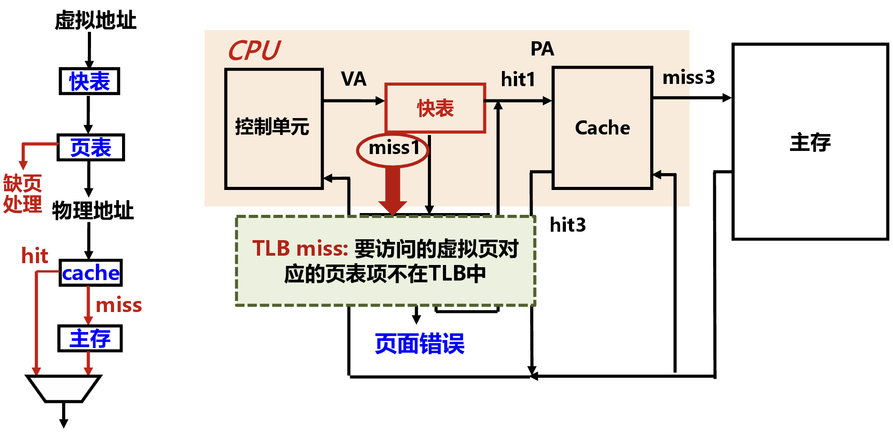​

​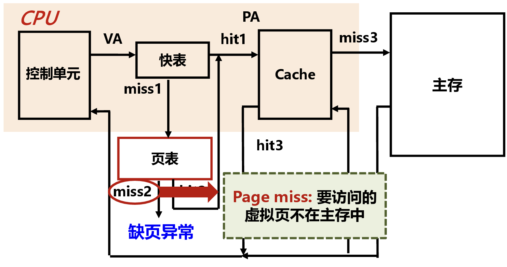​

​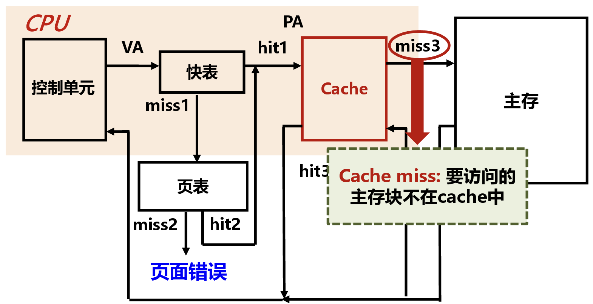​

## 存储特权与保护

众多程序共享主存，如何保证各程序不能越界访问其他程序的主存空间，干扰其他程序呢？

我们引入了存储特权的概念。

### 存储特权

存储特权就是为存储器划分不同的权限级别，形成特权模式，限定只有特殊程序（操作系统）才能访问特殊主存空间。特权模式是一种重要功能定义，由OS和硬件配合实现，管住主存储器就能限制计算机的操作权限。

### 存储保护机制

三种特权模式：

* S模式：监管模式Supervisor Mode
* U模式：用户模式User Mode
* M模式：机器模式Machine Mode

实现存储保护至少需要支持2种特权模式，硬件通过指令等方式要能够支持各特权模式的转换。

​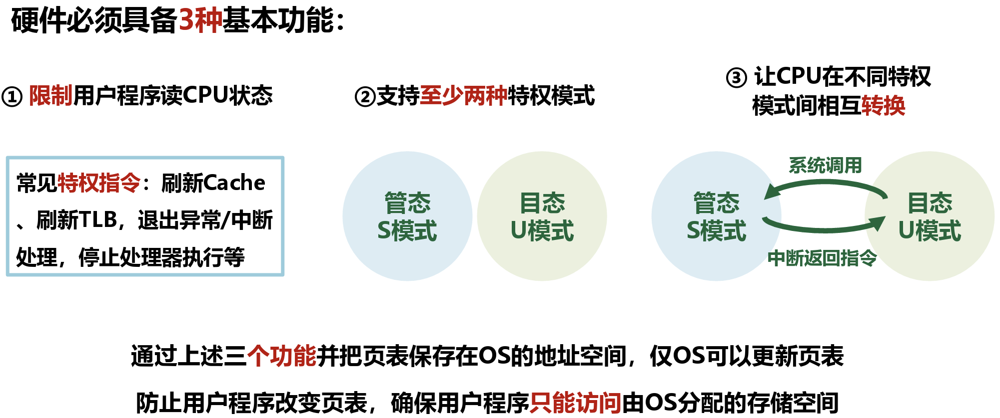​

以RISC-V架构的存储保护机制为例：

​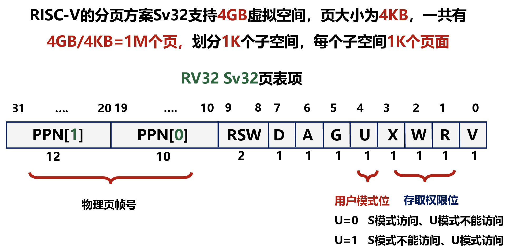​

‍
