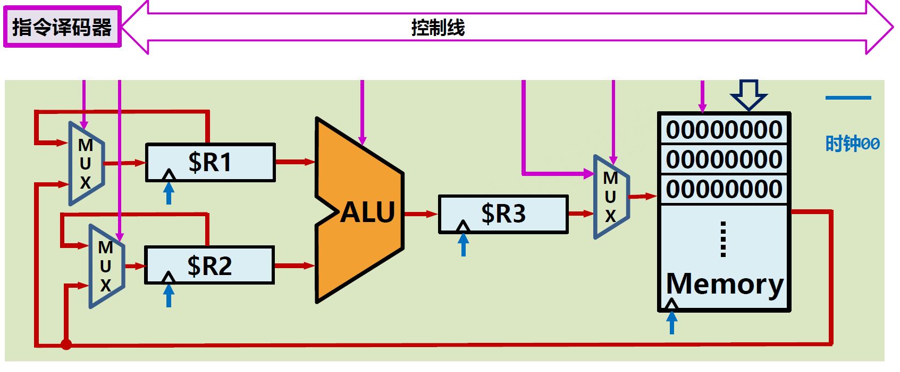

# 1.4.数据通路Data Path

这一节要解决如何让ALU完整工作的问题，也就是数据从哪来，到哪去。

* 数据通路是指令执行时数据所经过的**路径及部件的统称**
* 数据通路包含数据运算部件（**执行部件**）和部分存储部件
* 数据通路是一个包含组合电路的**体系化时序电路**结构

## 连接与时序

### 连接

如何有效连接ALU和存储器？

​​

* 控制线：连接各模块控制接口的一组连接线
* 数据线：连接各模块数据接口的一组连接线
* 地址线：作为地址访问存储器的一组连接线
* 时钟线：用来控制时序逻辑的一组连接线
* 控制线与有关指令控制模块组成**控制通路**
* 数据线、地址线与有关模块组成**数据通路**

### 时序

如何保证多输入同步，有效控制数据？引出了以下两个方面问题。

#### 暂存数据

* 存储器每个地址只能读取一个位宽数据
* 存在多个输入时，需要多次读取存储器
* 每次读取的数据需要暂存到运算单元旁

#### 控制步骤

* 当组合逻辑规模较大时，延迟较高
* 当组合逻辑存在回路时，延迟不确定
* 计算过程及数据结果亟待有效控制

为解决上述两方面问题，提出了寄存器（Register）的概念。

### 控制

如何有效控制ALU、存储器、寄存器等部件以满足以下三条性质呢？

* 功能性：有效组织各部件进行运算
* 通用性：适用于更多不同类型运算
* 高效性：充分利用部件满负荷运算

​​

解决方案是增加指令的概念。

* 功能性：通过指令有效组织各部件进行运算
* 通用性：设计不同指令适用于更多类型运算
* 高效性：最优化调度指令充分组织部件运算

同时需要增加**指令译码器**。

​​

## 实例：加法运算

以两个数字的加法运算为例。

高级语言首先编译为机器语言。

​​

​​

0. 时钟00，初始状态  
    ​​

1. 时钟01下降沿，立即数`100`​作为`MUX`​输入信号，`MUX`​选择`100`​，`#01`​存储器被写使能  
    ​​
2. 时钟01上升沿，`100`​被`MUX`​选择输出，然后写入`#01`​存储器  
    ​​
3. 时钟02下降沿，立即数`11001`​作为`MUX`​输入信号，`MUX`​选择`11001`​，`#01`​存储器被写使能  
    ​​
4. 时钟02上升沿，`11001`​被`MUX`​选择输出，然后写入`#02`​存储器  
    ​​
5. 时钟03下降沿，`#01`​存储器被读使能，左上角的`MUX`​选择下面的支路，即输出`00000100`​到寄存器`$R1`​  
    ​​
6. 时钟03上升沿，`00000100`​被写入寄存器`$R1`​  
    ​​
7. 时钟04下降沿，`#02`​存储器被读使能，左上角的`MUX`​选择上面的支路，即输出`00000100`​到寄存器`$R1`​，左下角的`MUX`​选择下面的支路，即输出`00011001`​到寄存器`$R2`​  
    ​​
8. 时钟04上升沿，00011001被写入寄存器`$R2`​，寄存器`$R1`​中的值被写入寄存器`$R1`​  
    ​​
9. 时钟05下降沿，`ALU`​被传入`ADD`​指令  
    ​​
10. 时钟05上升沿，`ALU`​执行加法计算，结果被写入寄存器`$R3`​  
     ​​
11. 时钟06下降沿，存储器`#03`​被写使能，`MUX`​选择下面的支路，即寄存器`$R3`​中的值会被写入`#03`​  
     ​​
12. 时钟06上升沿，寄存器`$R3`​中的值`00011101`​被写入`#03`​，至此两个数的加法运算完成。  
     ​​

## 寄存器堆

从上面的加法运算例子中我们发现各部件间都可能需要寄存器，需要定义`$R1、$R2...$RK`​等，数量多，指令控制复杂。此外，寄存器在暂存数据后，可能保持多个周期，即寄存器需要增加写控制信号，当没有写使能时，保持寄存器值。

为了解决这些问题，我们提出了**寄存器堆**。

寄存器堆是CPU中多个寄存器组成的阵列。

与分散寄存器相比，寄存器堆的设计目的是：

* **复用**寄存器：使用更少的寄存器满足数据通路需要
* **限量**寄存器：形成一定量寄存器，用于设计指令集

以MIPS 32位架构为例，寄存器堆包含32个32位宽寄存器`$R1-$R32`​，由5位地址线访问寄存器，两路并发访问、一路写入。

​​

​​

‍

引入寄存器堆后，数据通路结构如下图所示

​​

## CPU执行过程

* CPU是计算机的核心，能够自动逐条取出指令并执行
* CPU包含：控制通路、数据通路两个总体部件
* 数据通路在控制通路产生的控制信号下完成指令功能

​​

‍
