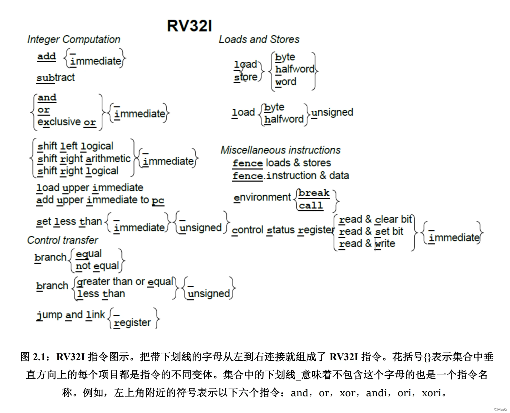
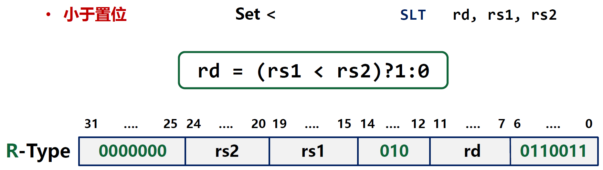

# 1.5.指令Instruction

这一节解决如何通过指令进行有效控制的问题，也就是指令怎么设计，怎么控制。

## 指令设计

### 指令

**指令**是CPU完成任务的最基本单元。

* 指令对应一次**有明确操作功能**的**数据通路的控制**
* 指令是CPU运行**最小节奏的表达**，也称为**操作**
* 指令是硬件功能的表达，但依据计算需求而定义
* 指令显式或隐式地包含：**操作码**和**操作数**

​​

#### 操作码

表示 CPU 支持指令（操作）的编码。

* 操作类型：一个指令系统所支持的操作种类
* 编码方法：表达指令或操作的具体编码方法
* 指令助记符：每个指令有与之对应的助记符

#### 操作数

##### 立即数

* 立即数：指令中给出的一个直接用于计算的数值
* 立即数具有数值特性，不能作为目的地址
* 立即数是（常量）操作数

例如，`sw  #01, 11001`​ 中的 `11011`​

##### 寄存器编号

* 寄存器编号：访问 CPU 内寄存器堆的地址
* 由于寄存器堆规模不大，通常称为编号
* 寄存器编号表示（变量）操作数

例如，`add  $R3, $R1, $R2`​ 中的 `$R3, $R1, $R2`​

##### 存储器地址

* 存储器地址：访问数据存储器的地址
* 由于存储器规模较大，称为地址
* 存储器地址表示（变量）操作数

例如，`sw  #03, $R3`​ 中的 `#03`​

### 指令设计原则

* 原子性：每条指令对应一个明确且不可分的操作
* 独立性：指令功能完整独立，不依赖于其他指令
* 通用性：指令通过配置不同操作数完成通用功能

### 指令表示

* 操作码助记符：标志指令功能，如ADD
* 操作数标记：

  * 立即数：imm
  * 源寄存器编号：rs1, rs2
  * 目标寄存器编号：rd

## RV32I

RISC-V是一种国际流行的开放指令集体系结构，RV32I是RISC-V中32位基本整数指令集。它支持32位寻址空间，支持字节地址访问，仅支持小端格式（little-endian，高地址高位，低地址低位)，寄存器也是32位整数寄存器。RV32I指令集的目的是尽量简化硬件的实施设计，所以它只有40条指令（之前是47条指令，在最新的规范中，一些csr指令被放在扩展指令集中）。这40条指令几乎能够模拟其它任何扩展指令（除了A扩展指令，因为原子指令需要硬件支持）。

如果用更简单的实现方式，比如对于ECALL和EBREAK指令，调用时候，系统总是自陷（trap），以及用NOP指令模拟Fence指令，则RV32I甚至可以减少到38条指令（在RISC-V中，NOP指令是伪代码，其实就是`addi, x0, x0, 0`​）。

实际上要实现机器模式的Risc-V特权架构，还需要6条csr指令，之前这些指令都是在RV32I中的，现在被放在扩展指令集Zicsr中了。所以说要实现一个完整的Risc-V系统，至少要实现RV32I+Zicsr指令集。

### 寄存器

在RV32I指令集架构中，包括32个通用目的寄存器，其中x0被预留为常数0，其它31个寄存器(x1-x31)是普通的通用整数寄存器。在Risc-V汇编语言中，每个通用寄存器都有一个对应的ABI名字，也就是说在汇编语言中，x1等价于ra，它们都会汇编成相同的机器码。

|寄存器|ABI名字|注释|Saver|
| --------| ---------| ------------------------------------------------------| ----------------------------|
|x0|zero|Hard-wired zero，常数0||
|x1|ra|返回地址Return address|caller，调用函数的指令pc|
|x2|sp|栈指针Stack pointer|callee，被调用的函数指令pc|
|x3|gp|全局指针Global pointer||
|x4|tp|线程指针Thread pointer||
|x5|t0|临时/备用链接寄存器Temporary/alternate link register|caller|
|x6|t1|临时寄存器Temporaries|caller|
|x7|t2|临时寄存器Temporaries|caller|
|x8|s0/fp|保存寄存器/帧指针Saved register/frame pointer|caller|
|x9|s1|保存寄存器Saved register|caller|
|x10|a0|函数参数/返回值Function arguments/return values|caller|
|x11|a1|函数参数/返回值Function arguments/return values|caller|
|x12|a2|函数参数Function arguments|caller|
|x13|a3|函数参数Function arguments|caller|
|x14|a4|函数参数Function arguments|caller|
|x15|a5|函数参数Function arguments|caller|
|x16|a6|函数参数Function arguments|caller|
|x17|a7|函数参数Function arguments|caller|
|x18|s2|保存寄存器Saved registers|caller|
|x19|s3|保存寄存器Saved registers|caller|
|x20|s4|保存寄存器Saved registers|caller|
|x21|s5|保存寄存器Saved registers|caller|
|x22|s6|保存寄存器Saved registers|caller|
|x23|s7|保存寄存器Saved registers|caller|
|x24|s8|保存寄存器Saved registers|caller|
|x25|s9|保存寄存器Saved registers|caller|
|x26|s10|保存寄存器Saved registers|caller|
|x27|s11|保存寄存器Saved registers|caller|
|x28|t3|临时寄存器Temporaries|caller|
|x29|t4|临时寄存器Temporaries|caller|
|x30|t5|临时寄存器Temporaries|caller|
|x31|t6|临时寄存器Temporaries|caller|

在Risc-V架构中，要得到当前指令pc（指令在存储器中的位置，instruction program counter)，可以通过AUIPC指令，把它读入到一个通用寄存器中。

### 指令格式

RV32I指令格式包括以下6种，每种指令格式都是固定的32位指令，所以指令在内存中必须4字节对齐。其中rd表示目的寄存器，rs1是源操作数寄存器1，rs2是源操作数寄存器2，imm是立即数，opcode是指令操作码大类，funct3和funct7是指令操作码小类，指令操作码=opcode+funct3+funct7。

​​

​​

> **为什么S类型、B类型中的立即数不像I类型中那样连续存放呢？**
>
> 在RV32I架构中，S格式指令中立即数位置分开放置的设计主要是为了简化硬件的解码过程，提高解码速度，并减少硬件资源的开销。这种设计牺牲了极小的编译上的开销，以换取硬件实现的效率和简洁性。
>
> 以下是这种设计选择的关键点：
>
> 1. **硬件解码简化**：通过保持某些立即数位和符号位在固定位置，RISC-V架构简化了指令的硬件解码过程，使得解码更快，资源开销更小。
> 2. **符号位固定**：所有立即数的符号位固定在指令的第31位，允许符号扩展与指令解码并行进行，进一步提高处理速度。
> 3. **避免硬件移位**：通过特定的立即数位排列，避免了使用硬件移位器，减少硅空间的浪费，减少了解码时的硬件复杂性和扇出。
> 4. **编码效率**：虽然立即数的编码方式看似复杂，但这种设计实际上在不同指令格式之间共享解码单元，优化了符号位、立即数字段、寄存器字段的对齐，提高了整体的编码效率。
>
> 总结来说，RV32I中立即数位置分开放的设计，是一种在硬件实现简化和解码效率之间做出的权衡选择，通过这种设计，RISC-V旨在提供一个既高效又低成本的处理器架构。

### 符号位扩展

I、S、B、U、J类型指令中的立即数都支持符号位扩展，所有出现立即数的指令种类(I-type、S-type、B-type、U-type、J-type)，立即数的符号扩展都取决于指令的第31位（立即数的最高位）。

如`imm[11:0]`​，表示一个12位的立即数，当进行符号位扩展时，用最左边的位imm[11]来进行扩展；`imm[31:12]`​表示一个20位的立即数，它的低12位会补0。csr指令中的5位立即数不需要符号位扩展。

扩展后的五种类型立即数结构如下，`inst[x]`​表示在指令中的第x指令位。

​​

S和B格式之间唯一的区别在于12位立即数用于在B格式中以2的倍数编码分支偏移量。与传统做法相反，硬件不会将指令编码的立即数左移一位，而是保持中间位（imm[10:1]）和符号位在固定位置，而S格式中的最低位（inst[7]）编码了B格式中的高位。

同样，U格式和J格式之间唯一的区别在于，20位立即数在形成U立即数时左移12位，在形成J立即数时左移1位。在U格式和J格式立即数中指令位的位置被选择来最大化与其他格式以及彼此之间的重叠。

### 指令类型

RV32I中指令类型有四种：

* 整数计算指令Integer Computational Instructions

  * 移位指令Shift
  * 算术指令Arithmetic
  * 逻辑指令Logical
  * 比较指令Compare
* 控制传输指令Control Transfer Instructions

  * 条件指令Branch
  * 跳转指令Jump & Link
* 存取指令Load and Store Instructions

  * 存储指令Store
  * 加载指令Load
* 其他指令Other Instructions

  * 同步指令Synch
  * 环境指令Environ

​​

#### 整数计算指令

##### 逻辑左移SLL

​​

##### 立即数逻辑左移SLLI

​​

##### 逻辑右移SRL

​​

##### 立即数逻辑右移SRLI

​​

##### 算术右移SRA

​​

##### 立即数算术右移SRAI

​​

#### 算术指令

##### 加法ADD

​​

##### 立即数加法ADDI

​​

##### 减法SUB

​​

##### 高位立即数赋值LUI

​​

##### 高位立即数PC加AUIPC

​​

#### 逻辑指令

##### 异或XOR

​​

##### 立即数异或XORI

​​

##### 或OR

​​

##### 立即数或ORI

​​

##### 与AND

​​

##### 立即数与ANDI

​​

#### 比较指令

##### 小于置位SLT

​​

##### 立即数小于置位SLTI

​​

##### 无符号小于置位SLTU

​​

##### 无符号立即数小于置位SLTUI

​​

#### 条件指令

##### 等于跳转BEQ

​​

##### 不等跳转BNE

​​

##### 小于跳转BLT

​​

##### 大等跳转BGE

​​

##### 无符号小于跳转BLTU

​​

##### 无符号大等跳转BGEU

​​

#### 跳转指令

##### 取指偏移跳转JAL

​​

##### 取指寄存器跳转JALR

​​

#### 存储指令

##### 字节存储SB

​​

##### 半字存储SH

​​

##### 字存储SW

​​

#### 加载指令

##### 字节加载LB

​​

##### 半字加载LH

​​

##### 无符号字节加载LBU

​​

##### 无符号半字加载LHU

​​

##### 字加载LW

​​

#### 同步指令

##### 线程同步FENCE

同步内存和I/O(Fence Memory and I/O)

在后续指令中的内存和 I/O 访问对外部（例如其他线程）可见之前，使这条指令之前的内存及 I/O 访问对外部可见。比特中的第3、2、1和0位分别对应于设备输入，设备输出，内存读写。例如 fence r, rw，将前面读取与后面的读取和写入排序，使用 pred = 0010 和 succ = 0011进行编码。如果省略了参数，则表示 fence iorw, iorw，即对所有访存请求进行排序。

Risc-V在多个hart（硬件线程）之间使用的是松散一致性模型，所以需要存储器fence指令。

fence指令能够保证存储器访问的执行顺序。在fence指令之前的所有存储器访问指令，比该fence之后的所有数据存储器访问指令先执行。

Risc-V架构将数据存储器的地址空间分为设备IO(device IO)和普通存储器空间，因此其读写访问分为四种类型：

* I：设备读（device-input)
* O：设备写（device-ouput）
* R：存储器读（memory-reads）
* W：存储器写（memory-writes）

PI/PO/PR/PW分别表示fence指令之前的四种读写访问类型，SI/SO/SR/SW分别表示fence指令之后的四种读写访问类型。

​​

#### 环境指令

##### 环境调用ECALL

通过引发环境调用异常来请求执行环境。

##### 环境断点EBREAK

通过抛出断点异常的方式请求调试器。

​​

‍
