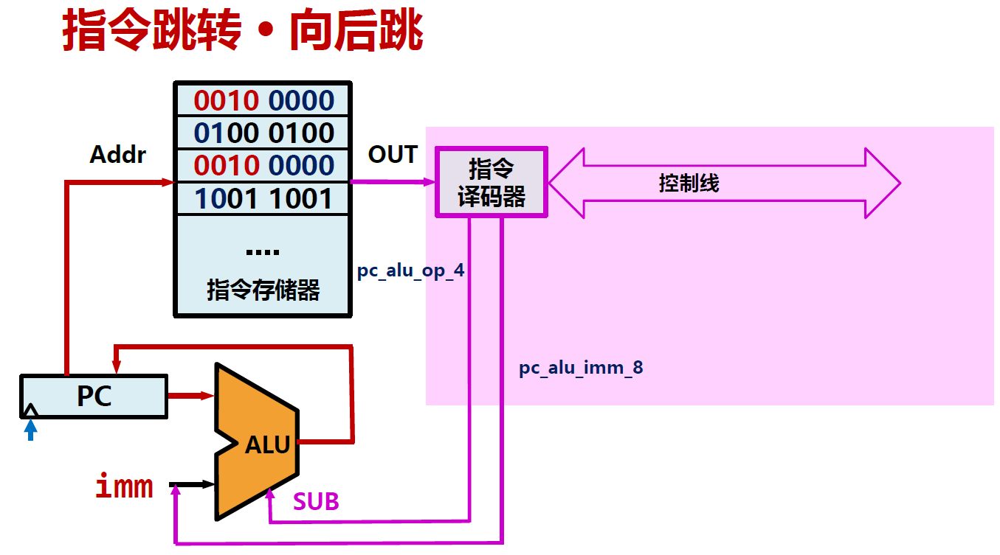

# 1.6.控制通路Control Path

## 指令译码

指令译码：通过指令译码器及相关逻辑解释指令形成控制线的过程，简称译码。

### 实例：加法运算

学习完加法运算中数据通路和指令的作用后，我们想继续了解在加法运算中控制通路如何控制，把指令表达的操作正确传递给数据通路。

假设我们已经创建了寄存器堆，设计了16位指令系统，如下所示。

​​

​​

将操作码存入指令存储器：

​​

然后控制通路根据**操作码**对数据通路进行控制，指令经过**译码**可以获得指令格式及操作数，每条指令的**控制逻辑叠加**后形成控制通路。

​​

​​

​​

​​

​​

​​

​​

​​

​​

​​

​​

执行完前5条指令后，发现第六条指令`sw	#03, $R3`​无法执行，因此增加AR类型指令格式

​​

### 指令译码器

在指令译码过程中使用**指令译码器**，将操作码转换成指令控制线，指令控制线控制数据通路，形成指令控制。

​​

## 程序计数器

如何从指令存储器中获取指令呢？

**程序计数器（PC，Program Counter）** 用来存放即将执行指令的地址，又称指令计数器、指令指针寄存器（IP）。

* 顺序执行时，PC+“1”形成下条指令地址
* 跳转执行时，PC+offset形成下条指令地址
* “1”与指令存储器位宽有关
* 每条16位指令在存储器中占2个字节，“1”=2B

程序顺序执行：初始时，PC=0，表示计算机执行的第一条指令地址。随着时钟变动，PC指引指令存储器，顺序读取指令并执行。

### 字节顺序

当一条指令是N个字节，它在存储器中如何放置呢？

​​

​​

大小端各有优缺点，大小端更多是设计约定，存储器布局（字节顺序）也是指令系统设计时需要考虑的方面。

​​

## 指令跳转

跳转指令的特点：对PC进行算术运算，改变下一条执行指令的地址

​​

​​

​​

‍
