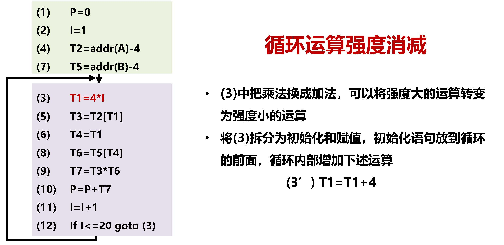
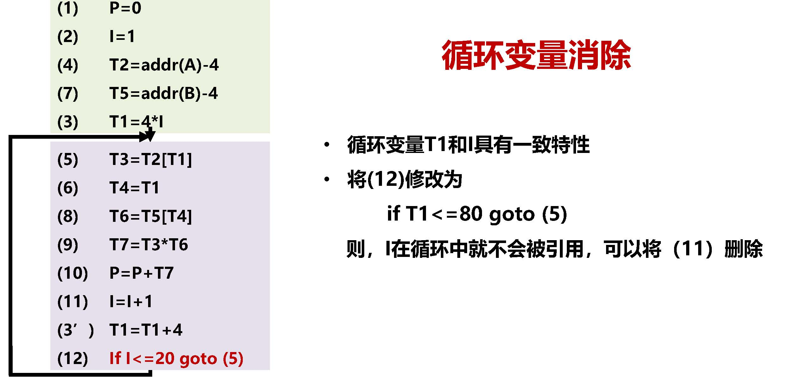

# 2.2.2.编译后端

综合包括代码优化、目标代码生成。根据**中间表示**和**符号表**来构建目标程序。综合过程也被称为**编译后端**。

​​

## 基本块

**基本块（Basic Block，BB）** ：仅有一个入口和一个出口的一段代码，入口是第一个语句，出口是最后一个语句。通过基本块可以构建程序的结构关系，基本块构建采用最大化原则，在跳转时被分割。

## 控制流图

**控制流图（Control Flow Graph，CFG）** ：`CFG = <V, E, Entry>`​

* V：基本块构成的集合
* E：(V×V)由基本块构成的边，表达程序的控制流
* Entry：V的初值，表示程序的入口

CFG每个节点的两个集合：

* ​`Succ(v) = {x in V | exists e in E, e = v → x}`​（后继节点集合）
* ​`Pred(v) = {x in V | exists e in E, e = x → v}`​（前驱节点集合）

## 代码优化

90-10原则：

* 一个程序90%的执行时间花在10%代码上
* 例如：循环代码消耗一个程序最主要的执行时间
* 相对容易实现对一个程序90%的优化，其余10%很难
* 优化原则：不改变原有代码逻辑且加速程序执行

代码优化就是对中间代码及目标代码进行等价变换，使代码的时空效率提高。

代码优化可以分为四种：

* 局部优化：在只有一个入口、一个出口的基本块上进行的优化
* 循环优化：对循环代码进行的优化
* 全局优化：在整个程序范围内进行的优化
* 窥孔优化：针对目标代码的一组简单、局部改进技术

由此我们可以设计出五种具体的代码优化方法：

* 编译期代码执行
* 公共子表达式删除
* 循环不变代码提取
* 循环变量消除
* 循环运算强度消减

### 编译期代码执行

**编译期代码执行（Compile-Time Function Execution，CTFE）** ：在编译阶段对确定代码进行执行并填充结果。

效果：更短代码、更少寄存器

​​

​​

### 公共子表达式删除

**公共子表达式删除（Common Subexpression Elimination，CSE）** ：发现公共子表达式，并进行替换。

效果：更少寄存器、更少计算

​​

值得注意的是，公共子表达式删除方法并不一定能提高代码执行速度。比如下面这个例子，无论是否优化，`x ** 2`​只会被计算一次。

​​

公共子表达式删除算法：

* 定义位：表达式e被赋值且计算的位置p
* 终结位：表示式e中一个或多个操作数被赋值的位置p
* 表达式e**可以**当作公共子表达式删除**当且仅当**从表达式e到每个后续定义位e之间不存在终结位

比如下图中的`a + b`​就可以删除，而`a * c`​、`d * d`​、`c * 2`​、`i + 1`​都不能被删除。

​​

​​

### 循环不变代码提取

**循环不变代码提取（Loop Invariant Code Removal，LICR）** ：将循环中不改变的代码移到pre-header中。

一个表达式`S: x := y op z`​ 是循环不变代码，当且仅当`y`​和`z`​没有在循环体内部被修改，`S`​是改变`x`​仅有语句。

例如：

​​

### 循环变量消除

**循环变量消除（Induction Variable Elimination，IVE）** ：用等价替换方式消除不必要的循环变量，即找到两个变化节奏一致的循环变量x和y，消除其中一个。

​​

### 循环运算强度消减

**循环运算强度消减（Induction Variable Strength Reduction，IVSR）** ：用等价替换方式减少循环的计算强度，即对循环中计算复杂的操作进行简化，尤其是可被循环变量替代的乘法操作。

​​

> 请对下面的代码进行优化。上半部分为初始化逻辑，下半部分为循环逻辑。
>
> ​​
>
> ‍
>
> ​​
>
> ​​
>
> ​​
>
> ​​
>
> ​​
>
> ​​
>
> ​​
>
> ​​
>
> ​​
>
> ​​
>
> ​​
>
> ​​

## 目标代码生成

目标代码生成的三个任务：

* 指令选择
* 寄存器分配和指派
* 指令排序

### 指令选择

**目标机器指令系统**的性质决定了指令选择的难易程度。

常见的ISA类型：

* RISC精简指令集计算机
* CISC复杂指令集计算机
* 基于堆栈的机器（如JVM）

​​

为了设计出良好的代码序列，我们必须知道指令的代价，然而指令代价通常难以获得，需要结合上下文信息。例如，对于`x = y + z`​，指令选择为

```x86asm
MOV y,R0
ADD z, R0
MOV R0, x
```

但是，有时会出现多余的指令，例如：

​​

### 寄存器分配和指派

寄存器是运行速度最快的存储单元，数量少，无法存放所有待计算的信息。由于寄存器数量有限，哪些变量应该被放入寄存器十分关键，未放置在寄存器中的信息将被放置于内存中。

寄存器分配就是指定变量存放于在哪些寄存器的过程，即使单寄存器分配，数学上都是[NP完全](https://zh.wikipedia.org/wiki/NP%E5%AE%8C%E5%85%A8)问题。目标机系统要求寄存器分配遵守特定规则，使问题更复杂。

> 下图中有三个四元式要放入一个寄存器R中执行，求最优寄存器分配顺序。
>
> ​​
>
> 我们发现，这三个四元式代表的是`A=(B+C)*D+E`​这个算式，因此为了让寄存器分配顺序最优，可以将中间过程的`ST`​和`LD`​指令舍弃，即：
>
> ​​

### 指令优化

**待用信息**：在一个基本块内，四元式`i`​对`A`​赋值，在四元式`j`​中引用`A`​，称`j`​为`i`​的待用信息。

​​

**活跃信息**：在一个基本块内，表示某个变量是否会被引用。

活跃信息与待用信息构成二元组`(x,x)`​：

* 第一元：`x`​是数字，表示将引用的待用行号，`^`​表示非待用
* 第二元：活跃标识，`y`​表示活跃，`^`​表示不活跃

例如：

​​

根据指令优化二元组，我们可以对指令进行优化：

​​

‍
