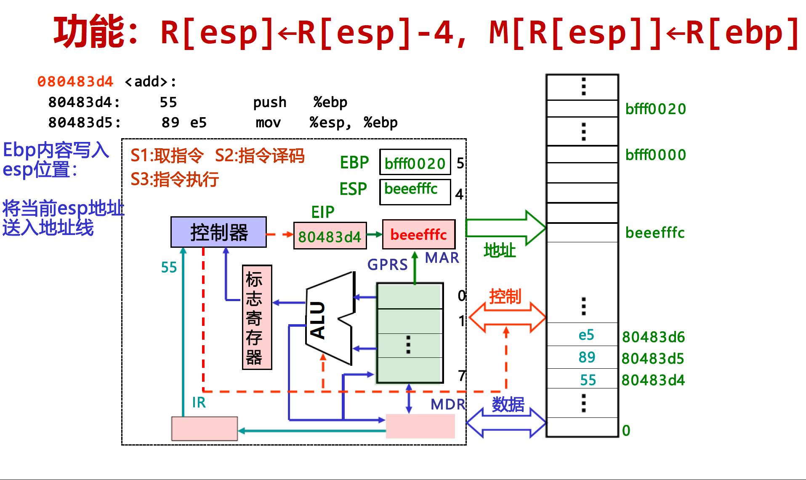

# 2.5.IA-32指令集汇编

## IA-32指令汇编概述

### 发展历史

​​

x86是Intel开发的一类处理器体系结构的泛称，包括Intel 8086、80286、i386和i486等，因此其架构被称为“x86"。后来由于数字并不能作为注册商标，因此，使用了可注册的名称，如奔腾Pentium、PentiumPro、Core 2、Core i7等。现在Intel把32位x86架构的名称x86-32改称为IA-32，IA是Intel Architecture的缩写。

AMD首先提出了一个兼容IA-32指令集的64位版本，在IA-32基础上扩充了指令及寄存器长度和个数等，更新了参数传送方式。AMD称其为AMD64，Intel称其为Intel64 (不同于IA-64)。命名为x86-64，有时也简称为x64。

### IA-32的体系结构

* 8个通用寄存器GPR（0-7）
* 1个标志寄存器EFLAGs
* 指令计数器PC用EIP寄存器来实现
* 可寻址空间4GB（0x00000000-0xFFFFFFFF）
* 指令格式变长
* 操作码变长
* 指令由若干字段（操作码字段OP、寻址字段Mod、SIB-Scale Index Base等）组成

​​

​​

计算机中的数据可以存放在寄存器或存储器中。​​

指令中需给出：

* 操作性质（操作码）
* 源操作数1和源操作数2（立即数、寄存器编号、存储地址）
* 目的操作数地址（寄存器编号、存储地址）

存储地址的描述与操作数的数据结构有关。

### IA-32支持的数据类型及格式

|C语言声明|Intel操作数类型|汇编指令长度后缀|存储长度（位）|
| :------------------------: | :---------------: | :----------------: | :--------------: |
|(unsigned) char|整数/字节|b|8|
|(unsigned) short|整数/字|w|16|
|(unsigned) int|整数/双字|l|32|
|(unsigned) long int|整数/双字|l|32|
|(unsigned) long long int|-|-|2×32|
|char *|整数/双字|l|32|
|float|单精度浮点数|s|32|
|double|双精度浮点数|l|64|
|long double|扩展精度浮点数|t|80/96|

IA-32架构由16位架构发展而来，一个字为16位，长度后缀为w；32位为双字，长度后缀为I；long double实际长度为80位，但分配96位=12B (按4B对齐)。

### IA-32的寄存器组织

​​

从16位到32位，寄存器的组织采用扩展方式，有8个8位寄存器（AL AH到DL DH），支持char型；short型对应于8个16位寄存器（AX-DI）；扩展到32位以后，又增加了8个32位寄存器（EAX-EDI），可存放int型和long型数据。此外，还拥有用于存放指令地址的指令指针寄存器，以及条件寄存器。

​​

反映了体系结构发展的轨迹，8到16再到32位，字长不断扩充，指令保持兼容。ST(0)-ST(7)是80位，MM0 ~MM7使用其低64位。

IA-32的标志寄存器：

​​

### IA-32的寻址方式

* 寻址方式

  * 如何根据指令给定信息得到操作数或操作数地址
* 操作数所在位置

  * 指令中：立即寻址
  * 寄存器中：寄存器寻址
  * 存储单元中（属于存储器操作数，按字节编制）：其他寻址方式

* 存储器操作数的寻址方式和微处理器的工作模式有关

  * 实地址模式（基本用不到）  

    * 为8086/8088兼容设置，加电或复位时
    * 寻址空间1MB，20位地址：(CS)<<4+(IP)
  * **保护模式**（需要掌握）  

    * 加电后进入，采用虚拟存储管理，多任务情况下隔离、保护
    * 80286以上微处理器的工作模式
    * 存执空间232B(4G)，32位线性地址分段（段基址+段内偏移量）

​​

​​

​​

​​

​​

## IA-32指令集

IA-32常用指令可以分为四类：

* **传送指令**

  * 通用数据传送指令  

    * MOV：一般传送，包括`movb`​、`movw`​和`movl`​等
    * MOVS：符号扩展传送，如`movsbw`​、`movswl`​等
    * MOVZ：零扩展传送，如`movzwl`​、`movzbl`​等
    * XCHG：数据交换
    * PUSH/POP：入栈/出栈，如`pushl`​、`pushw`​、`popl`​、`popw`​等
  * 地址传送指令  

    * LEA：加载有效地址，如`leal (%edx,%eax), %eax`​的功能为将edx和eax中的值之和存入eax
  * 输入输出指令

    * IN和OUT：I/O端口与寄存器之间的交换
  * 标志传送指令

    * PUSHF、POPF：将EFLAG压栈，或将栈顶内容送EFLAG
* **定点算术运算指令**

  * 加/减运算（影响标志、不区分无/带符号）

    * ADD：加，包括`addb`​、`addw`​、`addl`​等
    * SUB：减，包括`subb`​、`subw`​、`subl`​等
  * 增1/减1运算（影响除CF以外的标志、不区分无/带符号）

    * INC：递增，包括`incb`​、`incw`​、`incl`​等
    * DEC：递减，包括`decb`​、`decw`​、`decl`​等
  * 取负运算（影响标志、若对0取负，则结果为0且CF清0，否则CF置1）  

    * NEG：取负，包括`negb`​、`negw`​、`negl`​等
  * 比较运算（做减法得到标志、不区分无/带符号）  

    * CMP：比较，包括`cmpb`​、`cmpw`​、`cmpl`​等
  * 乘 / 除运算（不影响标志、区分无/带符号）  

    * MUL：无符号乘
    * IMUL：带符号乘
    * DIV：无符号除
    * IDIV：带符号除
* **位运算指令**

  * 逻辑运算（仅NOT不影响标志，其它指令OF=CF=0，而ZF和SF则根据结果设置：若全0，则ZF=1；若最高位为1，则SF=1）

    * NOT：非，包括`notb`​、`notw`​、`notl`​等
    * AND：与，包括`andb`​、`andw`​、`andl`​等
    * OR：或，包括`orb`​、`orw`​、`orl`​等
    * XOR：异或，包括`xorb`​、`xorw`​、`xorl`​等
    * TEST：做“与”操作测试，仅影响标志
  * 移位运算（左/右移时，最高/最低位送入CF）

    * SHL/SHR：逻辑左/右移，包括shlb、shrw、shrl等
    * SAL/SAR：算数左/右移，左移时需要判断溢出，右移时高位补符号位（移位前后符号位发生变化，则OF=1），包括salb、sarw、sarl等
    * ROL/ROR：循环左/右移，包括rolb、rorw、roll等
    * RCL/RCR：带进位循环左右移，将CF作为操作数一部分循环移位，包括rclb、rcrw、rcll等
* **控制转移指令**

  * 无条件转移指令

    * JMP DST：无条件跳转到目标指令DST处执行
  * 条件转移（分支指令）

    * Jcc DST：cc为条件码，根据标志（条件码）判断是否满足条件，若满足则转移到目标指令DST处执行，否则按顺序执行
  * 条件设置

    * SETcc DST：按条件码cc判断的结果保存到DST（是一个8位目标寄存器）
  * 调用和返回指令（用于过程调用）

    * CALL DST：返回地址RA入栈，转DST处执行
    * RET：从栈中取出返回地址RA，转到RA处执行

### 传送指令

#### 入栈(pushw %ax)

栈（stack）是一种采用“先进后出”方式进行访问的一块存储区，用于嵌套过程调用，从高地址向低地址增长。

​​

为什么AL在栈顶？因为IA-32采取小端序，将最低有效字节放在低地址上。

#### 出栈(popw %ax)

​​

#### 程序执行过程

程序执行过程：

1. 根据EIP取指令
2. 指令译码
3. 取操作数
4. 指令执行
5. 回写结果
6. 修改EIP的值（下一条指令）

​​

​​

​​

​​

​​

​​

​​

​​

​​

### 定点算数运算指令

|指令|显式操作数|影响的常用标志|操作数类型|AT&T助记符|对应C运算符||
| :----: | :----------: | :---------------------------------: | :-------------: | :-------------------: | :------------: | -----------------------------------------------------------------------------------------------------------------|
|ADD|2|OF、ZF、SF、CF|无/带符号整数|addb、addw、addl|+|加减运算指令：都会影响相应的标志信息，且不区分操作数是带符号数还是无符号数|
|SUB|2|OF、ZF、SF、CF|无/带符号整数|subb、subw、subl|-||
|INC|1|OF、ZF、SF|无/带符号整数|incb、incw、incl|++||
|DEC|1|OF、ZF、SF|无/带符号整数|decb、decw、decl|--||
|NEG|1|OF、ZF、SF、CF|无/带符号整数|negb、negw、negl|-||
|CMP|2|OF、ZF、SF、CF|无/带符号整数|cmpb、cmpw、cmpl|<、<=、>、>=||
|MUL|1|OF、CF|无符号整数|mulb、mulw、mull|*|乘除运算指令：不影响相应的常用标志，不产生标志信息，区分操作数是带符号数还是无符号数|
|MUL|2||无符号整数|mulb、mulw、mull|*||
|MUL|3||无符号整数|mulb、mulw、mull|*||
|IMUL|1||带符号整数|imulb、imulw、imull|*||
|IMUL|2||带符号整数|imulb、imulw、imull|*||
|IMUL|3||带符号整数|imulb、imulw、imull|*||
|DIV|1|无|无符号整数|divb、divw、divl|/、%||
|IDIV|1|无|带符号整数|idivb、idivw、idivl|/、%||

​​

​​

​​

​​

​​

### 位运算指令

> 假设：  
> M[0x1000]=00000F89H  
> M[0x1004]=00001270H  
> R[eax]=FF000001H  
> R[ecx]=00001000H  
> 请说明以下指令代表的功能。
>
> 1. notw %ax
> 2. andl %eax,(%ecx)
> 3. orb 4(%ecx),%al
> 4. xorw %ax,4(%ecx)
> 5. testl %eax,%ecx
>
> 这五条指令分别代表的功能：
>
> 1. ​`notw %ax`​
>
>     * 功能：对寄存器 `ax`​ 中的值按位取反。
>     * 解释：`ax`​ 是 `eax`​ 寄存器的低 16 位。假设 `R[eax] = FF000001H`​，那么 `ax`​ 的值是 `0001H`​。取反后，`ax`​ 的值变为 `FFFEH`​。
> 2. ​`andl %eax,(%ecx)`​
>
>     * 功能：将寄存器 `eax`​ 中的值与内存地址 `ecx`​ 指向的值按位与，并将结果存储在内存地址 `ecx`​ 指向的位置。
>     * 解释：`R[ecx] = 00001000H`​，内存地址 `0x1000`​ 的值是 `00000F89H`​。`R[eax] = FF000001H`​。按位与操作后，结果是 `00000001H`​。因此，内存地址 `0x1000`​ 的值将被更新为 `00000001H`​。
> 3. ​`orb 4(%ecx),%al`​
>
>     * 功能：将寄存器 `al`​ 中的值与内存地址 `ecx + 4`​ 指向的值按位或，并将结果存储在内存地址 `ecx + 4`​ 指向的位置。
>     * 解释：`R[ecx] = 00001000H`​，内存地址 `0x1004`​ 的值是 `00001270H`​。`R[eax] = FF000001H`​，`al`​ 的值是 `01H`​。按位或操作后，结果是 `00001271H`​。因此，内存地址 `0x1004`​ 的值将被更新为 `00001271H`​。
> 4. ​`xorw %ax,4(%ecx)`​
>
>     * 功能：将寄存器 `ax`​ 中的值与内存地址 `ecx + 4`​ 指向的值按位异或，并将结果存储在内存地址 `ecx + 4`​ 指向的位置。
>     * 解释：`R[ecx] = 00001000H`​，内存地址 `0x1004`​ 的值是 `00001270H`​。`R[eax] = FF000001H`​，`ax`​ 的值是 `0001H`​。按位异或操作后，结果是 `00001271H`​。因此，内存地址 `0x1004`​ 的值将被更新为 `00001271H`​。
> 5. ​`testl %eax,%ecx`​
>
>     * 功能：将寄存器 `eax`​ 中的值与寄存器 `ecx`​ 中的值按位与，并设置标志寄存器，但不存储结果。
>     * 解释：`R[eax] = FF000001H`​，`R[ecx] = 00001000H`​。按位与操作后，结果是 `00000000H`​。因此，零标志（ZF）将被设置为零。

​​

### 控制转移指令

​​

​​

​​

​​

​​

​​

​​

​​

​​

​​

‍
