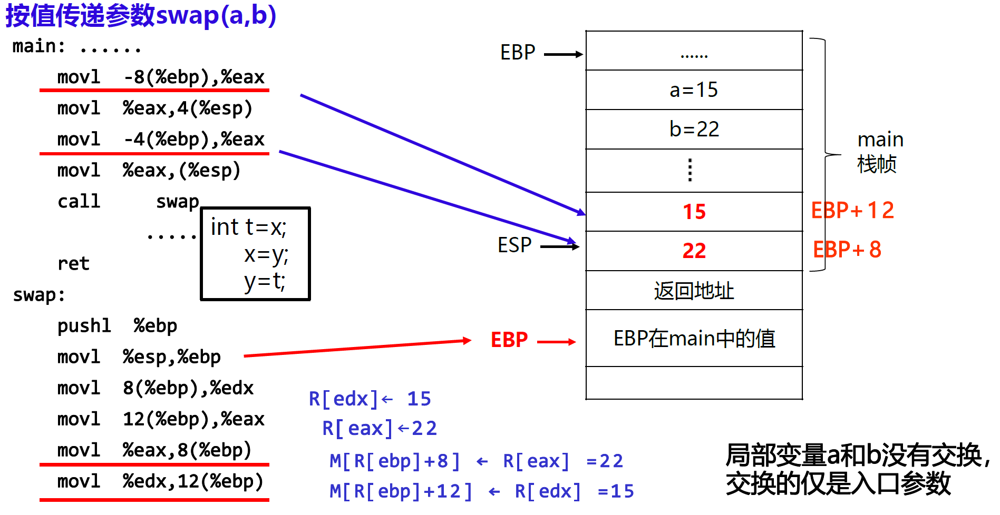

# 2.6.过程及结构体汇编

## 过程调用的汇编表示

### 函数的执行

​​

​​

函数调用的执行步骤（P为调用者，Q为被调用者）

1. P过程

    1. P将入口参数（实参）放到Q能访问到的位置（栈）
    2. P保存返回地址，然后用CALL指令将控制转移到Q
2. Q过程

    1. Q为自己的非静态局部变量分配存储空间（准备阶段）
    2. 执行Q的函数代码（处理阶段）
    3. Q释放局部变量空间
    4. Q取出返回地址，用RET指令将控制转移到P（结束阶段）

IA-32的寄存器使用约定（哪些在调用、被调用过程中使用）：

* 调用者（P）保存寄存器：EAX、EDX、ECX

  * Q可直接使用这三个寄存器
  * 若P在从Q返回后还要用的话，P应在转到Q之前先保存，并在从Q返回后先恢复它们的值再使用。
  * 函数调用时，参数通常被压入栈中。在一些情况下，参数也可以通过寄存器传递在IA-32中，前3个整数类型参数会依次存放在寄存器EAX、EDX、ECX中。
* 被调用者（Q）保存寄存器：EBX、ESI、EDI

  * 函数（Q）可以使用EBX、ESI、EDI寄存器进行计算，若在函数中使用，但必须先将它们原值保存到栈中，并在返回P之前恢复它们的值。
* EBP和ESP分别是帧指针寄存器和栈指针寄存器，指向当前栈帧的底部和顶部

​​

​​

C函数调用的大致结构如下：

* 准备阶段  

  * 形成**帧底**：push指令压栈和mov指令形成栈底
  * 生成**栈帧**(如果需要的话)：sub指令或and指令
  * **保存现场**(如果有被调用者保存寄存器) ：mov指令
* 过程(函数)体  

  * 分配局部变量空间，并赋值
  * 具体处理逻辑，如果遇到函数调用时  

    * 准备参数：将实参送栈帧入口参数处
    * CALL指令：保存返回地址并转被调用函数
  * 在EAX中准备返回参数
* 结束阶段  

  * 退栈：leave指令或pop指令
  * 取返回地址返回：ret指令

​​

​​

​​

​​

​​

​​

​​

​​

​​

## 循环分支的汇编表示

​​

​​

​​

​​

​​

## 数组分配的汇编表示

​​

​​

​​

​​

​​

​​

​​

​​

## 结构体的汇编表示

### 结构体的分配和访问

* 结构体成员在内存的存放与访问

  * 分配在栈中的结构型变量的首地址由EBP或ESP来定位
  * 分配在静态区的结构型变量首地址是一个确定的静态区地址
  * 结构型变量各成员首地址可用“基址加偏移量”的寻址方式

​​

* 结构体数据作为入口参数

  * 当结构体变量需要作为一个函数的形参时，形参和调用函数中的实参应具有相同结构
  * 有按值传递和按地址传递两种方式

    * 若采用按值传递，则结构成员都要复制到栈中参数区，这既增加时间开销又增加空间开销，且更新后的数据无法在调用过程中使用  

      ​​
    * 通常应按地址传递，即在执行CALL指令之前，仅需传递指向结构体的指针而不需要复制每个成员到栈中  
      ​​

​​

​​

​​

### 联合体数据的分配和访问

联合体各成员共享存储空间，按最大长度成员所需空间大小为目标。

对于联合体：

```C
union uarea{
	char c_data;
	short s_data;
	int i_data;
	long l_data;
};
```

IA-32编译时，`long`​和`int`​长度都为4字节，故`uarea`​所占空间为4字节，而对于与`uarea`​有相同成员变量的结构体变量来说，其占用空间至少为11字节，如果对齐则占用更多。

union通常用于特殊场合，当事先知道某种数据结构中的不同字段的使用互斥，就可将这些字段声明为联合，以减少空间；但有时会得不偿失，可能只会减少少量空间却大大增加处理复杂性。

此外，联合体可实现对相同位序列进行不同数据类型的解释，例如：

​​

## 数据对齐的汇编表示

### 数据的对齐

数据对齐（Alignment）：要求数据的地址是相应的边界地址

* 机器字长为32位或64位，主存按一个传送单位（32/64/128位）进行存取，而按字节编址，例如：若传送单位为64位，则每次最多读写64位，即可同时读写第`8i-8i+7(i=0,1,2,...)`​字节。
* 各种不同长度的数据存放时，有两种处理方式：

  * 按边界对齐

    * 字地址：4的倍数（二进制低2位为0）
    * 半字地址：2的倍数（二进制低位为0）
    * 字节地址：任意
  * 不按边界对齐

最简单的对齐策略是按数据长度进行对齐：​​

​​

### 对齐方式的设定

* ​`#pragma pack(n)`​

  * 为编译器指定**结构体**或**类**内部的**成员变量**的对齐方式
  * 当自然边界（如int型按4字节、short型按2字节、float型按4字节）比n大时，按n字节对齐
  * 缺省`#pragma pack()`​，按自然边界对齐
* ​`__attribute__((aligned(m)))`​

  * 为编译器指定一个结构体或类或联合体或一个单独的变量（对象）的对齐方式
  * 按m字节对齐（m必须是2的幂次方），且其占用空间大小也是m的整数倍，以保证在申请连续存储空间时各元素也按m字节对齐
* ​`__attribute__((packed))`​

  * 不按边界对齐，称为紧凑模式

​​

​​

​​

​​

‍
