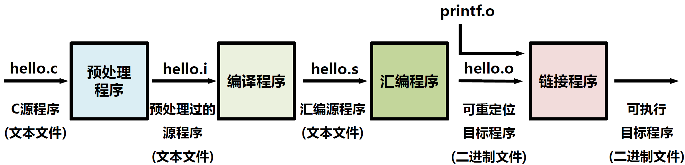
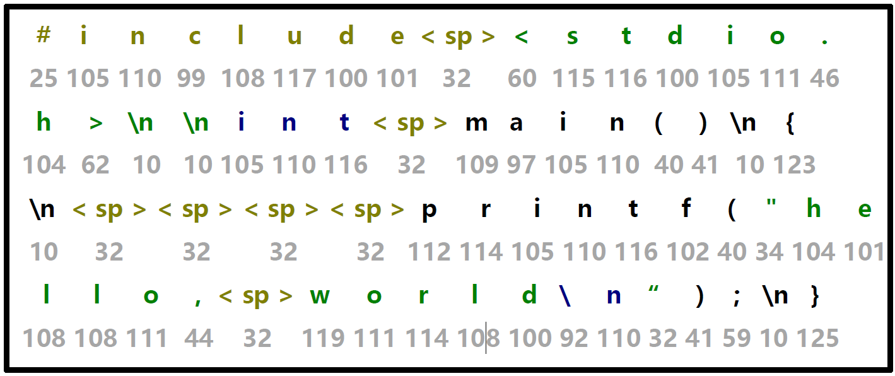
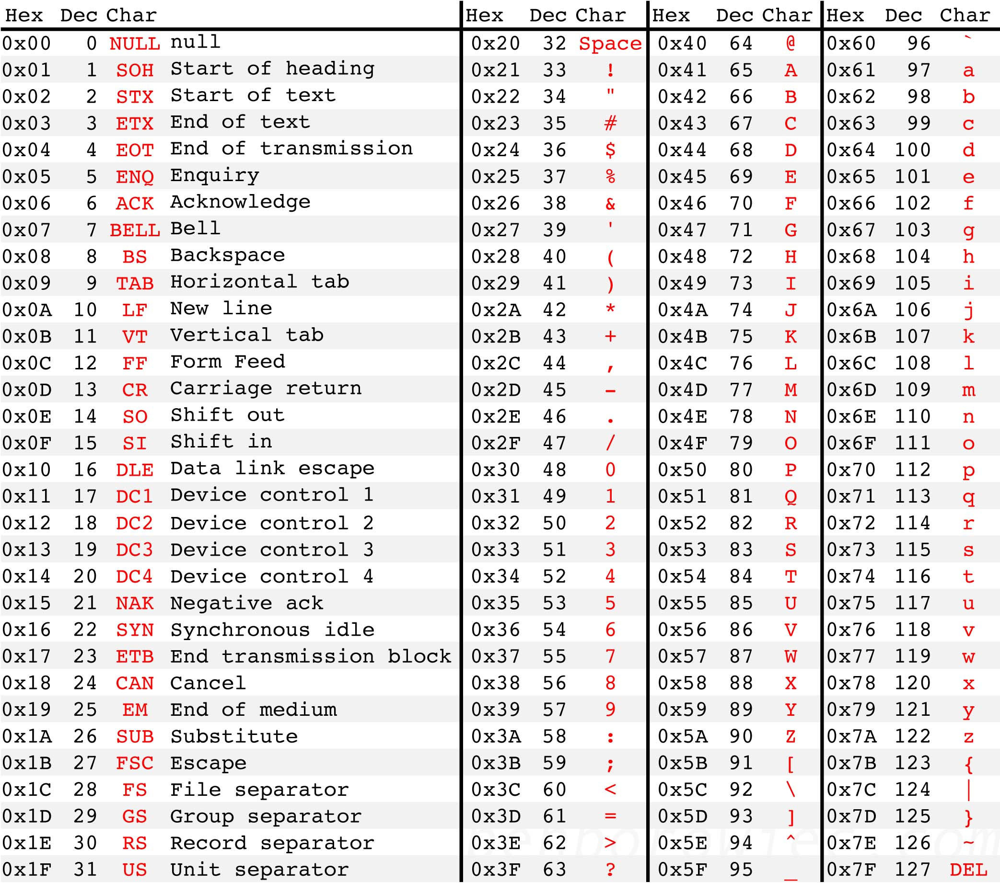
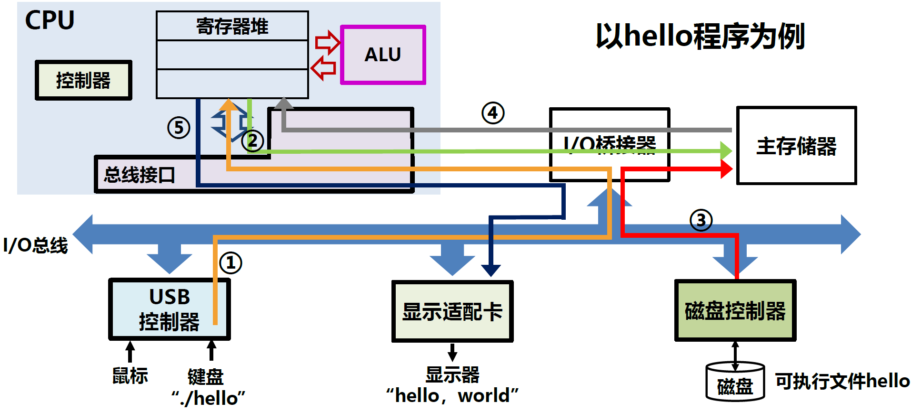
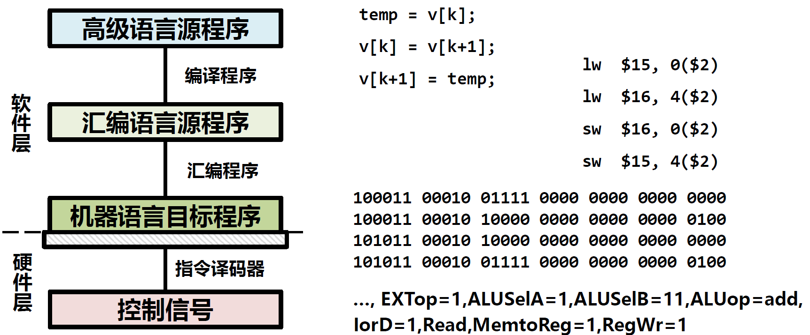
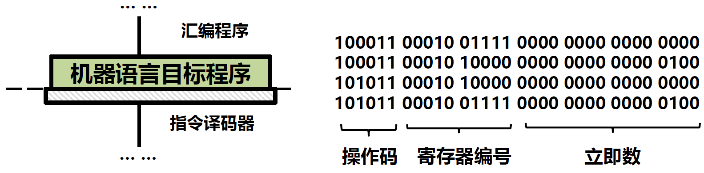
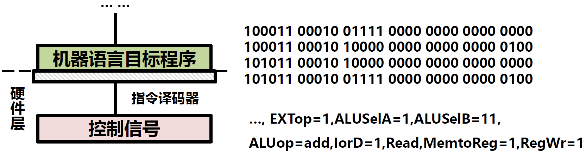
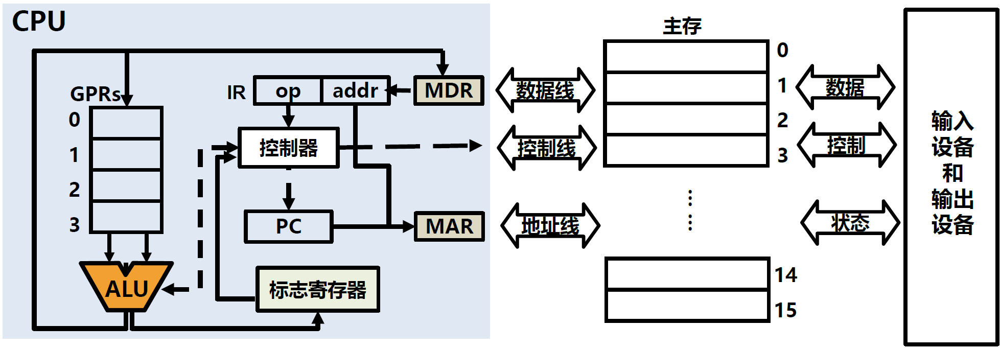

# 2.程序执行

在1.硬件组成中我们已经学会了如何造出一台计算机，但我们还不清楚一个用各种各样语言编写的程序是如何被计算机执行的，因此在这一章我们将深入探究一段代码是如何经历**预处理**、**编译**、**汇编**、**链接**、**生成可执行目标文件**，最终被计算机执行的。



## 程序执行

### 源代码的存储

在计算机中，源程序是以字符形式存储的，比如最基础的一段打印`hello, world`的代码：

```C
// hello.c
#include <stdio.h>

int main()
{
    printf("hello, world\n");
}
```

通常，英文字符采用ASCII编码，其中的`<sp>`代表空格：



> **ASCII（American Standard Code for Information Interchange，美国信息交换标准代码）** 是基于拉丁字母的一套电脑编码系统。它主要用于显示现代英语，而其扩展版本延伸美国标准信息交换码则可以部分支持其他西欧语言，并等同于国际标准ISO/IEC 646。
>
> ASCII由电报码发展而来。第一版标准发布于1963年 ，1967年经历了一次主要修订，最后一次更新则是在1986年，至今为止共定义了128个字符；其中33个字符无法显示（一些终端提供了扩展，使得这些字符可显示为诸如笑脸、扑克牌花式等8-bit符号），且这33个字符多数都已是陈废的控制字符。控制字符的用途主要是用来操控已经处理过的文字。在33个字符之外的是95个可显示的字符。用键盘敲下空白键所产生的空白字符也算1个可显示字符（显示为空白）。
>
> 

### 目标文件生成

1. 预处理：对源程序中以字符#开头的命令进行处理。例如将#include命令后面的`.h`文件内容嵌入到源程序文件中。
2. 编译：对预处理后的源程序进行编译，生成汇编源程序
3. 汇编：将汇编源程序生成一个可重定位目标文件，存放机器指令
4. 链接：将多个可重定位目标文件和标准库函数合并成一个可执行目标文件

### 目标文件执行

程序执行本质是数据在CPU、主存储器和I/O模块之间流动的过程。执行一个程序，首先将所需程序加载到内存中的某个位置，然后将PC设置为程序的起始地址。数据流动通过总线、I/O桥接器实现。

以执行打印`hello, world`的程序为例：



程序的启动和执行依靠操作系统支持：

* 外壳程序，如shell进行命令行的解释
* 内核程序，如read磁盘、write屏幕等外设调度

程序在不同阶段具有等价转换，比如同一个程序的高级语言、汇编、机器语言、控制信号，实际上是等价的：



机器代码段由多条指令构成，指令是一串二进制序列，通常被划分为若干字段，包含操作码、地址码、立即数字等。



CPU通过逻辑电路直接执行用二进制表示的机器指令，通过控制器中的指令译码器将指令译码为控制信号。



### 指令执行



* 标志寄存器：存放ALU运算得到的标志信息
* IR：存放主存读出的指令
* 程序指令被事先存放在主存中
* 根据PC取指令到IR，IR译码并生成控制信号
* ALU读寄存器内容并进行运算，向寄存器写结果

‍
