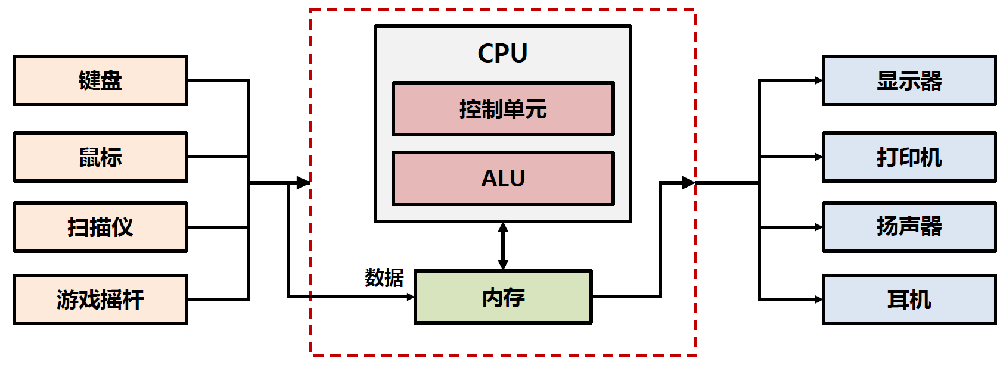

# 3.1.IO系统与总线

## I/O系统

### 概述

我们在学习完硬件组成和程序执行之后，已经设计出能够执行按照规则执行程序的计算机了，但是我们应该怎么告诉计算机需要执行什么程序，结果输出到哪里呢？这就需要**I/O系统**来帮助计算机与外界进行交互与通信。

键盘、鼠标、扫描仪等设备作为**I（Input，输入）** ，将外界信息传递给CPU和存储器，显示器、打印机、扬声器等设备作为**O（Output，输出）** ，将结果向外界传递出来。总的来说，计算机以**CPU为中心**控制**I/O设备**，完成人机交互过程。

​​

那这些输入输出设备应该接在哪里呢？直接插在CPU上吗？显然这不现实，所以我们想到了**系统总线**，在系统总线上增加**I/O接口（I/O控制器）** ，将这些各种各样的输入输出设备通过I/O接口挂接在总线上，由总线作为中介，协调CPU与各种输入输出设备。

用户通过I/O设备与计算机交互，I/O设备与计算机通过**设备控制器（Device Controller）** 连接，设备控制器就充当了I/O设备和计算机之间的桥梁。

​​

> 那为什么要接在I/O接口上而不直接接在总线上呢？
>
> * 各种IO设备使用不同的操作方法，由CPU直接控制不同的IO设备，不现实
> * IO设备的数据传送速度比存储器和处理器的速度慢得多，使用高速的系统总线与慢速的IO设备直接连接，不切实际
> * IO设备经常使用与处理器不同的数据格式和字长度

​​

### 组织结构

​​

### 系统控制

​​

### 软件驱动

​​

### 接口信号

接口信号指硬件之间或组件之间通信时使用的电子信号。

​​

### 实例：键盘输入

以键盘输入数据这一过程为例，当敲下按键后，字符会通过映射电路变为ASCII码传入数据暂存器，然后引发中断，将ASCII码传给CPU。

​​

这就引出了设备控制器的两个重要结构：数据寄存器（保存输入字符）和状态寄存器（聚合交互状态）。

​​

通常键盘控制器中的状态寄存器会存储以下几种数据：

* 就绪位
* 中断允许位IE
* 中断标志位IF
* 数据溢出标志位

那么如何让控制器中的寄存器对CPU可见呢？

内存映射技术能将设备控制器中的寄存器以内存单元的形式呈现给CPU，CPU使用与内存读写相同的指令与其交互。

> 内存映射技术：保留一部分地址空间给设备控制器
>
> 不需要额外的I/O指令
>
> 通过内存访问指令读取，数据传输高效
>
> 限制可用的内存地址空间
>
> 安全性问题：未经保护的访问会造成漏洞和攻击风险

​​

​​

这样我们就实现了统一规划地址空间，在不改变指令集情况下，将设备控制器集成到系统中。

## 总线

### 概念

**系统总线**是计算机系统中的一种**通信路径**，用于连接计算机的主要组件，提供这些组件之间进行**数据传输**和**控制信号传递**的通道。

​​

* 特性

  * 连接两个以上部件或设备的信息通路
  * 各个部件或设备的共享传输介质
* 为什么要用总线

  * 大大降低部件间互连的复杂性，减少连线数量，成本低
  * 部件间的连接接口统一为与总线的接口
  * 易于增加新设备
* 不足

  * 分时共享，大量同时工作的部件间的信息交换效率降低
* 信息传输方式

  * 串行
  * 并行
* 传输速度制约

  * 总线长度（The length of the bus）
  * 总线连接的设备数（The number of devices on the bus）

系统总线相当于存储总线+I/O总线：

​​

### 组成

系统总线是计算机中的关键资源，包含以下部分：

* 地址线：CPU通过地址线发送地址信息，访问设备。地址线的位宽决定了处理器可以直接寻址的内存地址数量。
* 数据线：数据的读取、写入和交换。数据线的数目由总线支持的指令集决定，数据线的位宽一般与指令集中定义的数据位数相匹配。
* 控制线：在计算机的各个组件之间传递控制和命令信息。位数不确定，但需要保证能表达所需控制需求。
* 中断线：传递中断请求。与所支持中断级别的数目相对应。
* 中断响应线：传输中断响应信号。与所支持中断级别的数目相对应。
* 总线仲裁线：仲裁各设备使用总线的权限，确保设备按照优先级或时间片获得总线访问权。在当前总线周期中，设备竞争使用下一个总线周期；当前周期结束前，需要选择下一个总线周期中运行的设备。

### 规范

总线的标准化增加了第三方供应商可提供外围设备的范围，有利于降低价格，增加产品配置的灵活性，但破坏了公司产品的排他性。

在这种情况下，系统总线的标准化设计选择了折中的办法：系统总线由制造商专有设计，而IO总线由厂商联合制定标准，如PCI-Express标准。

桥接器将CPU的内部总线与类似PCIe的标准总线进行连接（转换）。

​​

## I/O处理器

**I/O处理器**是专门负责处理输入/输出操作的处理器，也叫**I/O控制器**，以I/O控制、转换为主要目的。与传统处理器不同，I/O处理器无指令计算功能。I/O处理器可大可小，与计算机系统总体结构有关，部分系统中，I/O处理器集成在CPU或SoC中。

​​

I/O处理器减少了主处理器所受的中断数，主处理器在共享内存中建立I/O程序，I/O处理器完成程序的执行后中断主处理器。

**为什么需要I/O处理器呢？**

* 减轻主处理器负担：I/O处理器的I/O任务与主处理器分离
* 数据缓存和优化：具备数据缓存能力，减少对内存的访问
* 设备管理和控制：对多个I/O设备集中管理和控制
* 并行处理：同时进行多个I/O操作

### 发展过程

1. CPU直接控制外设
2. 增加一个控制器或一个I/O模块，CPU使用编程控制
3. 采用中断技术，CPU不需要花费时间等待外设执行I/O操作，实现了外设和CPU的并行
4. I/O模块通过DMA直接传送一块数据到或从存储器传出，不需要CPU全部参与

## I/O控制

假设我们已经有了I/O系统，应该如何控制I/O系统的数据传输呢？有两个思路，使用程序来控制，或者让设备控制器直接与内存进行交换。

### 程序控制

我们引入I/O控制程序，通过特殊的计算机程序完成数据传输。例如键盘控制器的数据传输过程中，当新字符进入数据寄存器时设置状态寄存器的就绪位；当CPU读取数据寄存器时清除就绪位。

​​

1. 检查就绪位
2. 如果就绪位没有设置， 返回步骤1
3. 读数据寄存器
4. 读入数据存入内存
5. 返回步骤1

但是，如何知道什么时候从哪个外设获取外部数据呢？我们想到了两种办法，轮询和中断。

* 轮询：随时查询所有外设，有数据输入即获得，但程序要周期性运行。

  * 效率问题：处理器通过步骤1、2不断检查设备是否有新数据，获取字符前要无效轮询数百万次。
* 中断：外部设备有数据，则告知CPU获得，但需要特殊信号线——中断线及中断响应线。

  * 效率问题：每次获得数据都需要“中断—响应”过程，单次输入效率低，浪费处理器资源编排数据传输。适合低速输入数据，不适合网络、内存、硬盘等高速同步设备。

### 非程序控制（DMA）

**DMA（Direct Memory Access）** ：在CPU没有介入的情况下，设备控制器直接与内存交换。

​​

​​

在传统数据传输方式中，CPU需要向设备传输命令、设备地址、内存缓冲区地址、数据传输量。

例如：从内存缓冲区中，以地址M开始向地址D设备中传输N字节：

1. 在计数寄存器中存储N
2. 在内存缓冲区地址寄存器中存储M
3. 将D保存至设备地址寄存器中
4. 将写设备命令保存在命令寄存器中
5. 设置状态寄存器中的开始（Go）位

而DMA传输与CPU类似：

1. DMA控制器反复访问内存总线
2. 将N个连续的字节从内存地址M开始装入缓冲区中
3. 缓冲区就绪后，控制器按照指定的设备地址将缓冲区的内容初始化到设备中

​​

DMA进行必要初始化后，可在不打扰CPU的情况下完成所要求的数据传输。

## 主板

**主板（motherboard）** 是计算机内部的大型电路板，承载了各种硬件组件的连接和集成。主板是单个印刷电路板，包含处理器、内存和I/O控制器等，有多个插槽（子卡），可支持对计算机系统的扩展。

​​

* 北桥：集线器（Hub）芯片，编排CPU和内存系统，包括I/O控制器之间通信
* 南桥：用作I/O控制器枢纽的芯片，与标准I/O总线连接，并对设备进行仲裁
* PCI-Express：支持设备所需的高传输率和响应时间的总线标准
* LPC总线：低带宽设备与CPU连接的标准
* 高级I/O：负责慢速设备，如键盘、鼠标等的控制

‍
