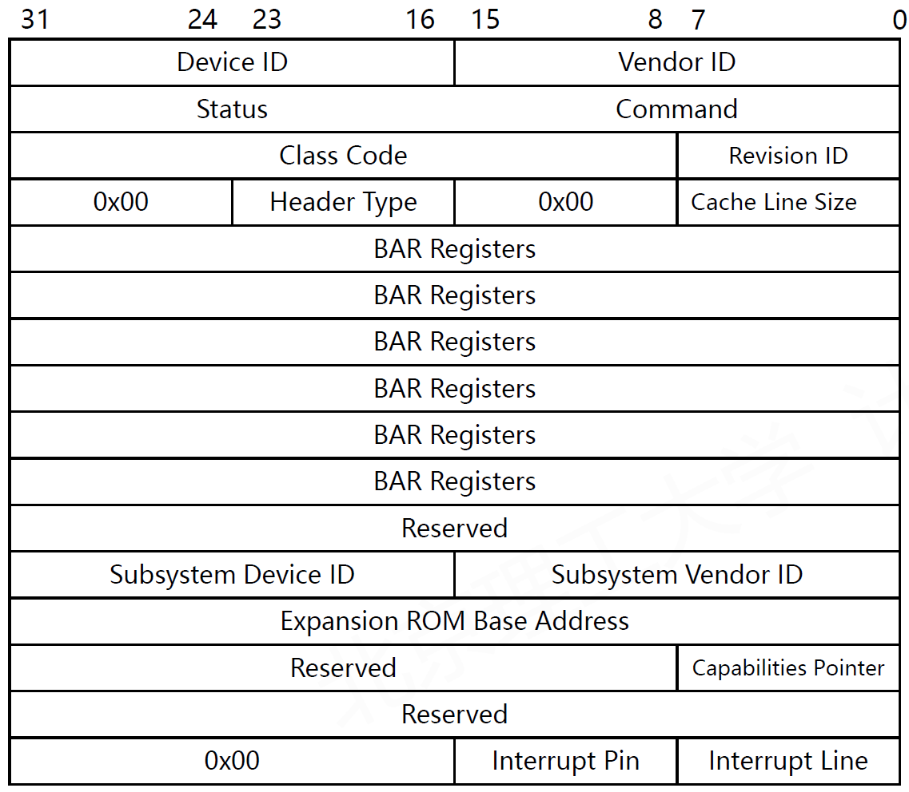

# 3.2.IO总线协议

I/O总线协议决定了I/O寄存器容量的获取、I/O设备的扫描和发现、内存地址和寄存器的对应。I/O总线协议经历了ISA、MCA、EISA、VLB、PCI、PCIe的发展阶段。

## ISA总线

**ISA（Industry Standard Architecture）总线**：1981年IBM公司针对IBM PC设计的外围总线协议。

8位 ISA：62管脚

16位 ISA：98管脚

ISA提供1-16MB存储空间及 64KI/O地址空间。

​​

​​

## MCA总线

**MCA（Micro Channel Architecture）总线**：1987年IBM公司针对ISA问题的改进，CPU独立、高性能。

非公开总线，只用于IBM PS/2计算机（高性能服务器）

MCA支持16/32位数据，10MHz，20/40MB/s性能

​​

## EISA总线

**EISA（Extended Industry Standard Architecture）总线**：1988年第三方厂商针对ISA问题的改进。

EISA采用ISA插槽，提供32位、8MHz ，32MB/s性能

|EISA并不流行，因为IBM坚持采用ISA+VLB，直到PCI。

​​

​​

## VLB总线

VLB（VESA Local Bus）总线：1992年解决ISA问题的第三次尝试。

VESA：Video Electronics Standards Association，目标接入高性能显卡

32位、33MHz = 133MB/s性能

技术实现困难，要求CPU支持频率以33MHz为倍数

​​

## PCI总线

**PCI（Peripheral Component Interconnect）总线**：1992年Intel（后PCI-SIG）提出。

32位、33MHz = 133MB/s，也支持64位（266MB/s）

完全Plug-and-Play，即插即用，通用的软件驱动

​​

PCI总线的结构：

​​

PCI桥将上级总线的数据和命令转发到下级总线执行，实现多级PCI桥接：

* 地址扩展
* 跨越物理距离
* 架构扩展灵活
* 突破共享总线频率限制

​​

例如，将32位数据写入I/O设备的寄存器地址A中：

1. 仲裁获得总线使用权
2. 在第一个时钟周期内将地址A放到地址/数据总线中
3. 同时将命令信号放置在命令字总线中

但是总线怎么知道写入到哪个控制器呢？

因此引入了PCI总线控制器：

* 操作系统分配：控制器的寄存器空间映射到CPU物理地址
* 控制器保持：每个I/O控制器记录自己的映射地址
* 控制器响应：每个I/O控制器仅响应属于自己地址的请求

系统如何配置PCI设备呢？

### PCI设备的配置

PCI有三个相互独立的物理地址空间：**设备存储器地址空间、I/O地址空间和配置空间。** 配置空间是PCI所特有的一个物理空间。由于PCI支持设备即插即用，所以PCI设备不占用固定的内存地址空间或I/O地址空间，而是由操作系统决定其映射的基址。

系统加电时，BIOS检测PCI总线，确定所有连接在PCI总线上的设备以及它们的配置要求，并进行系统配置。所以，所有的PCI设备必须实现配置空间，从而能够实现参数的自动配置，实现真正的即插即用。

PCI总线规范定义的配置空间总长度为256个字节，配置信息按一定的顺序和大小依次存放。前64个字节的配置空间称为配置头，对于所有的设备都一样，配置头的主要功能是用来识别设备、定义主机访问PCI卡的方式（I/O访问或者存储器访问，还有中断信息）。其余的192个字节称为本地配置空间（设备有关区），主要定义卡上局部总线的特性、本地空间基地址及范围等。

​​

* Vendor ID：设备的供应商。FFFFh是一个非法厂商ID，可它来判断PCI设备是否存在。
* Device ID：设备的型号和版本。操作系统就是凭着Vendor ID和Device ID找到对应驱动程序的。
* Revision ID：固件、外围器件等小版本
* Class Code：类代码。共三字节，分别是类代码、子类代码、编程接口。类代码不仅用于区分设备类型，还是编程接口的规范，这就是为什么会有通用驱动程序。
* Status：当前I/O控制器的状态
* Command：与当前工作模式有关的信息
* IRQ Line：IRQ编号。PC机以前是靠两片8259芯片来管理16个硬件中断。现在为了支持对称多处理器，有了APIC（高级可编程中断控制器），它支持管理24个中断。
* IRQ Pin：中断引脚。PCI有4个中断引脚，该寄存器表明该设备连接的是哪个引脚。
* BAR（Base Address Register）：基址寄存器，共6个。保存PCI设备可用寄存器空间的基地址，最多6段。PCI控制器可以灵活暴露自己的寄存器空间，BAR只负责通告寄存器容量，不存储任何与I/O相关的数据。

  * 假设某PCI设备希望暴露1段4KB的寄存器容量：

    1. 将BAR的低12位置为只读
    2. 操作系统写入0xFFFFFFFF，再读取
    3. 判断12位无法写入，则暴露内存= $2^{12}$(4KB)

驱动程序如何知道I/O控制器的映射内存空间地址？

​​

### PCI设备的枚举

系统首先需要读取PCI控制器的配置信息，如BAR：

​​

1. 给每个接入PCI的设备编号，编号的映射关系固定
2. 按照编号访问总线上的寄存器空间

### PCI设备的访问

使用选通信号访问特定PCI设备：

1. 数据/地址总线上的一部分信号（21根）作为选通信号
2. 通过主板，这些信号分别连通21个设备（接插件）
3. 特定时钟周期内，向命令总线上放置特定命令
4. 下一个时钟周期，选通目标PCI设备

​​

采取逐级定位的方法通过桥接器读出下游总线某设备的配置信息：

1. BID（BUS ID）：定位某一条PCI总线
2. DID（Device ID）：定位总线中的某个设备
3. RID（Register ID）：定位设备中的配置空间寄存器

​​

### 内存地址和寄存器的对应

将PCI控制器的寄存器容量映射到CPU的物理地址空间：

​​

1. 设备管理器查找系统地址分配表，寻找空闲物理地址
2. 将寄存器物理地址更新到系统地址分配表中
3. 设备的驱动程序将物理地址映射到虚拟地址中

​​

Windows设备管理器中可以看到每个PCI/PCIe设备被映射的物理地址。此处网卡通过PCI/PCIE接口使用了2个BAR，因而被分配了2段内存地址。

## PCIe总线

​​

**PCI的缺陷：**

* 速度和带宽限制：早期的 PCI 总线速度仅为 33 MHz
* 性能瓶颈：共享总线结构，设备需要竞争资源进行通信
* 扩展性受限：PCI 总线连接设备的数量和扩展性受到限制
* 电源管理和热插拔支持不足等

**PCIe的三大改进思路：**

* 将**共享**总线改为**Crossbar交换**方式  
  ​​
* 将**并行**链路通道改为**高速串行**链路通道  
  ​  
  ​  
  ​​
* 将**同步**数据收发模式改为**异步**队列模式

  数据的传输不再依赖于发送方和接收方之间的同步时钟信号。数据被划分为多个小数据包（packets），每个数据包都包含了发送方和接收方之间的必要信息。高带宽利用率、低时钟依赖性、灵活的系统设计。

从PCI升级到PCIe的过程中，最大的挑战是将**共享**总线改为**Crossbar交换**方式，因为之前大部分依赖共享拓扑的功能都需要改变，PCI生产厂商和驱动程序编写人员也需要做出改变。因此我们需要尽可能保留PCI的设计，在底层做修改，于是我们想到了在不改变PCI控制器和I/O设备的前提下加入PCIE交换完成功能升级。

​​

### PCIe设备的枚举

传统的PCI采用并行设备选通的原理，而PCIe采用**交换机**原理，给每个PCIe交换端口上挂接的设备映射一个固定ID，PCIe上的任何数据包都需要标识目的设备和源设备地址。

​​

PCIe的交换机结构与大多数交换设备类似，将一串比特从一个端口交换至另一个。

​​

两个PCIe交换机级联时，各自拥有`<设备ID, 端口>`​对应表，通过增加一个桥接器连接两个交换机，转换设备地址请求。

​​

## USB总线

**通用串行总线（Universal Serial Bus，USB）** 是一种用于连接外部设备和计算机的通信接口标准。它是一种简单、便捷且广泛应用的接口，用于在计算机和其他设备之间传输数据和供电。

一些USB接口：

​​

​​

USB的发展历程：

​​

**USB设备与计算机的连接：**

先接入I/O桥片，再利用I/O桥上的访存总线（如PCIE）与CPU沟通。

​​

USB主控制器在系统内被视作一个单独的PCIe设备，其后连接USB总线，包括多个USB设备，如键盘、鼠标等。

​​

USB主控制器与PCIe管理方式类似，也存在暴露的寄存器以及对应的内存地址。

​​

CPU如何把以太网帧传送到网络上：

1. 以太网帧先在主存中生成
2. 帧被转入USB控制器的寄存器中
3. USB控制器将数据转入USB网卡

CPU→PCIE主控→USB主控→USB网卡设备

​​

### USB总线拓扑

与PCI总线类似，采用共享总线方式，每个USB设备拥有一个7位的USB总线地址。

USB Hub：将上游方向的数据广播到下游端口，同时会有信号增强功能。

每个USB主控制器都配有一个Root Hub，将主控制器的一路信号转变成多路。Root Hub可以级联更多级Hub，如果某个设备中集成了USB Hub，就成为了复合设备。

​​

​​

### USB设备的热插拔

如果一个新的设备被新插入，控制端如何及时获知？

* 为了降低系统复杂性，USB不使用中断
* 在Hub内部设置一个状态改变寄存器Status Change Register
* 每当有端口状态变化，其对应位改变用以通知控制端

​​

### USB最新技术

USB4：支持高达40Gbps的数据传输速率，还将支持多种视频协议

Type-C：反向插拔、高速传输、供电功能

USB Power Delivery：一种能够提供更高功率供电的技术，可以通过USB接口为各种设备充电

‍
