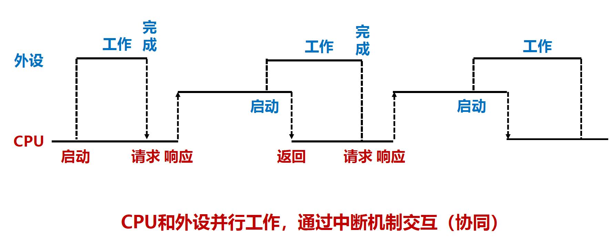

# 3.3.IO操作的软件实现

## I/O软件操作概述

### I/O软件

* 负责输入和输出数据
* 高级语言中，专门负责I/O操作的**I/O库函数**
* **I/O库函数**通过“软中断指令”调用**系统内核**实现I/O
* 任何I/O操作最终都由**系统内核**控制完成

**I/O软件采用层级结构：**

* 用户I/O软件：提出请求
* 内核I/O软件：管理控制
* I/O硬件：完成具体操作

​​

**操作系统在I/O中承担重要作用：**

* **共享性**：I/O资源被多个进程共享，需要 OS 统一调度，保证吞吐率和安全性（**效率、安全**）
* **复杂性**：I/O设备控制细节复杂，如果交由上层软件控制，会给开发人员带来麻烦（**简化**）
* **异步性**：I/O系统速度较慢且不同设备差异大，需要OS完成中断过程（**兼容**）

​​

**I/O操作的大致过程：**

1. CPU在用户态执行用户进程
2. CPU执行到陷阱指令时，进入内核态
3. CPU根据陷阱指令的系统调用号，执行系统调用服务程序
4. 执行对应的设备驱动程序
5. 启动外设工作，外设准备好后发送中断请求
6. CPU响应中断，基于中断服务程序与外设交互

​​

​​

​​

## I/O用户空间操作

用户I/O软件可以使用标准I/O库函数或系统调用封装函数。

​​

标准I/O库函数相当于对系统调用进行封装，抽象层次更高。移植性好，可在不同平台下运行，使用缓冲区来提高执行效率（DMA），但程序必须等待I/O完成后才能继续执行，并且有缓冲区溢出等安全风险。

|C标准库I/O、Linux系统级I/O、Windows API函数|||||
| ------------------------------------------------------------------------| ---------------------------| -----------------------| ----------------------| ------------------------|
|序号|C标准库|UNIX/Linux系统级函数|Windows API|功能描述|
|1|getc、scanf、gets|read|ReadConsole|从标准输入读取信息|
|2|fread|read|ReadFile|从文件读取信息|
|3|putc、printf、puts|write|WriteConsole|在标准输出上写信息|
|4|fwrite|write|WriteFile|向文件写入信息|
|5|fopen|open、creat|CreateFile|打开/创建文件|
|6|fclose|close|CloseHandle|关闭一个文件|
|7|fseek|lseek|SetFilePointer|设置读写位置|
|8|rewind|lseek(0)|SetFilePointer(0)|将文件指针指向文件开头|
|9|remove|unlink|DeleteFile|删除文件|
|10|feof|无对应|无对应|停留到文件末尾|
|11|perror|sterror|FormatMessage|输出错误信息|
|12|无对应|stat、fstat、lstat|GetFileTime|获取文件的时间属性|
|13|无对应|stat、fstat、lstat|GetFileSize|获取文件的长度属性|
|14|无对应|fcnt|LockFile/UnlockFile|文件的加锁、解锁|
|15|使用stdin、stdout、stderr|使用文件描述符0、1、2|GetStdHandle|标准输入/输出/错误|

### 文件

在类UNIX系统中，所有I/O操作都是通过读写一个文件实现的。对于用户程序来说，访问物理设备等同于读写一个真正的磁盘文件，例如：键盘=可读文件、显示器等于可写文件。“一切皆文件”是UNIX基本设计哲学。

#### 文件的分类

按照文件对应的实体：

* **标准输入输出文件**：键盘、显示器等设备终端所对应的文件
* **普通文件**：磁盘、光盘等外存储器上的文件

按照文件的字节类型：

* **ASCII文件**
* **二进制文件**

#### 文件的主要操作

* 创建：生成一个原先不存在的文件，系统返回一个描述符fd
* 打开：需要指定对文件的操作类型，读、写、追加等
* 设置文件读写位置：相对于文件最开始字节的偏移量
* 文件读写：从当前读写位置进行字节IO操作
* 关闭文件：释放文件打开时所创建的数据结构，回收文件描述符

#### 系统级I/O函数

###### create

​`int create(char *name, mode_t perms)`​

* name：需创建的新文件名称
* perms：新文件的访问权限，共9位，分别指定文件拥有者、拥有者所在组成员、其他用户所具有的读、写、执行权限
* 返回值：一个文件描述符，出错返回-1

###### open

​`int open(char *name, int flags, mode_t perms)`​

* name：需打开的文件名称
* flags：用户如何访问该文件，如只读、只写、读写等
* perms：指定文件的访问权限（若创建），通常为0
* 返回值：文件描述符int，出错返回-1

###### read

​`ssize_t read(int fd, void *buf, size_t n)`​

* fd：文件描述符
* buf：读出数据的buf
* n：需要读取的字节数
* 返回值：需要读取的字节数，出错返回-1

###### write

​`ssize_t write(int fd, const void *buf, size_t n)`​

* fd：文件描述符
* buf：待写入数据的buf
* n：需要写入的字节数
* 返回值：实际写入的字节数，出错返回-1

###### lseek

​`long lseek(int fd, long offset, int origin)`​

* fd：文件描述符
* offset：调整的字节数
* origin：基准调整位置，如文件开头、结尾
* 返回值：新的文件指针位置，出错返回-1

###### stat/fstat

​`int stat(const *name, struct stat *buf)`​

​`int fstat(int fd, struct stat *buf)`​

* name：文件名
* fd：文件描述符
* buf：用于存放文件元数据的结构体地址

该函数获取文件的所有属性信息，如文件名、大小、创建时间等

#### C标准库I/O函数

C标准I/O库函数均基于系统级I/O函数实现。将一个打开的文件表示为**FILE结构体**。

```C
typedef struct _iobuf{
	int  cnt ;     // 剩余未读写字节数
	char *ptr ;    // 下一个读写位置
	char *base;    // 缓冲区起始地址
	int  flag;     // 文件访问模式
	int  fd;       // 文件描述符
} FILE;
```

FILE结构体表示为在一个内存中的**流式缓冲区**。

​​

​​

###### fread

文件读取函数

* 从FILE缓冲区的ptr处开始读入信息
* FILE缓冲区的信息是从文件fd中预先读取
* 判断缓冲区没有信息后，从文件fd读取一定字节
* 通过base、ptr、cnt的配合实现流式传输

###### _fillbuf

缓冲区分配并填充函数

```C
# include "syscalls.h"
/* _fillbuf: allocate and fill input buffer */
int _fillbuf(FILE *fp)
{
	int bufsize;
	if ((fp → flag & (_READ | _EOF | _ERR)) != _READ)
		return EOF;
	bufsize = (fp → flag & _UNBUF) ? 1: BUFSIZ;
	if ((fp → base == NULL) /* 目前没有分配缓冲区 */
		if ((fp → base == (char *) malloc (bufsize)) == NULL)
			return EOF; /* 无法分配缓冲区，错误 */
	fp → ptr = fp → base;
	fp → cnt = read(fp → fd, fp → ptr, bufsize);
	if (fp → cnt < 0){
		if (fp → cnt == -1) fp → flag |= _EOF;
		else fp → flag | = _ERR;
		fp → cnt = 0;
		return EOF;
	}
	return (unsigned char) *fp → ptr++;
}
```

###### fopen

```C
#include <fcnt1.h>
#include "syscalls.h"
#define PERMS 0666 /* RW for owner, group, others*/
/* fopen: 打开文件，返回读写指针 ptr */
FILE *fopen(char *name, char *mode) {
    int fd;
    FILE *fp;
    // 检查文件打开模式是否合法
    if (*mode != 'r' && *mode != 'w' && *mode != 'a')
        return NULL;
    // 寻找空闲的文件指针
    for (fp = _iob; fp < _iob + OPEN_MAX; fp++) {
        if ((fp->flag & (_READ | _WRITE)) == 0)
            break; /* found free slot*/
        if (fp >= _iob + OPEN_MAX)
            return NULL;
    }
    // 根据文件打开模式选择适当的操作，调用系统级I/O函数
    if (*mode == 'w') fd = creat(name,PERMS);
    else if (*mode == 'a') {
        if ((fd = open(name, O_WRONLY, 0)) == -1)
            fd = create(name,PERMS);
        lseek(fd, OL, 2);
    } else fd = open(name, O_RDONLY, 0);
    ...
    if (fd == -1) return NULL;
    // 初始化文件指针的相关属性
    fp->fd = fd;
    fp->cnt = 0;
    fp->base = NULL;
    fp->flag = (*mode == 'r') ? _READ : _WRITE;
    return fp;
}
```

#### 用户程序中的I/O请求

用户可以使用C标准I/O库函数，也可以使用系统级I/O函数，但不管通过哪种方式，最终都会转换成：

​​

然后进入内核态处理。

#### 实现简单的文件复制

```C
#include <stdio.h>
#include <errno.h>

int main(int argc, char *argv[]) {
    FILE *srcfile, *dstfile;
    char buf[BUFSIZE];
    size_t srcsize, dstsize;
    // 检查命令行参数数量是否合法
    if (argc != 3) {
        printf("usage: copyfile srcfile dstfile\n");
        return 1;
    }
    // 打开源文件
    srcfile = fopen(argv[1], "rb");
    if (srcfile == NULL) {
        perror(argv[1]);
        return 2;
    }
    // 打开目标文件
    dstfile = fopen(argv[2], "wb");
    if (dstfile == NULL) {
        perror(argv[2]);
        return 3;
    }
    // 逐块读取源文件并写入目标文件
    while ((srcsize = fread(buf, 1,BUFSIZ, srcfile)) > 0) {
        dstsize = fwrite(buf, 1, srcsize, dstfile);
        if (dstsize != srcsize) {
            perror("Write Error.");
            return 4;
        }
    }
    // 关闭文件
    fclose(srcfile);
    fclose(dstfile);
    return 0;
}

```

## I/O软硬件协同

### I/O控制方式

* 计算机通过各类总线、设备控制器、桥接器，在CPU、主存和各个I/O硬件设备之间建立了物理通路
* 底层I/O软件基于该通路，通过读写设备控制器中的各类寄存器，实现设备输入输出操作
* I/O操作三种形式：程序直接控制、中断控制、DMA控制

#### 程序直接控制

通过查询程序控制主机和外设的数据交换，也称为“轮询”方式。

* 在查询程序中，安排相应的I/O指令
* 这些指令直接向设备控制器传送控制命令
* 并从状态寄存器中读取外设状态，实现I/O逻辑。

例如：打印机输出一个字符串

```C
copy_string_to_kernel(strbuf, kernelbuf,n);//字符串复制到内核缓冲区
for(i=0;i<n;i++) { //对于每个打印字符串循环执行
    while (printer_status!=READY); //等待直到打印机状态就绪
    *printer_data_port=kernelbuf[i]; //向数据端口输出一个字符
    *printer_control_port = START; //发送“启动打印”命令
}
return; //返回
```

#### 中断控制

I/O设备通过触发中断信号来通知计算机需要进行数据传输或其他操作。

* 计算机会停止当前的任务，并跳转到中断处理程序
* 可以实现异步的数据传输，提高系统的效率和响应性

例如：打印机输出一个字符串

```C
copy_string_to_kernel(strbuf, kernelbuf, n); // 将字符串复制到内核缓冲区
enable_interrupts(); // 开中断，允许外设发出中断请求
while(printer_status != READY); // 等待直到打印机状态为就绪
*printer_data_port = kernbuf[i]; // 向数据端口输出第一个字符
*printer_control_port = START; // 发送“启动打印”命令
scheduler(); // 阻塞用户进程P，调度其他进程执行
```

启动打印后，调度程序scheduler调出其他进程执行。

```C
if (n==0) {         //若字符串打印完，则
    unblock_user(); //用户进程P解除阻塞，P进入就绪队列
} else {
    *printer_data_port = kernelbuf[i]; //向数据端口输出一个字符
    *printer_control_port = START; //发送“启动打印”命令
    n = n-1; //未打印字符数减1
    i = i+1; //下一个打印字符指针加1
}
acknowledge_interrupt(); //中断回答（清除中断请求）
return_from_interrupt(); //中断返回
```

**中断控制的优势：**

* 启动打印后，转去执行其他进程，而将用户进程P阻塞
* CPU执行其他进程时，打印机也在工作
* 相较于程序控制方式提升了效率

​​

​​

**中断的嵌套**：

* 在中断处理过程中，若又有新的处理优先级更高的中断请求，则CPU会暂停正在执行的中断服务程序去处理新的中断
* **中断响应优先级**： 多个中断同时请求，哪个先被响应
* **中断处理优先级**： 本中断与其他中断之间的处理优先关系

​​

#### DMA控制

用专门的DMA接口硬件控制外设和主存之间的直接数据交换，而不通过CPU

DMA控制下，CPU只需要在最初“DMA控制器初始化”和最后处理“DMA结束”时介入。

​​

​​​

​​

例如：打印机输出一个字符串

```C
copy_string_to_kernel(strbuf, kernelbuf, n);//将字符串复制到内核缓冲区
initialize_DMA();//初始化DMA控制器（准备传输参数）
*DMA_control_post = START;//发送“启动DMA传送”命令
scheduler();//阻塞用户进程，调度其他进程执行
```

例如：“DMA”中断服务程序

```C
acknowledge_interrupt();//中断回答（清除中断请求）
unblock_user();//用户进程P解除阻塞，进入就绪队列
return_from_interrupt();//中断返回
```

## I/O内核空间操作

​​

**内核空间I/O软件：**

* 所有用户提出的I/O请求，最终通过系统调用实现
* 系统调用封装函数中设置陷阱指令
* 陷阱指令将程序转入内核空间的I/O软件中执行

**内核空间I/O软件包括三个层次：**

* **与设备无关的I/O软件层**：设备驱动程序统一接口、缓冲区处理、错误报告、文件打开与关闭等

  * **设备驱动程序统一接口**：操作系统为所有外设的驱动程序指定的统一接口，新的设备只需要按照规范来编写即可接入
  * **所有外设抽象成文件**：设备文件名、主设备号、次设备号
  * **缓冲区处理**：用户进程在提出I/O请求时，用来存放数据的缓冲区在用户空间fread(buf, size, num, fp)
  * 进入内核态，通常会在内核空间再开辟出1-2个缓冲区，存放外设的I/O数据
* **设备驱动程序层**：每个驱动程序针对一种外设功能而开发

  * 与设备无关，每个设备驱动程序只处理一种外设
  * Kernel-Mode Driver Framework（KMDF）
  * User-Mode Driver Framework（UMDF）
* **中断服务程序层**：处理每个特定的中断请求

  * 中断包括**中断响应**和**中断处理**，前者由硬件完成，后者由CPU执行一个中断服务程序完成
  * 中断服务程序通常包括准备阶段、处理阶段、恢复阶段  
    ​​

​​
