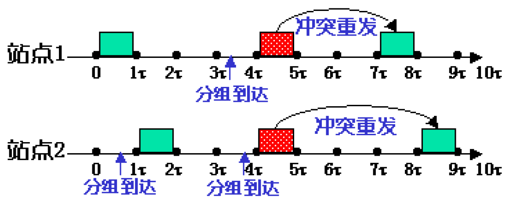

# 4.2.数据链路层

​​

我们可以把数据链路层理解成“小秘书”，网络层理解成“大BOSS”，当网络层需要数据链路层帮忙传送数据给另一个网络层时，数据链路层会把数据进行编号发送给物理层，物理层特别“傻”，容易把数据弄丢！数据丢失就回来继续找数据链路层要丢失的数据。

​​

## 封装成帧

**如何将一个比特流变成一组帧？**

‍

## 透明传输

### 字符计数

用每个帧的第一个字节作为计数，标明帧内字节数。

缺点：如果在某一个帧内，标记位后面的某个字节的数据丢失，那么会影响后面的帧  
比如`3 1 1`​和`4 2 2 2`​，如果前面的帧丢失变成`3 1`​，那么后面的4就会被补到前面变成`3 1 4`​，导致后面的全部错误。

​​

### 标记字节

用特定标记（flag）表示对帧的开始和结束。

​​

如果帧中出现与flag相同的数据，需要填充字节或比特，防止帧中出现与控制字符相同的数据。

​​

​​

字节填充和比特填充都是可行方法，实际中都有使用。成帧的长度与原始字节流内容相关，标记+填充很难定长（极端情况：原始内容都由标记flag构成，成帧长度变化明显）。

### 违规编码

因为曼彻斯特编码只使用高-低，低-高来表示，所以如果使用高-高，低-低来表示帧起始和终止就不会与数据冲突。

​​

### 以太网帧

​​

## 差错控制

**如何发现或纠正帧的传输错误？**

帧的传输过程中可能发生两种错误：帧丢失和比特错误。

### 帧丢失

为什么会发生帧

主要是因为发送方和接收方之间的速率不匹配，发送方快速发送，导致接收方不能完全接收，类似于泛洪。由此我们想到两个解决方案：

* **基于反馈的流控制**：接收方反馈后，发送方再发送（从接收方角度）
* **基于速率的流控制**：通过协议限制发送方速率（从发送方角度）

具体的解决思路分为三个阶段：

1. **确认**：接收方收到帧后，返回一个用于确认的特殊帧
2. **计时**：发送方启动计时，等待确认帧到达，否则重发帧
3. **编号**：对每个发出的帧进行编号，收发双方可以确定重发的具体帧

### 比特错误

由于噪声的存在，传输过程中比特可能会发生错误，解决的核心思想就是增加冗余信息。

* 多冗余信息：纠错码，接收方可以纠正一些传输错误
* 少冗余信息：检错码，接收方能够检测错误，并要求重传

#### 检错码

##### 奇偶校验码

增加1个校验位，只检查1位错误。

* 奇校验：帧内1的个数为奇数
* 偶校验：帧内1的个数为偶数

##### CRC

循环冗余校验码（Cyclic Redundancy Check，CRC）：增加n个校验位，检查n位错误。

​​

​​

​​

​​

## PPP协议

**点对点协议（Point to Point Protocol，PPP）** 是目前使用最广泛的数据链路层协议，**仅支持全双工**链路。

用在SONET和ADSL中：

​在PPP协议帧中，标记字节为`0x7E`​

​​

​​

如果**信息字段**和标志字段有相同比特组合时，采用**字节填充：**

* 转义字符：0x7D
* 信息字段的：0x7E→0x7D5E
* 信息字段出现转移字符：0x7D→0x7D5D

​​

PPP采用2位或4位校验码：CRC-16或CRC-32。

## 链路控制协议

点到点的流控制协议：flow control protocol：

* 非约束简单协议
* 简单的停等协议Stop-and-Wait
* 简单噪音信道协议Noisy Channel
* 滑动窗口协议Sliding Window

一些基本假设：

* 发送方A和发送方B
* A有足够的数据要发送
* 链路层之外接口完备，A和B已经编址
* 接收方存在一种等待数据到达的事件机制wait_for_event

​​

​​

​​

​​

​​

## 介质访问协议

**如果多主体利用同一个链路信道通信，如何分配？**

* 静态分配：规定哪些主体如何利用信道，质量好但利用率不高
* 动态分配：多主体通过竞争利用信道，有效但需要仔细设计

### 随机访问介质访问控制

> 所有用户都可以随机发送信息，发送时可以占用全部带宽，理论上个人使用时比静态分配信道的速度更快。

#### Pure Aloha协议

规则：如果某个主体想发送一个帧，则直接发送；如果产生冲突，冲突帧无效，之后再重传。

评价：无法做得比这个更差，但效率还真不太差

​​

​​

#### Slotted Aloha协议

将发送时间分槽(slot)，按照时间槽发送帧，降低冲突。

​​

​​

在Aloha协议中，通信站没有监听发送帧情况，我们可以从这里切入，提出了CSMA协议（Carrier Sense Multiple Access，载波监听多路访问）。

#### CSMA协议

​​

​​

​​

在CSMA协议中，只是发送帧，没有检测冲突，我们可以从这里切入，提出了CSMA/CD（CSMA with Collision Detection）协议。

#### CSMA/CD

​​

​​

在CSMA/CD协议中，冲突检测会有代价，我们可以从这里切入，提出了CSMA/CF（CSMA with Collision Free）协议。

#### CSMA/CF

​​

> **上述协议，可以直接用于无线通信吗？**
>
> **可以，但无线通信链路层有特殊问题**

​​

​​
