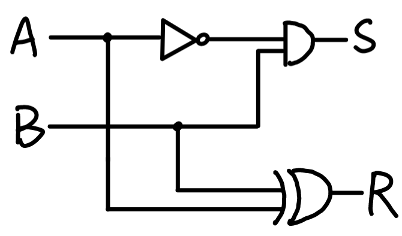
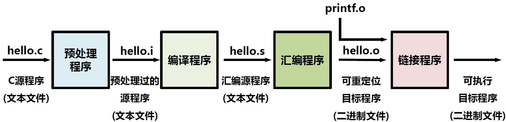
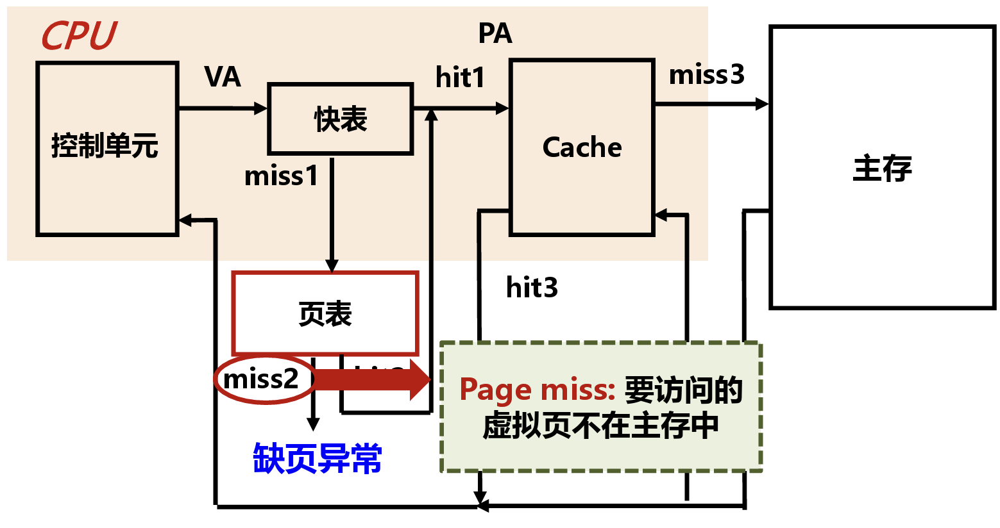

# Questions

**所有小测、期中考试、期末考试题目合集，按章节划分。**

**题目开头的T代表小测题，M代表期中考试题，F代表期末考试题，C代表自命题。**

> (T)“计算机系统”包含哪些与计算机相关的概念范畴？至少列出4条。

* 计算机组成原理
* 计算机体系结构
* 汇编语言
* 计算机接口
* 计算机网络
* 操作系统

> (T)冯·诺依曼结构（《101页报告》）的主要内容是什么？至少列出3条。

1. 采用“存储程序”的方式工作
2. 由运算器、控制器、存储器、输入设备和输出设备5个部件组成
3. 存储器可以存放指令和数据，两者形式上没有区别
4. 计算机内部以二进制形式表示指令和数据
5. 每条指令由操作码和地址码两部分组成

> (T)下图给出一个MOS管示意图，请画出利用多个MOS管组成“与门”的结构。
>
> ​​

​​

> (T)根据下列真值表，用“与门”、“或门”、“非门”、“异或门”画出逻辑结构，并尝试解释该真值表反应的运算操作，其中A和B是输入，S和R是输出。
>
> |A|B|S|R|
> | ---| ---| ---| ---|
> |0|0|0|0|
> |0|1|1|1|
> |1|0|0|1|
> |1|1|0|0|

$S=\overline{A}B$

$R=A\oplus B$

表示A减B的操作，S为借位，R为差

​​

> (T)采用16位二进制形式，写出80和-25的原码、反码和补码表示，并进行加法运算。

80原码：0000000001010000

80反码：0000000001010000

80补码：0000000001010000

-25原码：1000000000011001

-25反码：1111111111100110

-25补码：1111111111100111

> (T)下图是一个ALU结构，其中ZF是零标志，请利用N位全加器及基本门电路，画出ZF结构。
>
> ​​

​​

> (T)作为通用计算部件，ALU单元必须支持的运算类型有哪些？每种类型列举1-2个操作功能。

* 算术运算

  * 加ADD
  * 减SUB
* 逻辑运算

  * 与AND
  * 或OR
  * 或非NOR
* 比较运算

  * 小于SLT

> (T)请在图中标出存储器各接口的名称，并说明接口作用。
>
> ​​

​​

地址Addr：用来访问存储器单元

输入IN：以W位为一组，输入数据

输出OUT：以W位为一组，输出数据

位宽W：存储器单元的宽度

$\textsf{R/}\overline{\textsf{W}}$：控制存储器读/写，1是读，0是写

CLK：存储器时钟

> (T)请根据真值表，画出“2位译码器”的逻辑结构。
>
> |A1|A0|B3|B2|B1|B0|
> | ----| ----| ----| ----| ----| ----|
> |0|0|0|0|0|1|
> |0|1|0|0|1|0|
> |1|0|0|1|0|0|
> |1|1|1|0|0|0|

​​

> (T)请阐述CPU内各模块之间相连时可能存在的连接线类型。

* 控制线：连接各模块控制接口的一组连接线
* 数据线：连接各模块数据接口的一组连接线

> (TF)请阐述CPU采用时序逻辑作为总体设计框架的原因（存储器的写必须用时序逻辑的原因），至少说出2条。

* 保证多输入同步
* 有效控制数据

> (T)指令由操作码和操作数组成，请阐述操作数可能包含的种类，并简要说明。

* 立即数：指令中给出的直接用于计算的数值
* 寄存器编号：访问CPU内寄存器堆的地址
* 存储器地址：访问数据存储器的地址

> (T)请在下图中寄存器堆、ALU、存储器之间增加可能的连接线，形成基本可用的数据通路。
>
> ​​

​​

> (C)RV32I指令集包含哪些指令类型？

* 整数计算指令：移位指令、算术指令、逻辑指令、比较指令
* 控制传输指令：条件指令、跳转指令
* 存取指令：存储指令、加载指令
* 其他指令：同步指令、环境指令

> (T)这是RISC-V指令集中“小于置位”指令，请解释该指令的含义。
>
> ​`SLT	rd1, rs1, rs2`​

if rs1<rs2 : rd=1  
else : rd=0

> (TF)这是RISC-V指令集中“小于跳转”指令，请解释该指令的含义。
>
> ​`BLT	rs1, rs2, imm`​

if rs1 < rs2 : PC+=imm

> (T)这是RISC-V指令集中“立即数逻辑右移”指令，请解释该指令的含义。
>
> ​`SRLI	rd, rs1, shamt`​

shamt = imm[4:0]  
rd = rs1 >> shamt  
空位补0

> (T)这是RISC-V指令集中6指令格式的一种：R-Type格式，请阐述为何RISC-V指令集不能仅使用R-Type表示所有指令？
>
> ​​

1. **操作类型多样：**  RISC-V指令集需要支持多种操作类型，单一的R-Type无法覆盖所有操作，因为它只提供了一种基本的指令格式。
2. **操作数数量不同：**  不同的指令可能需要不同数量的操作数。R-Type无法满足所有指令的要求。
3. **效率考虑：**  在指令集设计中，需要考虑到指令的编码效率和执行效率，使用不同的指令类型和格式可以更好地满足编码和执行的效率需求。

> (T)请说明指令集（Instruction Set）和指令集体系结构（Instruction Set Architecture）的区别。

* 指令集：面向特定目标的一组计算机指令，是设计者表达软件功能需求的主要方式。
* 指令集体系结构：指令集及其抽象实现所关联的一切要素，是支撑指令集的一个抽象计算机模型。

> (T)请填写下表，根据指令表达写出指令含义。
>
> |指令功能|指令表达|指令含义|
> | ----------| ----------| ----------|
> |存储|​`sw   addr, imm`​|<br />|
> |加载|​`lw   rd, addr`​||
> |加法|​`add   rd, rs1, rs2`​||

|指令功能|指令表达|指令含义|
| ----------| ----------| ---------------|
|存储|​`sw   addr, imm`​|M[addr] = imm|
|加载|​`lw   rd, addr`​|rd = M[addr]|
|加法|​`add   rd, rs1, rs2`​|rd = rs1+rs2|

> (T)请根据下面3条指令的指令表达，采用16位指令，给出指令格式设计，若有多个，请分别画出。
>
> |指令功能|指令表达|
> | ----------| ----------|
> |存储|​`sw   addr, imm`​|
> |加载|​`lw   rd, addr`​|
> |加法|​`add   rd, rs1, rs2`​|

​​

> (T)请写出CISC和RISC的中英文全称。

CISC：复杂指令集计算机（Complex Instruction Set Computer）

RISC：精简指令集计算机（Reduced Instruction Set Computer）

> (T)请阐述ISA所覆盖的内容（内涵）有哪些？至少列出5条。

设计目标：硬件规模及面向需求的特征

设计原则：CISC或RISC或先进理念

数据表示：关键数据类型的表示方法

寄存器组：抽象模型的多类型寄存器设计

指令类型：指令的功能体系及类型

指令格式：用来转换二进制的指令编码

寻址方式：操作数的直接或间接获取方法

> (T)请在下图中PC寄存器、指令存储器之间增加连接线及必要的部件，使其能够进行指令获取。
>
> ​​

​​

> (TF)请在下图中增加连接线，给出间接寻址和寄存器间接寻址的结构，并简要说明。
>
> ​​
>
> ​​

​​

​​

> (T)写出不少于4种指令集的名字，并简要（一句话）说明这些指令集的特点。

1. **x86**：由Intel开发，CISC架构，支持广泛的软件兼容性。
2. **ARM**：主要用于移动设备，RISC架构，高效能耗比。
3. **MIPS**：主要用于嵌入式系统和网络设备，RISC架构，具有较高的代码密度和简单的指令集。
4. **RISC-V**：开源，RISC架构，支持小型嵌入式系统到大型计算机系统。

> (T)请说明存储器层次结构的设计初衷（动机）。

为了兼顾存储容量与存储时间两个因素，所以设计了具有不同特长的存储器，他们组成存储器的层次化结构。

> (TF)请解释程序的局部性原理。

* 空间局部性：被访问的某个存储单元的**邻近单元**短时间可能被访问
* 时间局部性：被访问的某个存储单元在**较短时间**内很可能再被访问

> (C)请解释Cache如何利用程序的局部性原理。

* 空间局部性的利用：访问当前主存单元时，把邻近单元内容调入
* 时间局部性的利用：当前主存单元被访问后，应保留一段时间

> (T)某程序由10000条指令组成，每条指令执行一次，其中，10条指令在取指令时没在Cache中找到。在指令执行时，该程序需要2000次主存数据访问，其中，20次没有在Cache中找到。请问：
>
> （1）执行该程序的Cache命中率是多少？
>
> （2）若Cache访问数据时间是1ns，主存访问数据时间是10ns，计算程序获取数据的平均访问时间。

（1）

命中率=1-(10+20)/(10000+2000)=99.75%

（2）

平均访问时间=1+10×(1-99.75%)=1.025ns

> (T)某存储器包含16个地址，每个地址对应2字节，所连接CPU采用2路组相联Cache，Cache行数为4，Cache行尺寸是4字节，如图所示。某程序采用顺序执行方式，存储在存储器第0-15号地址，请在图中填写，当Cache首次存满时的内容。
>
> ​​

Cache一行4个字节，1个地址2个字节，一行可以存2个地址，用1比特表示。

Cache分为2组，用1比特表示。

因此，主存地址4位=标记2位+Cache组号1位+块内地址1位。

​​

> (T)请写出下面两个算法的全程，简要说明工作原理，并说明它们的区别。
>
> （1）Cache替换的LRU算法
>
> （2）Cache替换的LFU算法

最近最少使用算法LRU：在候选行中，总是选择近期最少使用的Cache行进行替换。

最不经常使用算法LFU：在候选行中，总是选择引用次数最少的Cache行进行替换。

LRU算法强调“**近期最少**”，LFU算法强调“**次数最少**”，LFU比LRU实现复杂，LRU可以看作是“次数”为1的LFU。

> (T)请说明直接映射、全相联映射和组相联映射各自的优缺点。

​​

> (TM)请绘制六管结构。

​​

> (T)决定CPU频率的最主要因素是什么？

最大组合逻辑延迟决定CPU频率的上限。

> (TF)请说明五级流水线各部分的名称及简要功能，并画图表示。

* IF取指令：从存储器取指令
* ID指令译码：产生指令执行的控制信号及操作数
* EX执行：执行部件根据指令完成运算
* MEM访存：从存储器中读取或写入数据
* WB写回：将运算结果写回寄存器

​​

> (T)请结合下图说明流水线的结构冒险。
>
> ​​

​​

> (T)请说明CPU中MMU（存储管理单元）包含哪几个功能。

* 高速缓存Cache
* 虚拟存储管理Virtual Memory Management
* 存储特权管理Privileged Memory Management

> (T)请说明虚拟地址空间的作用。

让程序不受物理主存制约，让多程序共享主存。

> (T)在下图中，完成虚拟地址向物理地址转换的过程（标注连线即可）。
>
> ​​

​​

> (TF)请在如下流程图中填写各模块的名称。
>
> ​​

​​

> (T)G=(V, Σ, R, S)是一个上下文无关文法，其中，V是一个非终结符号的有限集合，Σ是一个终结符号的有限集合，请说明R的构成及表达。

R：从V到(V∪Σ)*的关系，构成文法**规则**

> (T)如下是一个简单的上下文无关文法，请写出该文法对应的语法树，注意，不要对该树结构进行优化。
>
> ​​

以生成字符串`aab`​为例：

```
        S
       / 
      A  
     / \
    a   S
       / 
      A  
     / \
    a   S
       / 
      B  
     / 
    b   
```

> (T)请将如下三地址码表达转换为四元式表达。
>
> ​​

​​

> (T)请绘制如下程序的控制流图。
>
> ```
> (1) c=a+b
> (2) d=a*c
> (3) i=1
> (4) c=c*2
> (5) if c>d:
> (6)    g=a*c
> (7) else:
> (8)    g=d*d
> (9) i=i+1
> (10) if i>10:
> (11)    goto(4)
> ```

​​

> (TF)如下表达式的逆波兰式等价表达是什么？请说明相比该表达式，逆波兰式的作用是什么？
>
> ​`A+B*(C+D)-E/(C-D)`​

​`ABCD+*+ECD-/-`​

逆波兰式将运算符置于其运算对象之后，操作数在前，运算符在后，无需括号指示运算顺序。

> (T)请阐述编译前端和编译后端都包含哪些主要功能。

* 编译前端：词法分析、语法分析、语义分析、中间代码生成。
* 编译后端：代码优化、目标代码生成

> (T)请列出IA-32汇编中所有寄存器的名称，含16位和8位寄存器，填写在下表中。
>
> ​​

​​

‍

> (TF)请阐述在ELF（Executable Linkable Format）格式中，如下节的作用。
>
> .text  
> .rodata  
> .data  
> .bss  
> .symtab  
> .rel.text  
> .rel.data  
> .debug  
> .line  
> .strtab

.text：程序的机器代码

.rodata：只读数据

.data：初始化的全局变量

.bss：未初始化的全局变量，不占用实际空间

.symtab：符号表。存放程序中定义和引用的函数和全局变量信息

.rel.text：.text节中位置的列表

.rel.data：被模块引用或定义的全局变量的重定位信息

.debug：调试符号表

.line：行号

.strtab：一个字符串表，包含节头部中的节名字等

> (T)请写出如下2段代码链接后，生成的代码样式（采用源文件方式描述）。
>
> ```C
> int x=3;
> int y=4;
> int z;
> int foo(int a){...};
> int bar(int b);
> ```
>
> ```C
> extern int x;
> static int y;
> int z;
> int foo(int a);
> int bar(int b){...};
> ```

```c
int x = 3;       // 在第一段中定义，并在第二段中以 extern 声明
static int y = 4; // 在第二段中重新定义为 static
int z;            // 在两个段中都声明，无需重新定义

int foo(int a) { ... } // 在第一段中定义，在第二段中声明
int bar(int b) { ... } // 在第二段中定义，在第一段中声明
```

> (T)这里给出一个C语言swap()函数的源代码及对应IA-32汇编代码，请补充下划线位置的汇编代码。
>
> ```C
> void swap(int *xp,int *yp){
> 	int t0=*xp;
> 	int t1=*yp;
> 	*xp=t1;
> 	*yp=t0;
> }
> ```
>
> ```x86asm
> swap:
> 	pushl %ebp
> 	__________
> 	pushl %ebx
> 	movl 8(%ebp),%edx
> 	__________
> 	movl (%edx),%ebx
> 	movl (%ecx),%eax
> 	movl %eax,(%edx)
> 	movl %ebx,(%ecx)
> 	popl %ebx
> 	__________
> 	ret
> ```

```x86asm
swap:
	pushl %ebp
	movl %esp,%ebp
	pushl %ebx
	movl 8(%ebp),%edx
	movl 12(%ebp),%ecx
	movl (%edx),%ebx
	movl (%ecx),%eax
	movl %eax,(%edx)
	movl %ebx,(%ecx)
	popl %ebx
	popl %ebp
	ret
```

> (T)参考上个题目源代码和汇编代码，完善swap()函数对应x86-64汇编代码，注意：参数采用寄存器方式传递。
>
> ```C
> void swap(int *xp,int *yp){
> 	int t0=*xp;
> 	int t1=*yp;
> 	*xp=t1;
> 	*yp=t0;
> }
> ```
>
> ```x86asm
> swap:
> 	pushq %rbp
> 	__________
> 	movl (%rdi),%edx
> 	movl (%rsi),%eax
> 	movl %eax,(%rdi)
> 	__________
> 	__________
> 	ret
> ```

```x86asm
swap:
	pushq %rbp
	movq %rsp,%rbp
	movl (%rdi),%edx
	movl (%rsi),%eax
	movl %eax,(%rdi)
	movl %edx,(%rsi)
	popq %rbp
	ret
```

> (T)请详细说明`leal -8(%ebp,%ecx,2),%eax`​汇编代码的含义。

%eax=%ebp+%ecx*2-8

> (M)翻译各模块的英文名称，并写出功能
>
> ​​

‍

> (M)使用与门、或门、非门组成半加器（A+B=S+C），不考虑前进位

‍

> (M)标出下图中具有9种功能的32位ALU的必要输入输出，并标出线路位数
>
> ​​

‍

> (TMF)标出下图中三个空白矩形块的功能，补全访存过程。标明“3次缺失”发生的位置。
>
> ​​

​​

​​

​​

​​

> (M)考虑立即数（imm），写出不少于4个类似`XOR   rd, rs1, rs2`​的逻辑指令。

‍

> (M)简述不少于3种Cache替换算法，并写出它们的区别。

‍

> (M)主存容量为4GB，按字节编址，用64M×8位的DRAM芯片组成512MB 64位并行的内存条。
>
> （1）一个内存条需要多少个DRAM芯片？
>
> （2）一个容量为2GB的主存需要多少个内存条？
>
> （3）主存地址多少位？哪几位表示DRAM芯片内地址？哪几位表示内存条中DRAM芯片地址？

（1）512MB/64MB=8个

（2）2GB/512MB=4个

（3）因为按字节编址，主存地址应该有32位：A<sub>31</sub>A<sub>30</sub>……A<sub>1</sub>A<sub>0</sub>，因为采用交叉编址，A<sub>28</sub>...A<sub>3</sub>用于表示片内地址，A<sub>2</sub>A<sub>1</sub>A<sub>0</sub>用于表示DRAM芯片地址。

> (M)写出RAID4和RAID5的区别。

‍

> (C)画图表示RAID3、RAID4、RAID5、RAID6。

RAID3采用**奇偶校验法**生成单个冗余盘，采用**小条带交叉编址**方式，数据传输率较高，主要用于大数据应用，如多媒体和大数据科学计算等。

​​

RAID4与RAID3类似，采用**奇偶校验法**生成单个冗余盘，采用**大数据块交叉编址**，每个磁盘独立操作，I/O可并行，适用于I/O较大需求的情况，如银行、证券等。

​​

RAID5类似RAID4，将奇偶校验块分布在各磁盘中，采用**大数据块交叉编址**，I/O请求的响应速度快，成本不高但效率高，因而被广泛使用于服务器中。

​​

RAID6与RAID5类似，采用**双维块奇偶校验**，容许双盘出错，由于引入了两个奇偶校验值，控制器设计复杂，写入速度降低，以写时间及容量为代价保证高可靠性。

​​

> (M)某存储器包含16个地址，每个地址对应2字节，所连接CPU采用2路组相联Cache，Cache行数为4，Cache行尺寸是4字节，如图所示。某程序执行①到⑩指令，请在图中填写，当程序执行完第⑩步时Cache中的内容。
>
> ​​

‍

> (F)使用1位半加器和1位全加器组成4位加法器。

​​

> (TF)为什么Cache采用纯硬件的方式实现？

* **减少软件开销**：Cache管理无需指令控制，减少CPU负担。
* **对指令透明**
* **并行处理**：硬件Cache可以与CPU并行工作，不需要CPU参与其内部操作的管理。

> (F)请分别谈谈在早期和当代将指令存储器和数据存储器合并的优势与不足。

冯·诺依曼结构中，指令存储器和数据存储器被合并在一起，而哈佛结构中指令存储器和数据存储器是两个独立的存储器。

哈佛结构使得指令和数据可以并行读取，大大提高了数据吞吐率，缺点是结构复杂。而冯·诺依曼结构中指令和数据是混合存储的，结构简单，成本低。

早期通用CPU难以采用复杂的哈佛结构，早期的X86能迅速占有市场，一条很重要的原因，正是依靠冯·诺依曼这种实现简单，成本低的结构。

现在的处理器，依托Cache的存在，已经很好的将二者统一起来了。现在的处理器虽然外部总线上看是冯·诺依曼结构的，但是由于内部Cache的存在，实际上已经类似改进型哈佛结构的了。

> (F)补全图中缺少的物理通路。
>
> ​​

​​

> (F)假设32位指令采用以下格式：
>
> |OPCODE|SR|DR|IMM|
> | --------| ----| ----| -----|
>
> 如果有64个操作码和56个寄存器，则立即数可以表示的值的范围是多少？假设IMM是2的补码值。

操作码有64个，则需要6比特才能表示完整。寄存器有56个，也需要6bit才能表示完整。则立即数可用位数为：32 - 6 - 6 - 6 = 14位，表示范围为-2<sup>13</sup>~2<sup>13</sup>-1

> (F)画出DRAM结构，写出它的优缺点。

​​

DRAM的优点是元件少、功耗小、集成度高，缺点是速度慢、需定时刷新。

> (F)为什么PCIe总线比PCI总线更快？

* 将共享总线改为Crossbar交换方式
* 将并行链路通道改为高速串行链路通道
* 让同步数据收发模式改为异步队列模式

> （F)画图说明多模块存储器的连续编址。

​​

访问地址按顺序分配给一个模块后，接着又按顺序为下一个模块分配访问地址。在某个模块进行存取时，其他模块不工作；当某个模块出现故障时，其他模块照常工作；但模块的串行工作限制了存储器的带宽。

> (F)写出FILE结构体定义代码。

```C
typedef struct _iobuf{
	int  cnt ;     // 剩余未读写字节数
	char *ptr ;    // 下一个读写位置
	char *base;    // 缓冲区起始地址
	int  flag;     // 文件访问模式
	int  fd;       // 文件描述符
} FILE;
```

> (T)写出`if (a >= 3 + 40 * (12 -1))`​经过词法分析后得到的符号表。

​​

> （F)在图中标出进程地址空间的各部分名称。​

​​

> (F)在图中标出Linux进程虚拟内存的段，以及①②③代表的缺页异常处理步骤。​

​​

> (C)系统总线包含哪些部分？

* 地址线：CPU通过地址线发送地址信息，访问设备。
* 数据线：数据的读取、写入和交换。
* 控制线：在计算机的各个组件之间传递控制和命令信息。
* 中断线：传递中断请求。
* 中断响应线：传输中断响应信号。
* 总线仲裁线：仲裁各设备使用总线的权限，确保设备按照优先级或时间片获得总线访问权。

> (C)填写下表
>
> |命令|含义|
> | ---------------| ------|
> |#define||
> |#undef||
> |#if||
> |#ifdef||
> |#ifndef||
> |#elif||
> |#else||
> |#endif||
> |#defined||
> |#include||
> |#include_next||
> |#line||
> |#||
> |##||
> |#pragma||
> |#warning||
> |#error||

|命令|含义|
| ---------------| ---------------------------------------------------------|
|#define|定义一个预处理宏|
|#undef|取消宏的定义|
|#if|编译预处理中的条件命令，相当于C中的if语句|
|#ifdef|判断某个宏是否被定义，若已定义，执行随后的语句|
|#ifndef|与#ifdef相反，判断某个宏是否未被定义|
|#elif|若条件不满足，则执行#elif后面的语句，相当于C中的else-if|
|#else|若条件不满足，则执行#else后面的语句，相当于C中的else|
|#endif|#if，#ifdef，#ifndef这些命令的结束标志|
|#defined|与#if, #elif配合使用，判断某个宏是否被定义|
|#include|包含文件命令|
|#include_next|与#include相似，但它区分`<file>`​和`"file"`​这两种方式的引入|
|#line|标志该语句所在的行号|
|#|将宏参数替代为以参数值为内容的字符串常量|
|##|将两个相邻的标记(token)连接为一个单独的标记|
|#pragma|说明编译器信息|
|#warning|显示编译警告信息|
|#error|显示编译错误信息|

> (C)计算`11010100`​的海明校验码。

校验码位数k需满足$2^k≥1+n+k$，因此k=4。

列表：

|索引号|12|11|10|9|8|7|6|5|4|3|2|1|
| :------: | :--: | ----| ----| ----| ----| ----| ----| ----| ----| ----| ----| :--: |
|数据|M8|M7|M6|M5|P4|M4|M3|M2|P3|M1|P2|P1|

P4 = M5⊕M6⊕M7⊕M8 = 1  
P3 = M2⊕M3⊕M4⊕M8 = 0  
P2 = M1⊕M3⊕M4⊕M6⊕M7 = 0  
P1 = M1⊕M2⊕M4⊕M5⊕M7 = 0

得到海明校验码：110110100000

> (C)写出下列IA-32的寻址方式：
>
> * 立即寻址
> * 寄存器寻址
> * 位移
> * 基址寻址
> * 基址加位移
> * 比例变址加位移
> * 基址加变址加位移
> * 基址加比例变址加位移
> * 相对寻址

​​

> (C)请对下面的代码进行优化。上半部分为初始化逻辑，下半部分为循环逻辑。
>
> ​​

‍

> (C)补全下面的Intel Core i7处理器封装图。
>
> ​​

​​

> (C)对于结构体`cont_info`​，若变量`x`​分配在地址0x8049200开始的区域，请写出变量`x`​中各元素的地址。
>
> ```C
> struct cont_info{
> 	char id[8];
> 	char name[12];
> 	unsigned post;
> 	char address[100];
> 	char phone[20];
> };
> struct cont_info x = {"0000000", "ZhangS", 210022, "273 long street, High Building #3015", "12345678"};
> ```

```C
&(x.id)=0x8049200;
&(x.name)=0x8049200+8=0x8049208;
&(x.post)=0x8049200+8+12=0x8049214;
&(x.address)=0x8049200+8+12+4=0x8049214;
&(x.phone)=0x8049200+8+12+4+100=0x804927C;
```

> (C)什么是计算机网络？

一组通过单一技术相互连接的自主计算机集合。

> (C)写出OSI七层网络模型，包括其英文名。

1. 应用层（Application Layer）
2. 表示层（Presentation Layer）
3. 会话层（Session Layer）
4. 传输层（Transport Layer）
5. 网络层（Network Layer）
6. 数据链路层（Data Link Layer)
7. 物理层（Physical Layer）

> (C)写出五层网络模型，包括其英文名。

1. 应用层（Application Layer）
2. 传输层（Transport Layer）
3. 网络层（Network Layer）
4. 数据链路层（Data Link Layer)
5. 物理层（Physical Layer）

> (C)A和B之间交互信息分成哪些步骤（如何组网）？

1. 交换一个比特0或1（物理层）
2. 交换一组比特0或1，形成一个网络包（数据链路层）
3. 对于网络包，在多主体之间进行路由（网络层）
4. 建立某种检查机制，确保网络包达到（传输层）
5. 用户应用产生数据，将数据分拆为多个网络包（应用层）

‍
