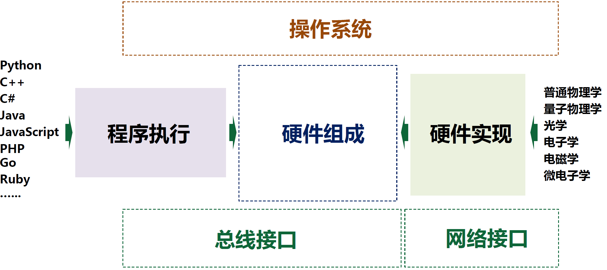
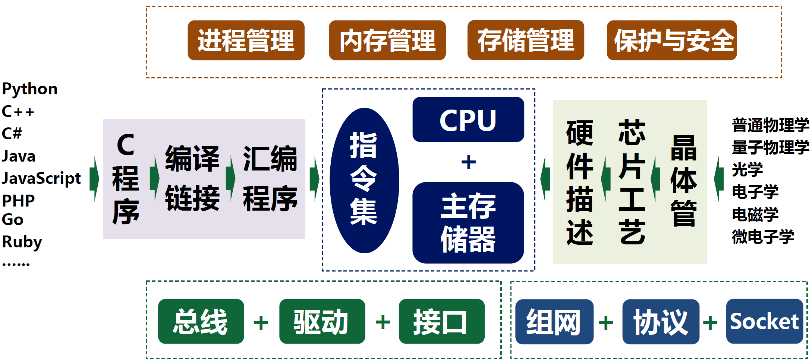
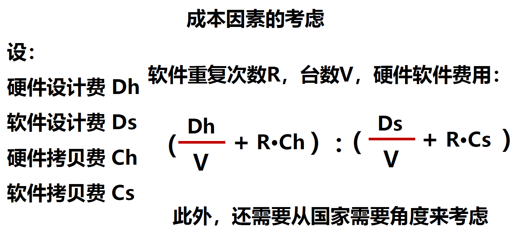

# 0.引言

​

​

* 计算机组成：Computer Organization

  * 计算机系统结构的逻辑实现
* 计算机体系结构：Computer Architecture

  * 计算机系统在软硬件功能分配及软硬件界面的确定
* 计算机系统实现：Computer Implementation

  * 计算机软件的执行过程及硬件的物理实现

### 冯·诺依曼结构

1. 采用“**存储程序**”的方式工作
2. 由**运算器、控制器、存储器、输入设备和输出设备**5个部件组成
3. 存储器可以存放**数据**和**指令**，两者形式上没有区别
4. 计算机内部以**二进制**形式表示指令和数据
5. 每条指令由**操作码**和**地址码**两部分组成

### 计算机系统设计

计算机系统是性能和价格两方面折中的结果。

理论上有两种极端的实现方法：

* 全硬件系统：全部功能硬件实现，不用软件
* 全软件系统：硬件提供海量1位加法和分支操作，其他用软件实现

关键问题：性能与价格的关系，软硬件实现在功能上等效

计算机系统设计者的主要任务是**确定软硬件的分界**。

软件与硬件实现的特点：

* 硬件实现：速度快、成本高、灵活性差、占用内存少
* 软件实现：速度低、复制成本低、灵活性好、占用内存多

发展趋势：硬件实现比例越来越高，因为软件成本升高。

​

基本设计原则：

* 原则1：加快经常性事件的执行速度

  * 硬件化常用功能、优化指令集
* 原则2：让尽可能多的部件协调运行

  * 增加缓存，让数据离执行单元更近、改进编译效果
* 原则3：系统尽量在软件上做到兼容

  * 统一程序语言、统一指令集、同系列向前兼容

‍