# 1.2.2.高速缓存Cache

## 程序的局部性原理

大量分析表明，程序对主存储器的访问存在局部性特征。在较短时间内，产生的地址往往集中一个很小的存储器范围。

* 空间局部性：被访问的存储单元的**邻近单元**短时间可能被访问
* 时间局部性：被访问的存储单元在**较短时间**内很可能再被访问

​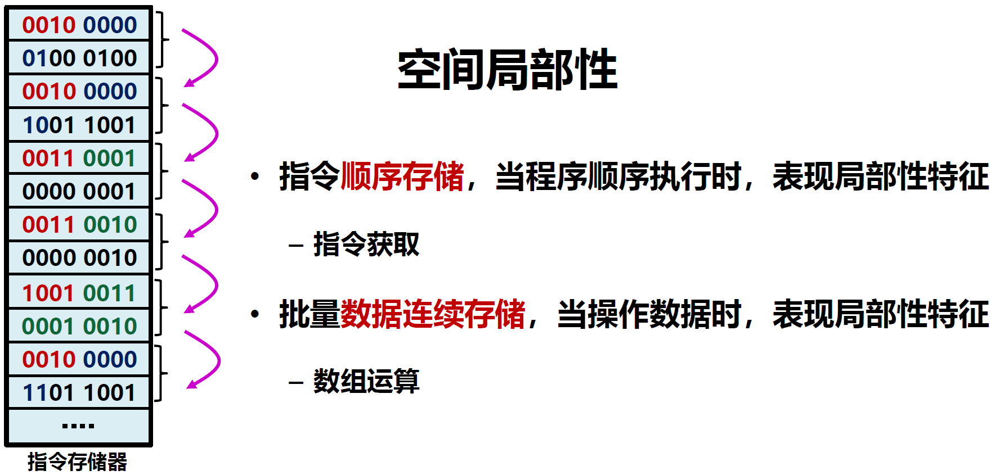​

​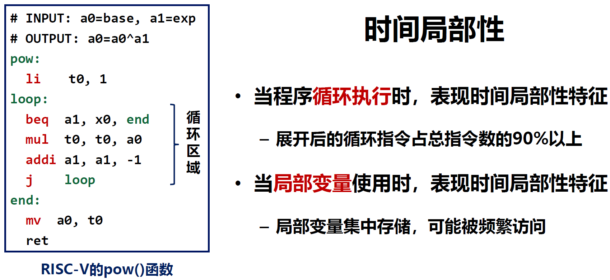​

局部性原理的利用：

* 空间局部性利用：访问当前主存单元时，**把邻近单元内容调入**，期待稍后被访问
* 时间局部性利用：当前主存单元被访问后，**应保留一段时间**，期待稍后被访问

以矩阵求和的两种不同思路为例，当按行累加时，访问顺序与存储顺序一致，空间局部性特征明显；当按列累加时，访问顺序与存储顺序不一致、有跳跃，空间局部性特征不明显。如果发挥缓存局部性，则按行比按列运行速度更快。

​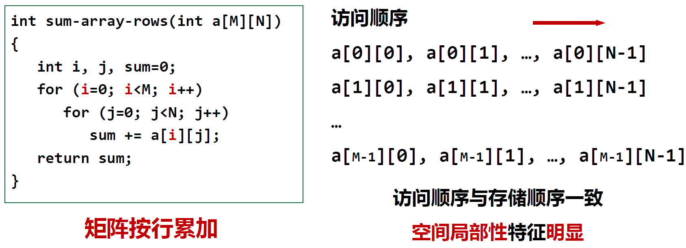​

​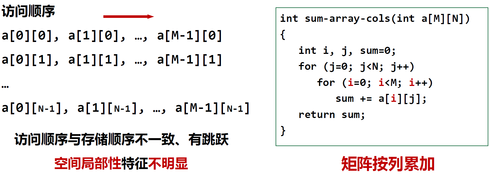​

## 高速缓存Cache

​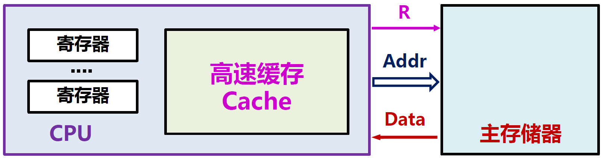​

高速缓存Cache是一种用于提高主存储器访问速度的硬件结构，一般在CPU内部，以**缓冲存储**为原理进行设计。

Cache利用了程序的局部性原理：

* 用CPU内部额外存储空间，通过缓存**缩短平均访存时间**
* Cache是**纯硬件设计**，不需要指令控制，对指令透明
* Cache通过较宽的数据线，获取并缓存超额数据
* Cache效果与空间或时间局部性特征直接相关

**如果只是一读一取，Cache为什么能够缓冲存储呢？**

因为Cache采取了以并行增吞吐、以空间换时间的策略，增加主存储器返回数据的带宽，一个地址返回一批（邻近）数据。

​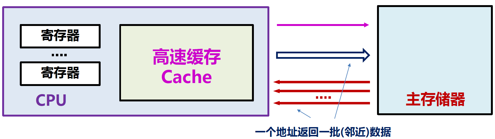​

### 工作原理

​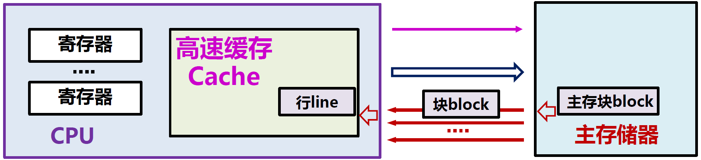​

* 块（block）：Cache与主存交换数据的大小
* 行（line）：Cache中存放一个块的区域

​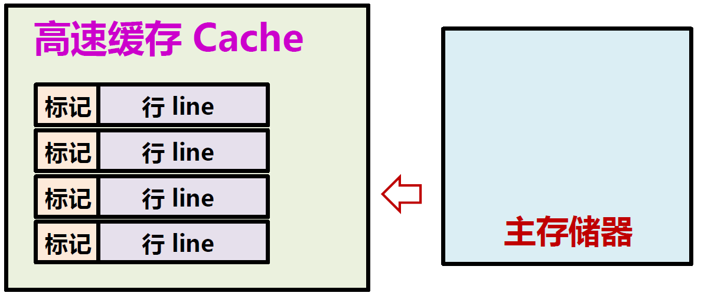​

* 标记：包含一个有效位，表明行内数据是否有效，上电时所有行均无效
* 冲刷：当某行有效位被置无效时，整行数据淘汰（作废），加载块后置有效

​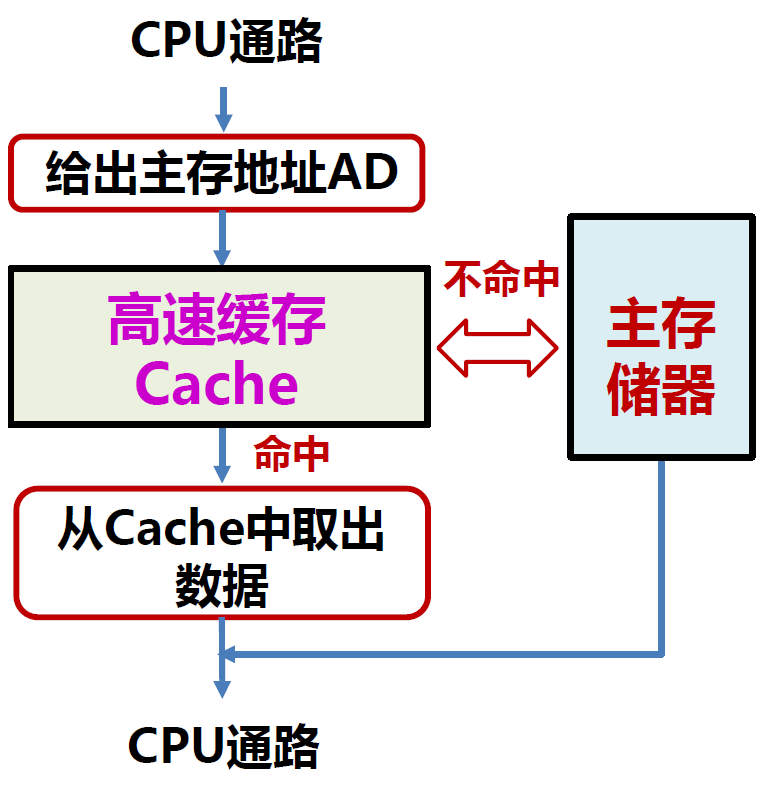​

* 命中率$p$​：CPU访问单元所在的主存块在Cache中的概率，即Cache命中概率
* 缺失率：未命中次数与访问总次数的比值
* 命中时间$T_c$：从Cache获得数据的时间
* 主存访问时间$T_m$：从主存获得数据的时间
* 平均访问时间为：$T_a= p \times T_c + (1-p) \times (T_m+T_c) = T_c+ (1-p) \times T_m$

> 某程序由3000条指令组成，每条指令执行一次，其中，4条指令在取指令时没在cache中找到。在指令执行时，该程序需要1000次主存数据访问，其中，6次没有在cache中找到。请问：
>
> （1）执行该程序的cache命中率是多少？
>
> 缺失率：(4+6)/(3000+1000) = 0.25% 命中率：99.75%
>
> （2）若从cache中获得数据时间是1ns，从主存获取数据时间是10ns，计算该程序执行时，“cache-主存”存储层次的平均访问时间。
>
> 平均访问时间：1ns + (1-99.75%) ╳ 10ns = 1.025 ns

​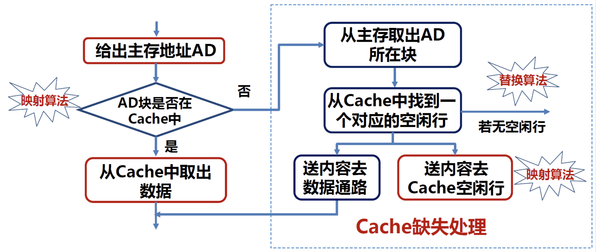​

在Cache工作过程中有两个重要两个算法：

* 映射算法：如何将主存地址与Cache所在行进行映射
* 替换算法：当Cache装满时，如何选择空闲行接收新数据

### 映射算法

Cache全硬件执行，CPU不可见，即**不存在Cache地址**。因此，主存块与Cache行之间需要一个映射规则：

* 查找：当访问某个主存单元时，可依据映射规则找到Cache对应行
* 写入：当主存块写入Cache时，根据映射规则写入Cache对应行

三种映射方法：

* 直接映射Direct：每个主存块映射到Cache的固定行中
* 全相联映射Full Associate：每个主存块映射到Cache的任意行中
* 组相联映射Set Associate：每个主存块映射到Cache固定组的任意行中

#### 直接映射

把主存的每一块映射到固定的一个Cache行，也称模映射。

​`Cache行号 = 主存块号 mod Cache行数`​

假设Cache共有16行，那么主存第100块应该映射到Cache第4行中。

​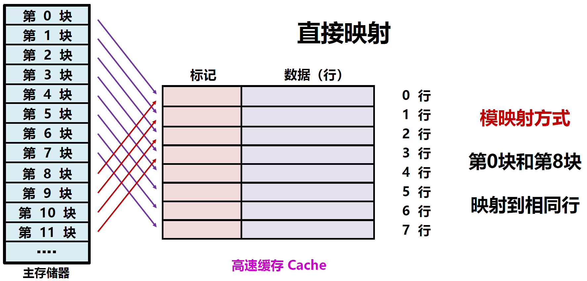​

​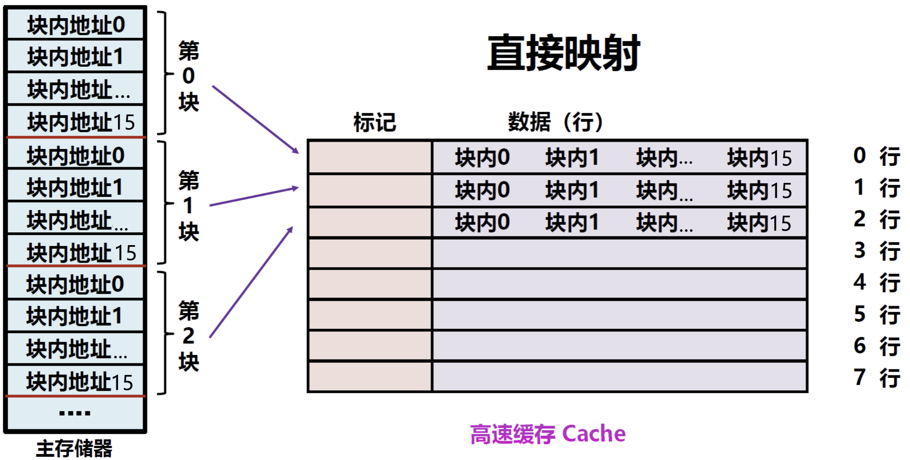​

由此我们可以发现两个神奇的事，首先，如果一个主存块的大小是16B，那么可以使用4比特表示第n(n=0...15)个字节，这4比特就叫块内地址，如果一个主存大小为4KB，那么一共有4KB/16B=256个块，可以用8比特表示第n个块(n=0...255)，这8比特就叫主存块号；其次，如果Cache有8行，那么使用3比特就可以表示第n行(n=0...7)，这3比特就叫行号。

那么结合直接映射的规则，我们就可以使用这8比特主存块号的后3比特作为Cache行号，前5比特作为Cache标记。然后Cache每行的数据部分存储一个主存块的镜像。

​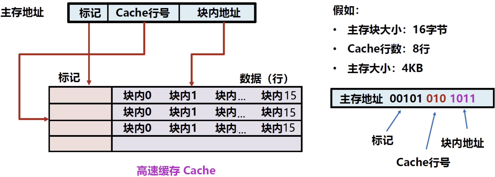​

​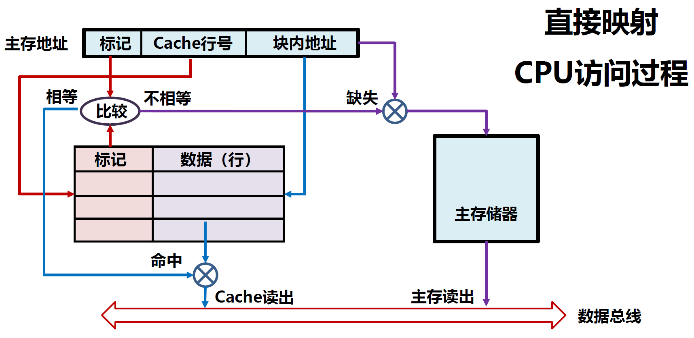​

* 标记：用来记录主存的高地址部分，与Cache行号一起表示主存地址
* Cache行号：直接映射的对应
* 块内地址：主存的低地址部分，在Cache行内查找具体地址对应内容

#### 全相联映射

把主存的每一块映射到任意一个Cache行，Cache标记用于指出该行取自主存的哪个块。与直接映射相比，缓存最灵活，但查找代价也最大。

​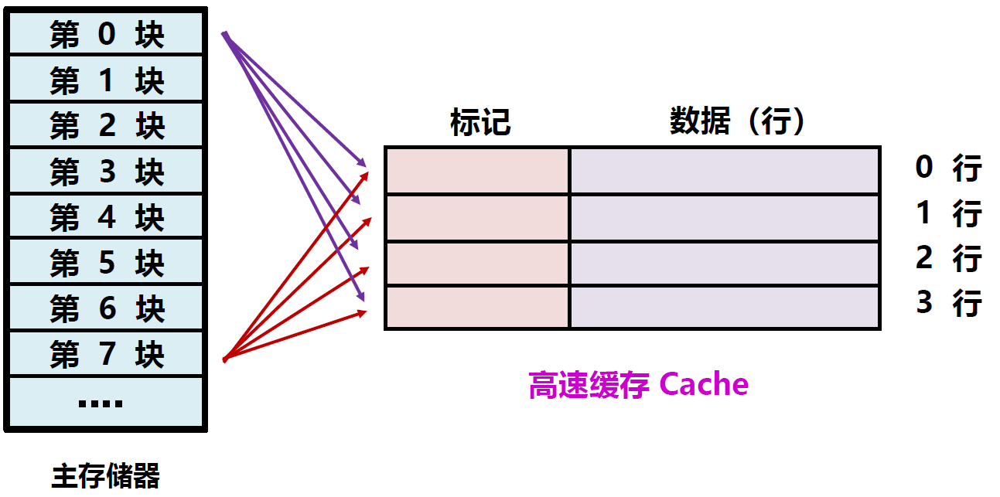​

​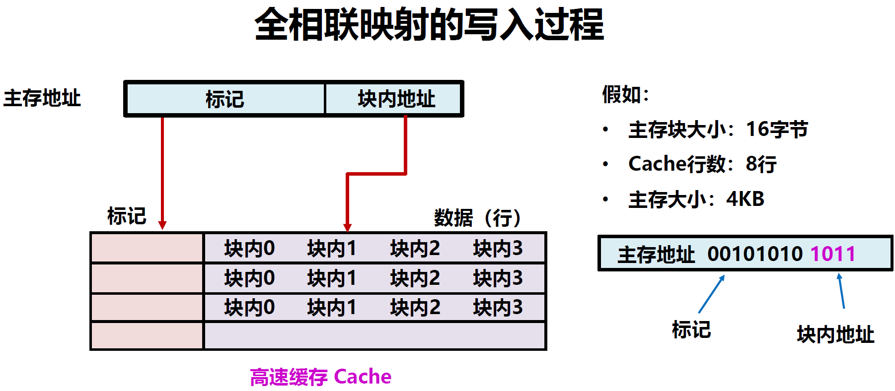​

​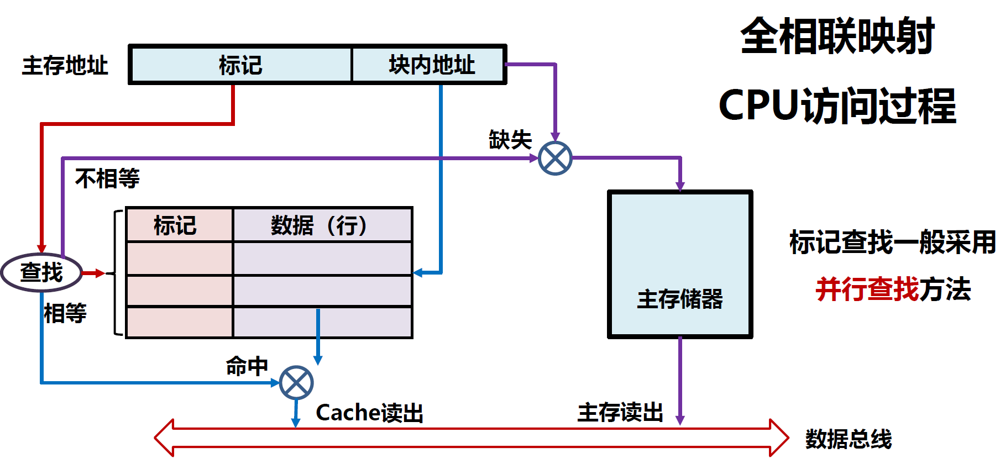​

#### 组相联映射

将Cache分成大小相等的组，每组包含一定数量行数。

* 组间直接映射：每个主存块地址采用直接映射方式到每个分组
* 组内全相联映射：在每个Cache分组内，采用全相联方式组织

直接映射与全相联映射的优缺点正好相反，组相联将两者结合。

​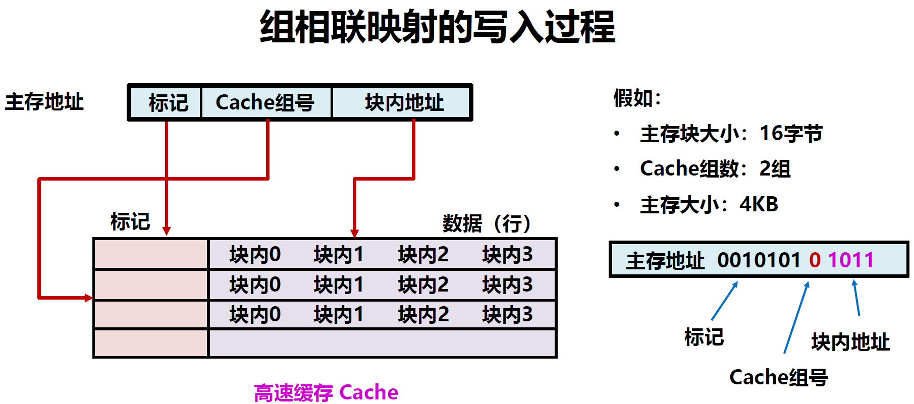​

​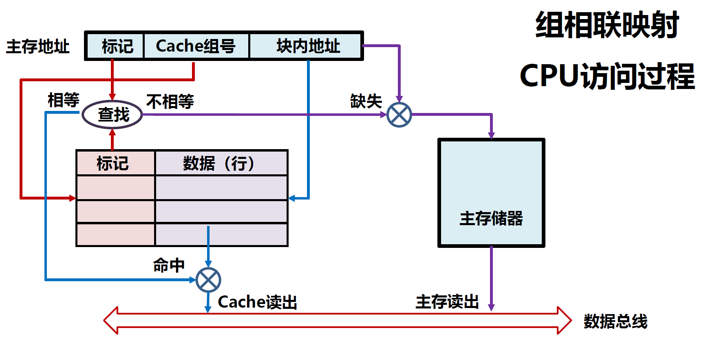​

​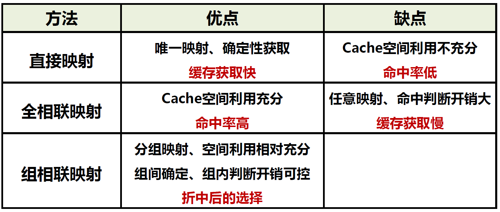​

### 替换算法

当Cache被占满时，新的主存块访问及映射需要淘汰旧的Cache行，因此，Cache需要一个替换算法，选择最应该被替换的Cache行。

4种常用的替换算法：

* 先进先出算法（First In First Out，FIFO）
* 最近最少使用算法（Least Recently Used，LRU）
* 最不经常使用算法（Least Frequently Used，LFU）
* 随机替换算法（Random）

#### 先进先出算法FIFO

设计思想：Cache是个大缓存队列，早入早出，简单公平。

主要思路：在候选行中，总是选择最早装入Cache的Cache行。

缺点：FIFO算法很难反映程序的访问局部性，缺失率较大。

​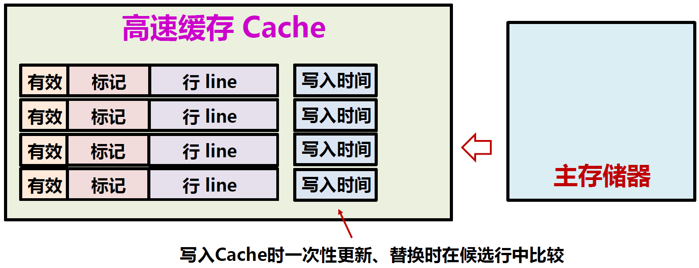​

#### 最近最少使用算法LRU

设计思想：Cache应该反映局部性原理，当前最少使用意味着将来最少使用，淘汰未来最少使用的行将带来更大受益。

主要思路：在候选行中，总是选择近期最少使用的Cache行进行替换。

缺点：LRU算法需要表达“**近期最少**”逻辑，实现复杂。

​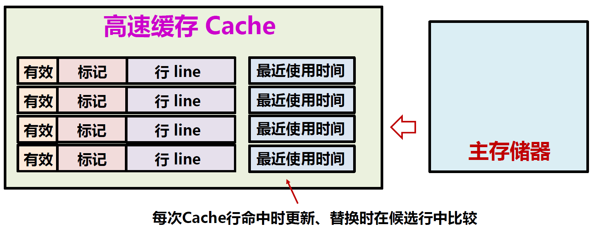​

#### 最不经常使用算法LFU

设计思想：Cache应该反映局部性原理，引用次数最少意味着缺少局部性特征，淘汰被引用次数最少的将带来更大受益。

主要思路：在候选行中，总是选择引用次数最少的Cache行进行替换。

缺点：LFU算法需要表达“**次数最少**”逻辑，实现复杂。

​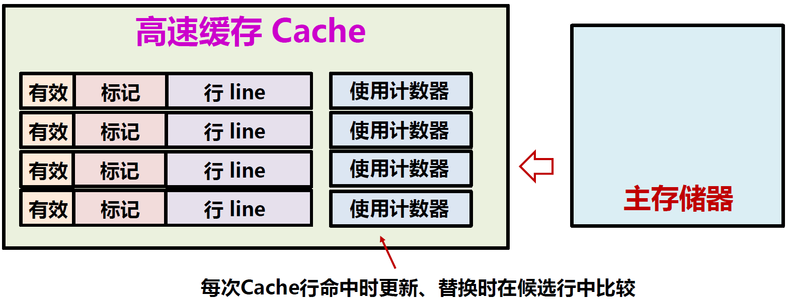​

#### 随机替换算法Random

设计思想：Cache实现的简单很重要，随机替换不增加复杂度。

主要思路：在候选行中，随机选择一个Cache行进行替换。

缺点：随机算法未直接反映程序的局部性原理。

然而，随机替换算法在性能上仅次于LRU和LFU。

​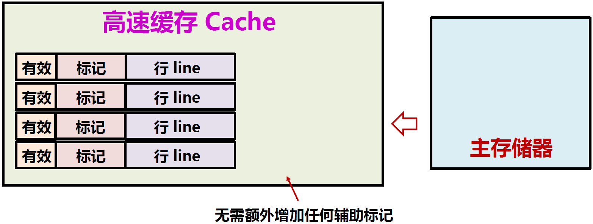​

在实际系统中，**LRU算法最常用**，Cache效果是最优先指标。

替换算法与映射方法不矛盾，替换在候选Cache行中产生。

Cache替换算法广泛应用在“缓存逻辑”使用的场景。

在系统使用中，Cache替换是常态，随时发生，Cache空闲是偶发。

### 多级Cache

​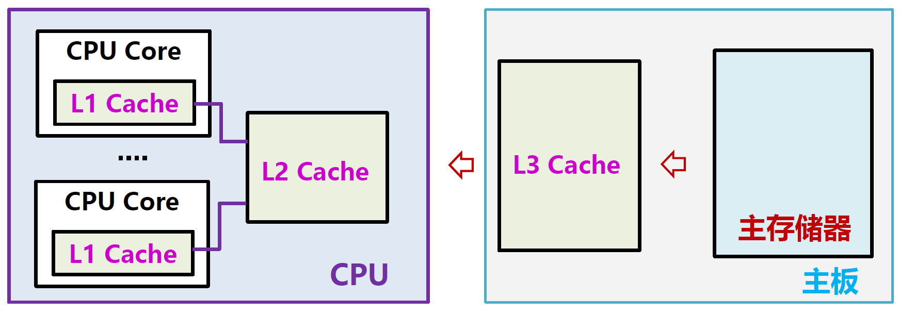​

‍
