# 1.2.4.辅助存储器Auxiliary Memory

## 辅助存储器

**辅助存储器（Auxiliary Memory）** 是系统运行时，与主存储器交换信息的存储器，不与CPU直接进行信息交换，属于外部存储器。

辅助存储器采用非易失性型存储器，掉电信息不丢失，包括磁表面存储器、光存储器、半导体存储器等。

## 磁盘存储器

磁盘存储器由磁记录介质、磁盘驱动器、磁盘控制器组成。

​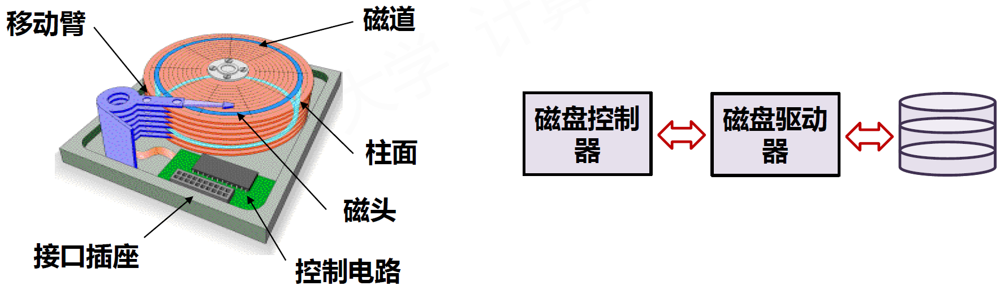​

* 盘片：每个盘片两面各有一个磁头
* 磁头号：表示盘片的盘面编号
* 磁道：磁头和盘片相对运动的圆轨迹
* 柱面：多个盘面的相同磁道形成的结构
* 磁道号：表示柱面编号，即柱面号
* 扇区：磁道分成的区域，基本读写单位
* 盘地址：柱面号/磁道号、磁头号、扇区号
* 磁盘地址寄存器：存储读写的盘地址

### 读写过程

1. 寻道

    1. 根据柱面号移动磁头到磁道
    2. 选择对应磁头号准备读写
2. 旋转等待

    1. 旋转盘片，扇区计数器清零，维护计数器
    2. 比较计数器与地址中的扇区号，发送符合信号
3. 读写

    1. 控制器驱动电路批量读写数据

​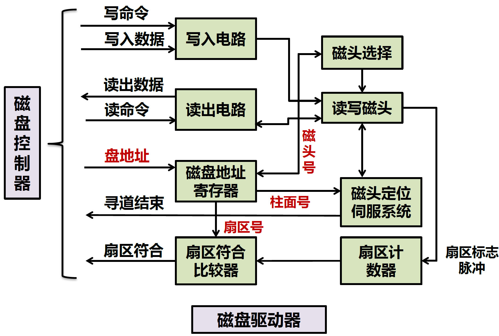​

### **控制过程**

1. CPU对磁盘控制器进行初始化

    1. 读命令、磁盘逻辑块号、主存起始地址、数据块大小  
        ​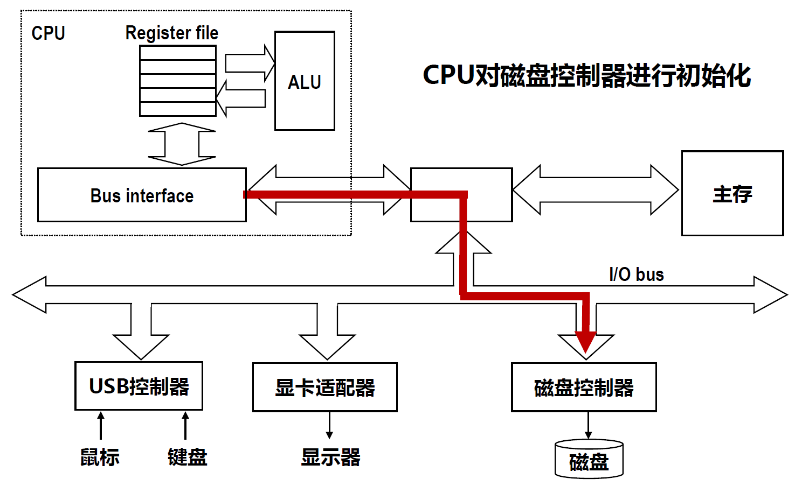​
2. 磁盘控制器读取相应扇区

    1. 采用DMA（Direct Memory Access，直接存储器读取）方式把数据送到主存  
        ​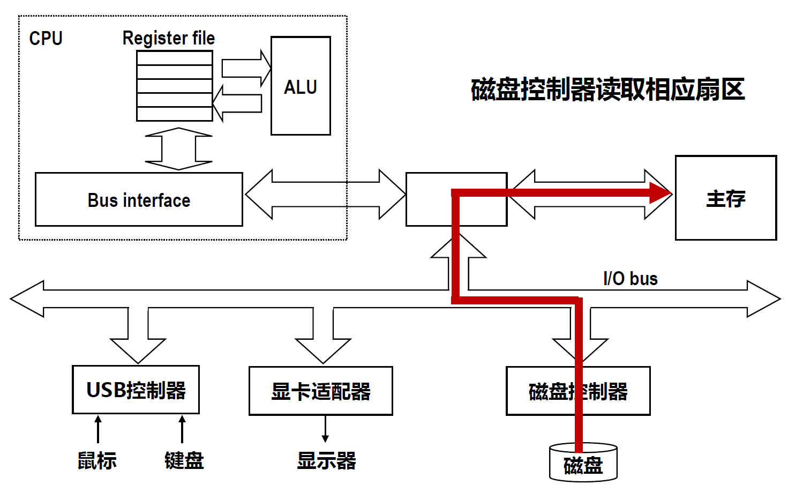​
3. 当DMA传送结束，磁盘控制器向CPU发出“DMA结束中断请求”，CPU收到中断后进行后续处理  
    ​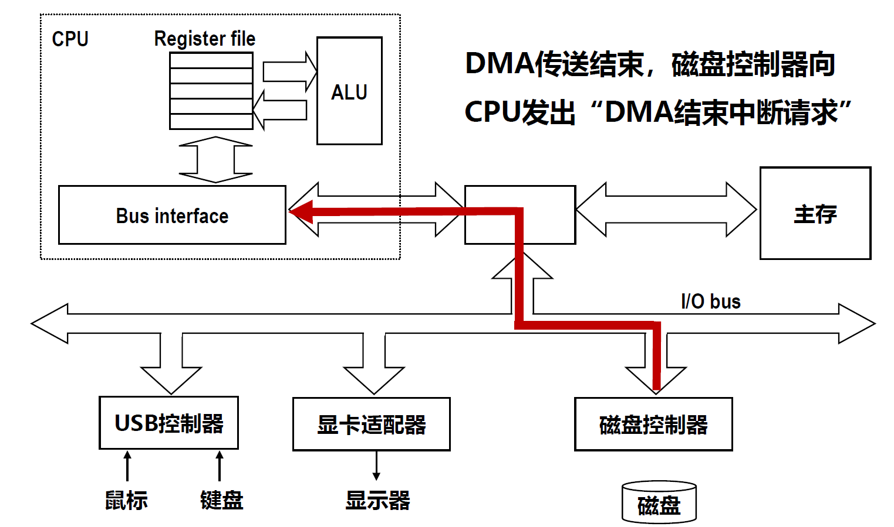​

### 性能指标

* 记录密度：磁盘记录信息的密度

  * 道密度：沿磁道分布方向，单位长度的磁道数量
  * 位密度：沿磁道方向，单位长度存放二进制的数量
  * 相同位密度下，外道比内道存储更多二进制信息
  * 低密度存储方式、高密度存储方式  
    ​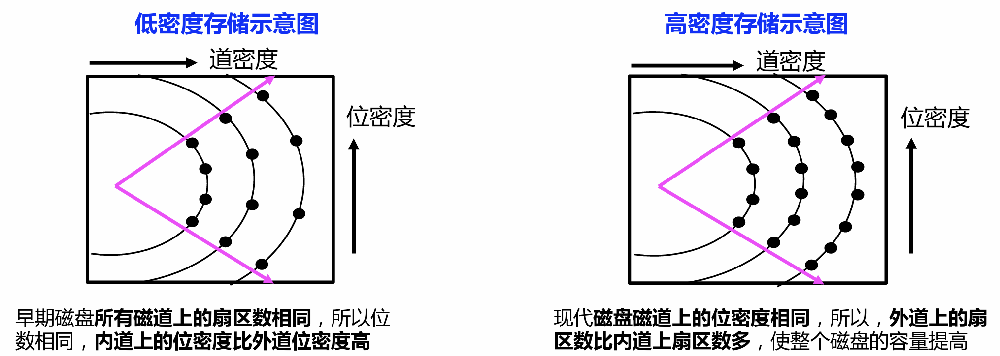​
* 存储容量：磁盘整体的信息容量

  * 存储容量与磁表面大小和记录密度密切相关
  * 以低密度存储方式为例

    * **未格式化容量**为：  
      磁盘总容量 = 记录面数×每面容量 = 记录面数×每面磁道数×每个磁道的位数 = 记录面数×理论柱面数×内圆周长×内道位密度
    * 磁盘实际数据容量（**格式化容量**）为：  
      磁盘实际数据容量 = 记录面数×每面磁道数×每磁道扇区数×扇区大小 = 记录面数×每面磁道数×每磁道扇区数×扇区大小
* 数据传输速率：从存储介质上读写数据的速率

  * 从磁盘存储器完成磁头定位和旋转等待后开始计算
  * 单位时间内从存储介质上读取或写入的二进制信息量
  * 真实表达磁盘介质的读写能力
* 平均存取时间：从给出地址到获得数据的平均时间

  * 磁盘响应过程：

    * 将读写请求放入队列中排队
    * 出队后由磁盘控制器解析请求命令
    * 寻道、旋转等待、读写数据
  * 总响应时间=排队延迟+控制器时间+寻道时间+旋转等待时间+数据传输时间
  * 磁盘上的信息以扇区为单位进行读写，平均存取时间 = 平均寻道时间+平均旋转等待时间+平均数据传输时间

    * 平均寻道时间：磁头寻找到指定磁道所需平均时间（大约5ms）
    * 平均旋转等待时间：指定扇区旋转到磁头下方所需平均时间（大约4～6ms），转速：4.2K / 10K rpm
    * 数据传输时间：大约0.01ms每扇区

​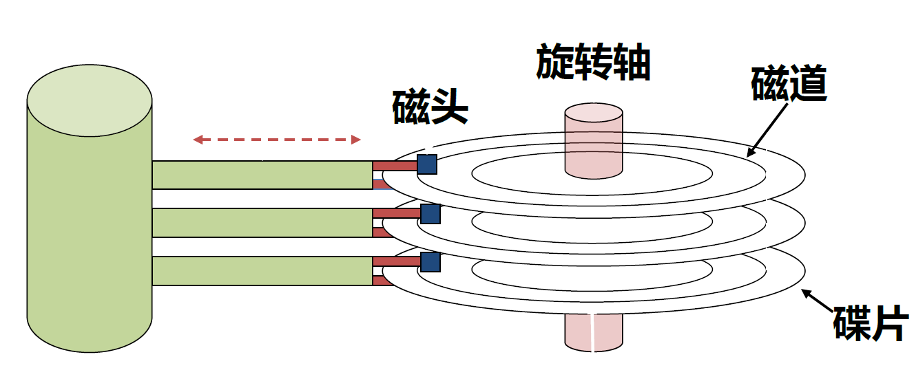​

## 闪存存储器

**闪存（Flash）** 是一种**高密度非易失性**读写存储器，功耗低、集成度高、速度较快，常用于U盘、固态硬盘、移动存储器等。

> 闪存是由日本的舛岡富士雄（Fujio Muoka）发明的。他分别于1966年和1971年从日本东北大学（Tohoku University）获得学士和博士学位，博士毕业之后他加入了东芝（Toshiba）公司。在东芝工作期间，他分别于1980年和1988年发明了NOR Flash和NAND Flash。这也是目前市面上主要的两种闪存。
>
> 一般而言，并行接口的Parallel Flash是基于NOR Flash的；而SSD硬盘，U盘，SD卡，eMMC等通常是基于NAND Flash的。
>
> NOR Flash一般容量较小，随机读写的速度比较快，支持XIP（Excution In Place），但是单位容量成本较高，一般用作代码存储，比如嵌入式系统中的启动代码U-Boot通常存在Parallel NOR Flash中。NAND Flash一般容量大，支持整页（Page）读写/编程，而且单位容量成本更低，但是随机读写速度较慢，而且不支持XIP（需要将代码拷贝到内部RAM才能可以执行），一般用来存放大容量的数据，比如手机中的视频照片等一般存在eMMC/SD卡中，eMMC/SD卡中除了NAND Flash之外，还有一个控制管理芯片，用来进行接口协议转换，坏块管理，错误校验等。

闪存的每个存储单元由单个MOS管组成，包括漏极D、源极S、栅极G、浮空栅。

* 当栅极G加足够正电压时，浮空栅储存大量负电荷，表示为“0”态
* 当栅极G不加正电压时，浮空栅少带或不带负电荷，表示为“1”态

​​

3种基本操作：编程(充电)、擦除(放电)、读取

​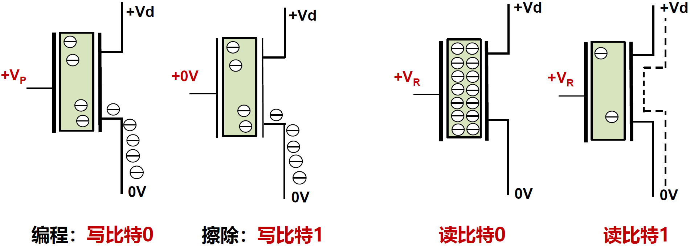​

Flash单元初始值是比特1，一旦充电，可以保持非常久（约100年），由于需要充电，写速度比读速度慢很多，且写入次数有寿命（约几万次）。

## 冗余磁盘阵列RAID

**冗余磁盘阵列（Redundant Arrays of Independent Disks，RAID）** 主要用于在当前技术条件下改善存储器整体性能。

设计思想：

* 将多个独立操作的磁盘按某种方式组织成磁盘阵列
* 并行+分布：利用类似于主存中多体交叉技术，将数据存储在多个盘体上，通过并行工作来提高数据传输速度
* 可靠性：用冗余磁盘技术进行错误恢复提高系统可靠性

设计特征：

* RAID是一组物理磁盘驱动器，但被操作系统视为一个
* RAID将存储数据按照特定规则分布在一组物理磁盘上
* 采用冗余磁盘存储奇偶校验信息，在磁盘损坏时恢复数据

### RAID级别

根据不同设计，RAID主要分为8个级别：0-7级。

#### RAID0

没有冗余盘，数据分布在多个物理磁盘上，适用于**容量和速度要求高**的**非关键数据**存储的场合。

与单个大容量磁盘相比有两个优点：

* 具有较快的I/O响应能力：较小的单个存储器I/O响应较好
* 具有较高的传输速率：当交叉编址时，一个请求有可能并行传送

​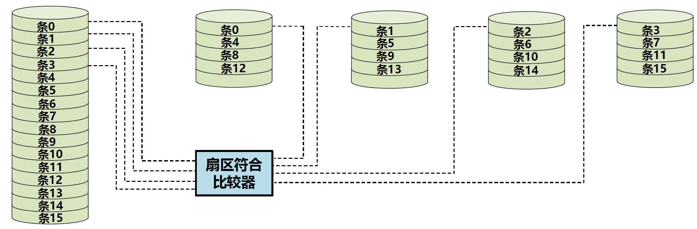​

#### RAID1

采用镜像盘一对一冗余，**可靠性高**，但**价格昂贵**，常用于**可靠性要求很高**的场合，如金融、证券等系统。

读请求可由任一个磁盘提供，或定位时间更少的磁盘提供。写请求要并行更新两个磁盘数据，性能由更慢的决定。

​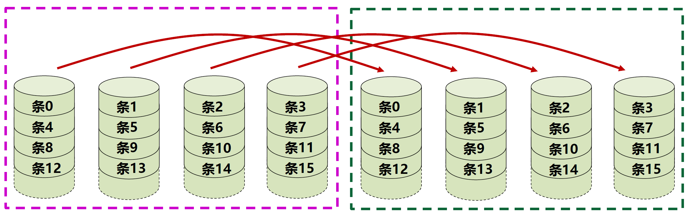​

#### RAID2

采用**海明校验法**生成多个冗余校验盘，实现**纠正一位**错误、**检测两位**错误的功能，校验盘与数据盘**成正比**，冗余信息开销较大，价格贵。

写操作时，要同时写数据盘和校验盘

仅比RAID1略好。

​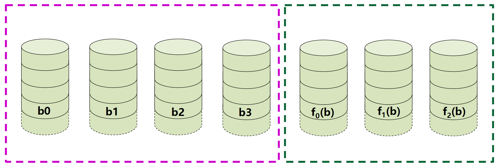​

#### RAID3

采用**奇偶校验法**生成单个冗余盘，采用**小条带交叉编址**方式，数据传输率较高，主要用于大数据应用，如多媒体和大数据科学计算等。

当1个磁盘损坏时，损坏的磁盘数据可通过其它磁盘恢复。

​​

#### RAID4

与RAID3类似，采用**奇偶校验法**生成单个冗余盘，采用**大数据块交叉编址**，每个磁盘独立操作，I/O可并行，适用于I/O较大需求的情况，如银行、证券等。

* 少量写时，有写损失：一次写操作包含两次读和两次写
* 大量写时，则只需直接写入奇偶校验盘和数据盘对应块

​​

#### RAID5

类似RAID4，将奇偶校验块分布在各磁盘中，采用**大数据块交叉编址**，I/O请求的响应速度快，成本不高但效率高，因而被广泛使用于服务器中。

所有磁盘地位等价，可提高容错性，避免校验盘I/O瓶颈。

​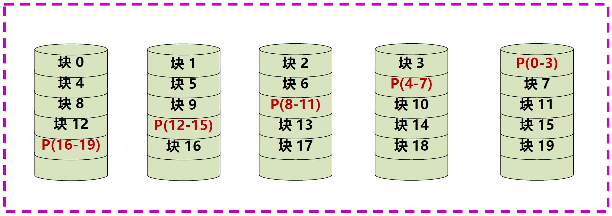​

#### RAID6

与RAID5类似，采用**双维块奇偶校验**，容许双盘出错，由于引入了两个奇偶校验值，控制器设计复杂，写入速度降低，以写时间及容量为代价保证高可靠性。

​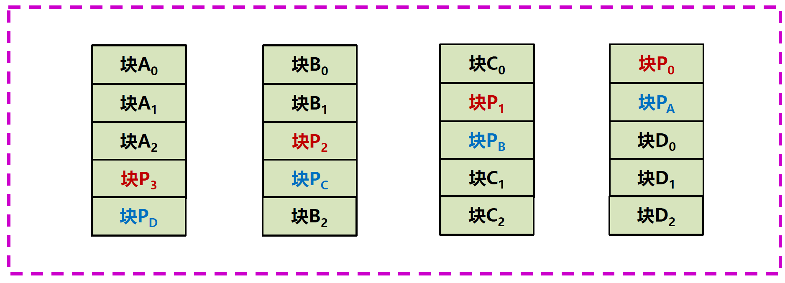​

#### RAID7

在RAID6基础上，采用Cache技术提高传输速率和响应速度，Cache块与数据分块一致，两个独立Cache并行运行。

* 写入时，向两个Cache同时写，再择机完成磁盘写入
* 读出时，先从Cache读，不命中时再从磁盘中读取

​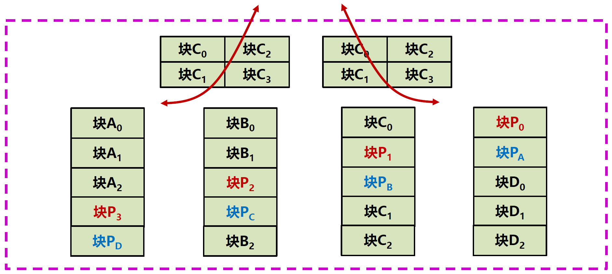​

## 存储数据校验

元件故障或噪音干扰等可能造成信息存取或传送差错，因此需要对数据进行校验。

​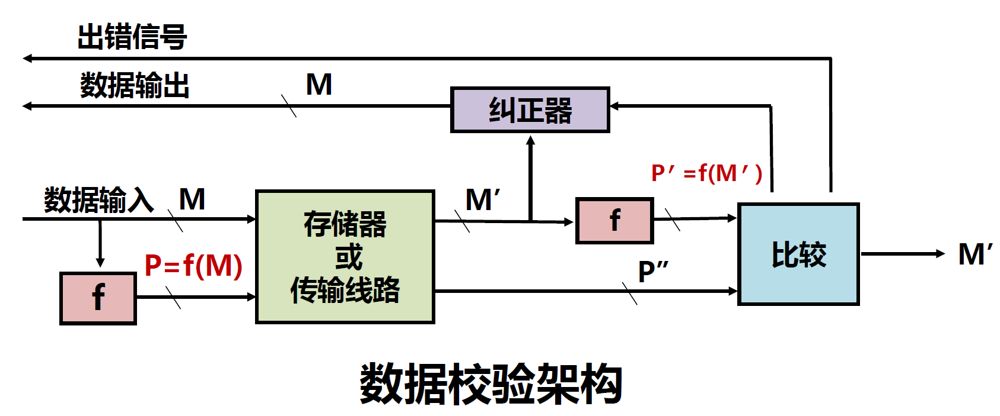​

比较产生“故障字”，有三种可能：

​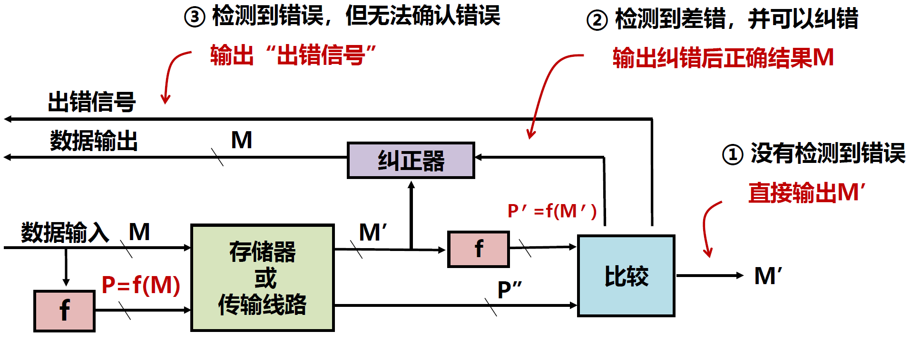​

### 奇偶校验码

基本思想：增加一位奇（偶）校验位并一起存储或传送，终部件计算新校验位，比较后判断是否发生错误。

特点：奇偶校验码只能发现奇数个位出错，不能发现偶数个位出错，也无法判断出错位置。

应用：因为一位出错的概率相对较大，两位以上出错情况较好，所以，奇偶校验码广泛应用于检错。

* 奇校验：增加校验位后，比特1的个数为奇数
* 偶校验：增加校验位后，比特1的个数为偶数

### 海明校验码

基本思想：将数据按某种规律分成若干组，对每组进行相应的奇偶检测以提供多位校验信息，从而可对错误位置进行定位，并将其纠正。

海明校验码实质上就是一种多重奇偶校验码。

​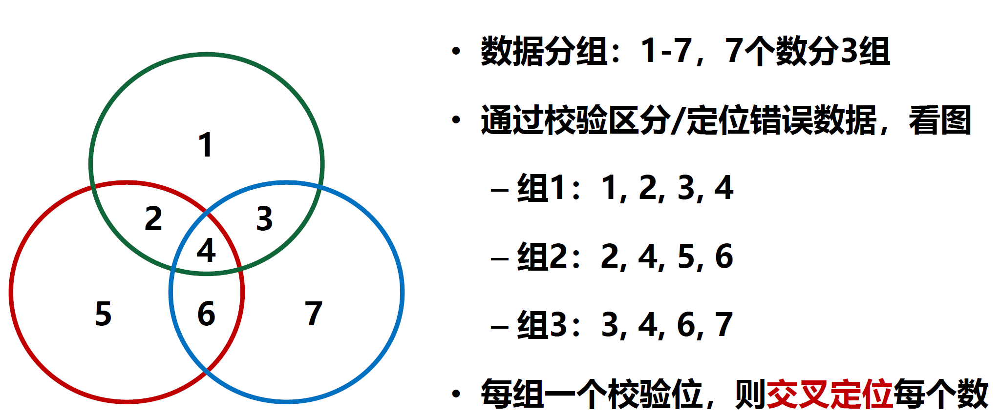​

假设被校验数据的位数为n，校验为k位，则k为组成检测数据的故障字。

如果只检测1位错误，则需要满足$2^k≥1+n+k$，即故障字的结果空间要超过所有的一位错误可能，由此，可以确定k的个数。

​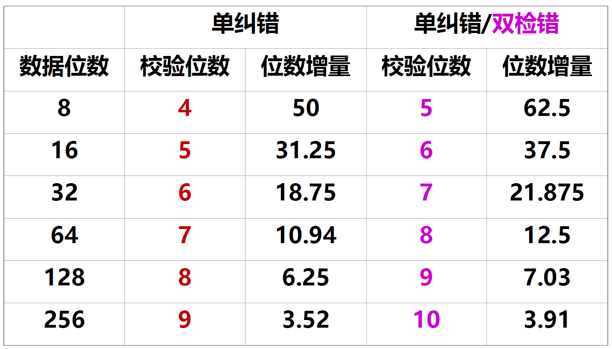​

#### 海明校验码分组

基本思想：n位数据位和k位校验位按某种方式排列为一个n+k位的码字，每个出错位位置与故障字数值建立关系，通过故障字确定码字的错误，并将其取反来纠正

分组规则：

* 规则1：若故障字每位全部是0，则表示没有发生错误
* 规则2：若故障字有且仅有一位为1，则表示校验位有一位出错，不需纠正
* 规则3：若故障字中多位为1，则表示有一个数据位出错，其在码字中的出错位置由故障字的数值来确定，纠正时只要将出错位取反即可

分组完成后，可对每组采用相应的奇（偶）校验，以得到相应的一个校验位。

> 以8位数据的检错和纠错为例：
>
> 假定8位数据M=`M8M7M6M5M4M3M2M1`​，根据故障字长度要求，需要4位校验位P=`P4P3P2P1`​。根据规则将M和P按一定的规律排到一个12位码字中，校验位放在$2^k $位置：
>
> |索引号|12|11|10|9|8|7|6|5|4|3|2|1|
> | :------: | :--: | ----| ----| ----| ----| ----| ----| ----| ----| ----| ----| :--: |
> |数据|M8|M7|M6|M5|P4|M4|M3|M2|P3|M1|P2|P1|
>
> 校验位与数据位之间存在如下关系：  
> P4 = M5⊕M6⊕M7⊕M8  
> P3 = M2⊕M3⊕M4⊕M8  
> P2 = M1⊕M3⊕M4⊕M6⊕M7  
> P1 = M1⊕M2⊕M4⊕M5⊕M7
>
> 那这个关系怎么得到的呢？
>
> 如下表所示，从第二行开始，每一行的第一列代表索引号，这个索引号是除去了校验位之外的其他所有位。后面几列为该索引号对应的二进制表示，其位数取决于最开始计算得出的海明校验码的位数，比如第二行，索引号是3，十进制3对应的二进制就是0011，之所以用4位表示是因为这段信息码需要4个海明校验位。
>
> |索引号|8|4|2|1|
> | :------: | :-: | :-: | :-: | :-: |
> |3|0|0|1|1|
> |5|0|1|0|1|
> |6|0|1|1|0|
> |7|0|1|1|1|
> |9|1|0|0|1|
> |10|1|0|1|0|
> |11|1|0|1|1|
> |12|1|1|0|0|
>
> 再看列信息：第一行最右边数字1所对应的列里，出现1的，就表示可以用这一位完成校验，出现数字0则表示不能用这一位进行校验，这样就得到了我们上面的关系。
>
> 假如要传输的内容为`M8M7M6M5M4M3M2M1=01101100`​，那么校验码为`P4P3P2P1=0000`​，得到传输的数据就是`011001100000`​。
>
> 当收到的数据为`011001110000`​，计算故障字`S4S3S2S1`​：  
> S4=P4⊕M5⊕M6⊕M7⊕M8  
> S3=P3⊕M2⊕M3⊕M4⊕M8  
> S2=P2⊕M1⊕M3⊕M4⊕M6⊕M7  
> S1=P1⊕M1⊕M2⊕M4⊕M5⊕M7  
> 得到故障字`S4S3S2S1=0101`​
>
> 此时根据规则3，有一个数据位出错，并且这个出错的数据位在P3和P1所校验的的分组里，P4和P2所校验的数据位没错。
>
> P3和P1都校验的数据位有M2、M4，P4和P2校验的数据位有M1、M3、M4、M5、M6、M7、M8。将正确的数据位去掉，因此错误的数据位是M2。
