# 1.7.指令集体系结构ISA

## ISA设计

An Instruction Set Architecture (ISA) is part of the abstract model of a computer that defines how the CPU is controlled by the software.

指令集体系结构是一种计算机的抽象模型，用来定义软件控制CPU的方法，它是计算机硬件之上的抽象层。

### 定位

​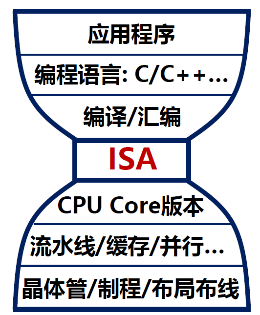​

* ISA是软件与硬件的分界层
* ISA隔离了硬件实现与软件需求
* ISA为计算机系统构建了分层体系
* ISA是一种“标准”，具有战略意义

指令集≠指令集体系结构：

* 指令集：面向特定目标的一组计算机指令，是设计者表达软件功能需求的主要方式
* 指令集体系结构：指令集及其抽象实现所关联的一切要素，是支撑指令集的一个抽象计算机模型

### 历史

​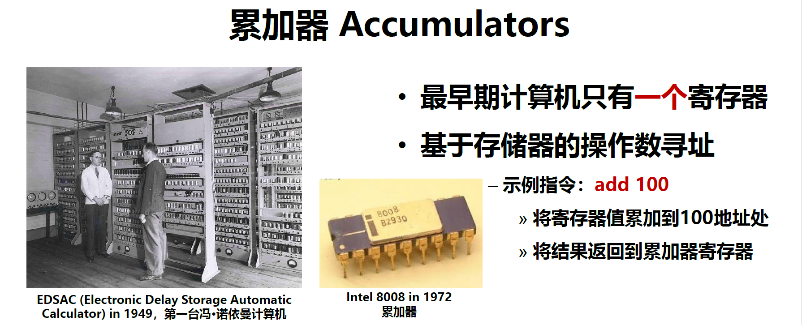​

​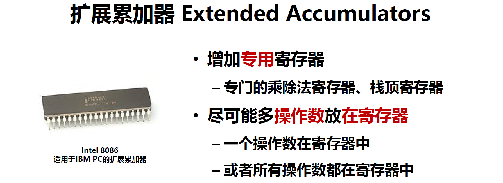​

​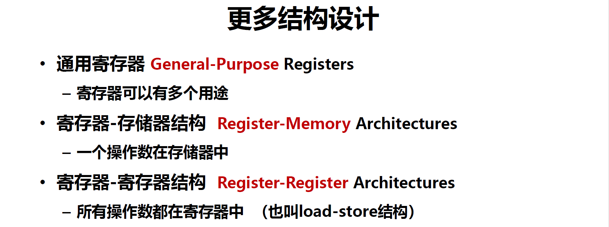​

​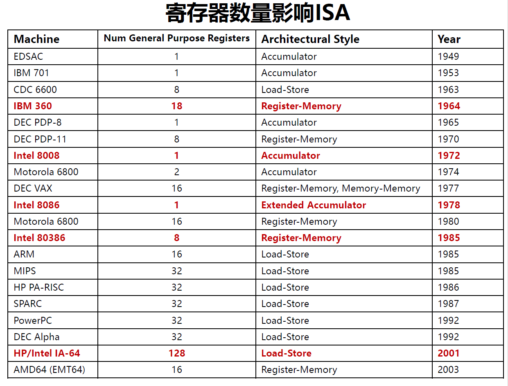​

### 内涵

设计目标：硬件规模及面向需求的特征

设计原则：CISC或RISC或先进理念

数据表示：关键数据类型的表示方法

寄存器组：抽象模型的多类型寄存器设计

指令类型：指令的功能体系及类型

寻址方式：操作数的直接或间接获取方法

指令格式：用来转换二进制的指令编码

## 寻址方式

寻址方式：指令中获得操作数的方式。

在指令中，地址码尽可能短、但操作数存放要尽可能灵活。

### 隐含寻址

不直接给操作数地址，而是在指令中隐含操作数地址。

​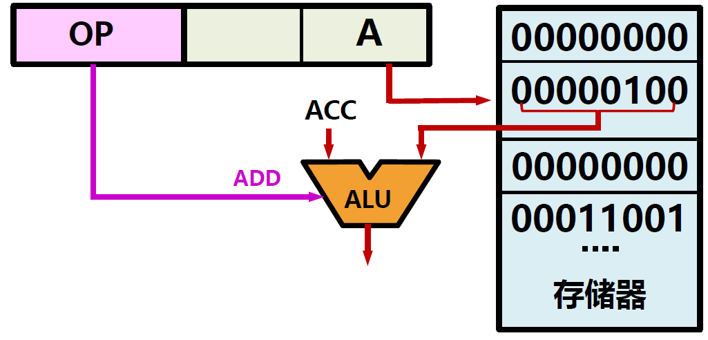​

### 立即寻址

指令直接给出操作数，操作数为立即数。

​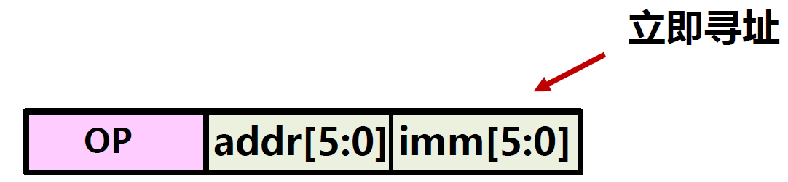​

### 直接寻址

指令的地址码是操作数的有效地址。

​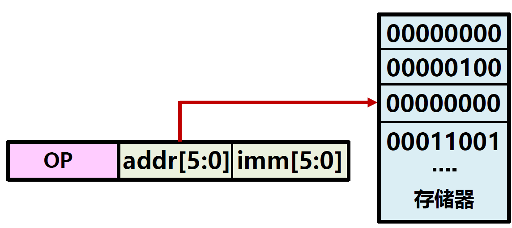​

### 间接寻址

指令的地址码是存放操作数有效地址的地址。

​​

### 寄存器寻址

指令的地址码是操作数所在的寄存器编号。

​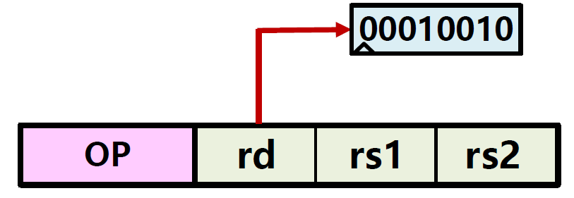​

### 寄存器间接寻址

指令的地址码是一个寄存器编号，其中存放的是操作数的有效地址。

​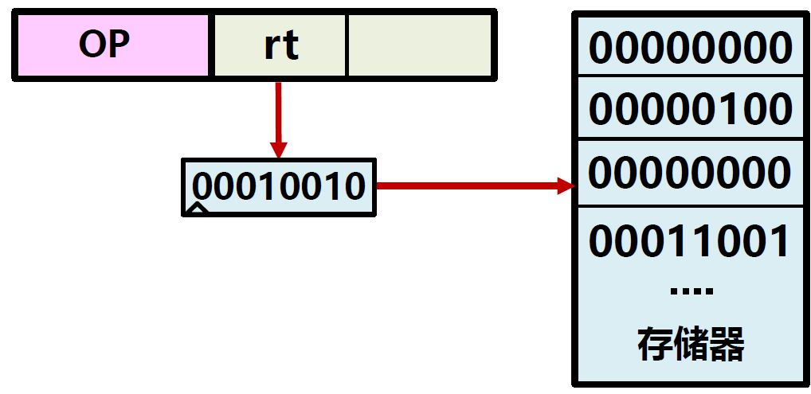​

### 相对寻址

​`程序计数器PC+指令中地址偏移量A=操作数的有效地址`​

​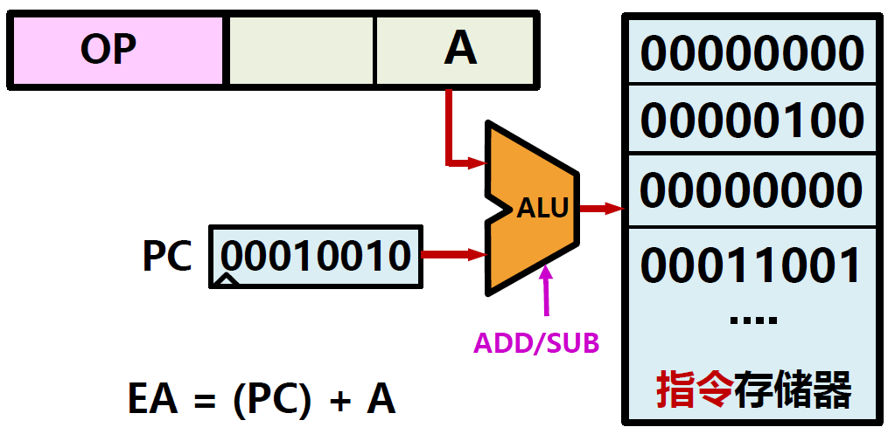​

### 基址寻址

​`CPU中基址寄存器BR的内容+指令中形式地址A=操作数的有效地址`​

​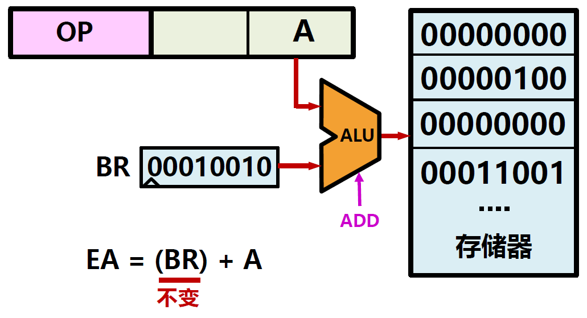​

### 变址寻址

​`指令中形式地址A+CPU中变址/通用寄存器IX的内容=操作数的有效地址`​

此时指令中形式地址A不变，作为基址。

​​

### 发展

ISA重要性：

* 早期：ISA设计具有至关重要的作用，单指令/VLIW/…
* 今天：ISA趋向于相同，差别很小，但有新趋势
* 了解->知道->认识->评估->优化->分析->原创
* 我国计算机系统发展之路还很漫长，总体处在“认识”阶段

## CISC和RISC

### CISC

CISC：Complex Instruction Sets Computer复杂指令集计算机

系统设计初期的一种主流思想：采用单个指令满足特定需求

* 例如：X86指令集的MUL、DIV、INC、DEC、MULX…

  * 指令格式不固定：指令可长可短、操作数可多可少
  * 寻址方式复杂多样：操作数可来自寄存器或存储器
  * CPI>5：指令越复杂，CPI越大

在CISC设计时期，人们直接用汇编方式编程

* CISC的缺点

  * 指令集虽大，但指令使用频度不均衡

    * 2/8定律，20%指令使用时间占80%的运行时间
    * 常用指令数仅占指令集总数的10-20%
  * CISC指令控制复杂，很难进行指令级并行的性能优化

    * 大量指令的控制线叠加，带来复杂的控制通路逻辑

### RISC

RISC：精简指令集计算机

系统设计中期的一种思想：尽量使用少数指令更快解决问题

JohnCock：RISC之父，图灵奖获得者

1980年设计了IBM801，采用RISC

​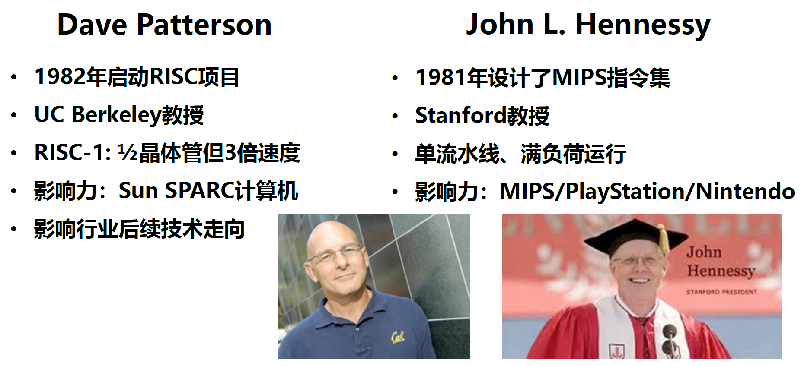​

* MIPS指令集设计原则

  * 一致性简洁：指令全部采用32位长度
  * 更少更快：小寄存器堆
  * 加快常规事件：支持常数操作、经常性操作
  * 考虑设计折中：不直接支持非常规操作

* MIPS=精简指令集计算机

  * 约200条指令，每个32位，3种格式
  * 所有操作数都在寄存器中
  * 约1种寻址模式：M[reg+imm]
* X86=复杂指令集计算机

  * 1000条指令，每个1-15字节
  * 操作数可在专用寄存器、GPR、存储器、栈，1/2/4/8字节，有/无符号
  * 几十种寻址模式，如M[segment+reg+reg*scale+offset]

​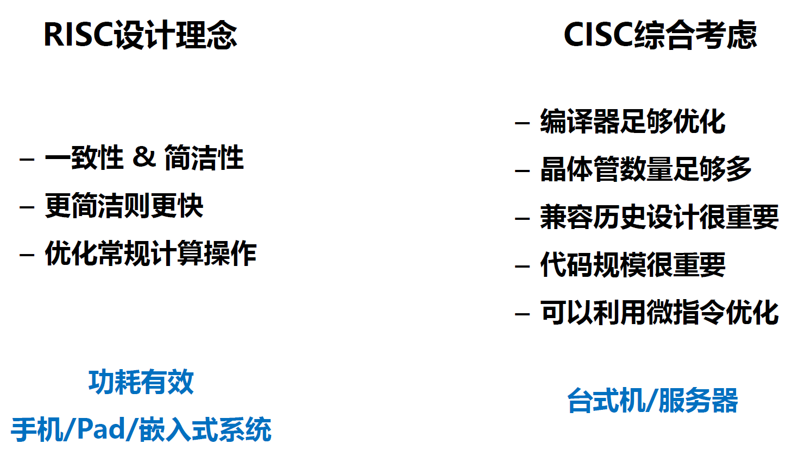​

## X86

* Intel公司从1970年代开始设计并不断完善优化的ISA
* X86指令集采用了与之前版本完全兼容的政策
* X86指令集是Intel公司内部多个研究组独立工作的结果
* X86成功源于Intel公司市场的成功，技术<?市场

​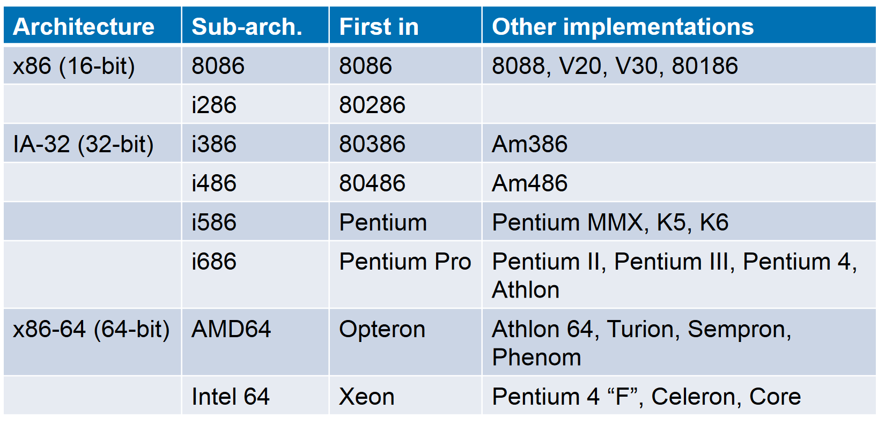​

​​

X86指令集特征：

* 1000指令，每个1-15字节，几十种加法
* 操作数可在专用寄存器、GPR、存储器、栈，1/2/4/8字节，有/无符号
* 几十种寻址模式，如M[segment+reg+reg*scale+offset]

​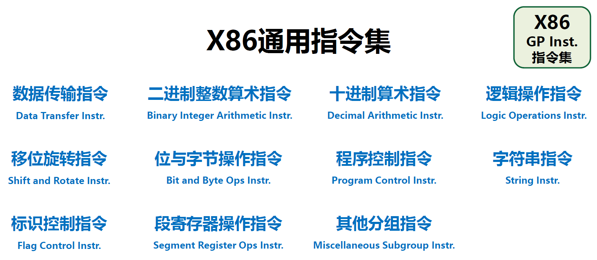​

* 数据传输指令：在存储器和寄存器间移动数据
* 二进制整数算术指令：二进制整数计算(字节/字/双字)
* 十进制算术指令：十进制算术计算(基于BCD编码)
* 逻辑操作指令：基本逻辑运算(字节/字/双字)
* 移位旋转指令：移位及旋转运算(字/双字)
* 位与字节操作指令：位的测试或修改(字/双字)
* 程序控制指令：跳转/条件跳转/循环/调用与返回
* 字符串指令：字符串操作及内存交互指令
* 标识控制指令：EFLAGS寄存器中的标识操作
* 段寄存器操作指令：段寄存器操作指令

## ARM

ARMv7指令为32位长，共3种格式

​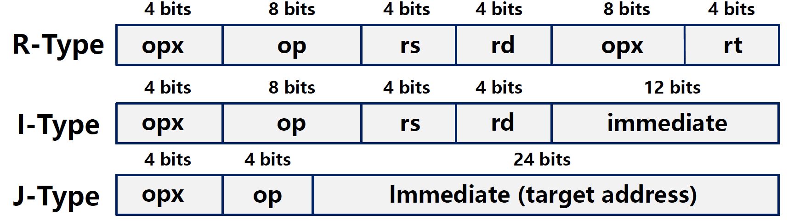​

## RISC-V

RISC-V
