# 1.8.指令流水线Pipeline

## 延迟与频率

### CPU时钟

计算机各部件需要协调工作，我们想到了使用一个规律稳定的信号来控制它们。

大概过程就是晶振产生正弦信号→PLL将其变成方波信号→CPU的multiplier将信号倍频→CPU核心每收到一个信号就执行一步操作。

#### 晶振Crystal Oscillator

晶振一般指石英晶体振荡器，也叫晶体振荡器，是稳定产生时钟频率的一种元件。它能够将电能与机械能进行相互转化，安装在主板上，为CPU等部件提供频率。

增加电压→石英谐振→稳定精准的单频振荡

#### 锁相环Phase-Locked Loop

锁相环是一种能够比较输出与输入相位差的反馈结构，利用**外部参考输入**控制**输出信号**的**频率和相位。** 许多电子设备要正常工作，通常需要外部的输入信号与内部的振荡信号同步，利用锁相环就可以实现这个目的。

​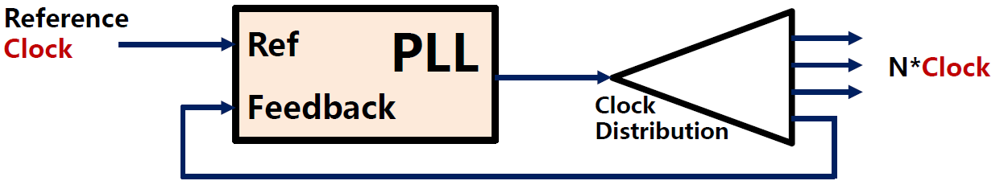​

### 组合逻辑延迟

以下图中的过程为例，在每个时钟周期内，组合电路必须完成计算，否则会影响下一个时钟周期内的计算。

​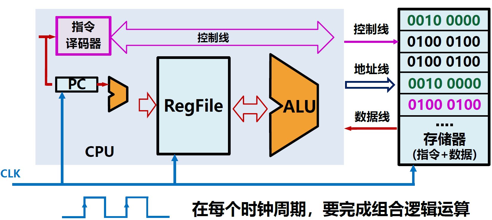​

也就是说如果门延迟固定，组合逻辑延迟固定，那么一个时钟周期不能小于组合逻辑延迟的最大值。

​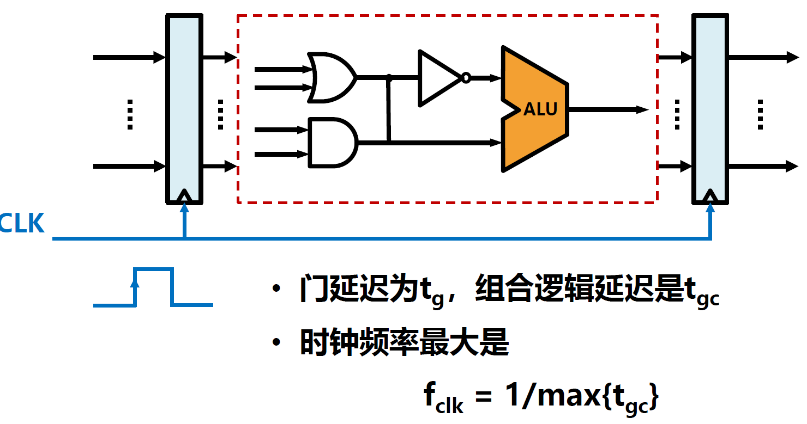​

由此可得，最大组合逻辑延迟决定了CPU频率的上限，而通常情况下CPU性能与CPU频率成正比。因此，降低组合逻辑延迟能够提升CPU性能，我们想到了使用**划分较小的组合逻辑+流水线设计**的方法。

例如，我们将上图中画框的组合逻辑电路进行分割，变成两个延迟相同的组合逻辑电路，那么时钟频率最大值就变为了原来的二倍。

​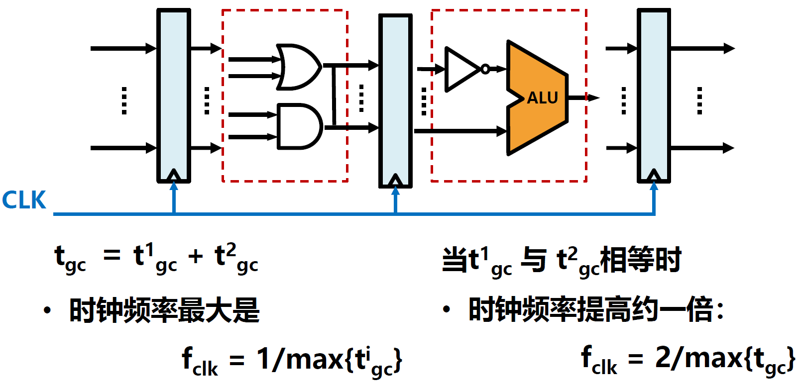​

然而，这种划分有一个严重的问题，假如原逻辑频率为f1，每周期执行运算F1次，划分后频率f2=n×f1，每周期执行运算F2=(1/n)×F1次，划分前后相同时间内总运算次数并没有改变。因此，加强每周期执行运算能力才是提升CPU整体性能的关键。

## 指令流水线设计

### 流水线

以洗衣服为例，假如洗衣服需要依次经历洗涤、烘干、折叠、支付四个过程，每个过程均耗时0.5小时，那么以独占顺序执行，四个人就需要8小时。而以流水线执行，四个人仅需3.5小时。

​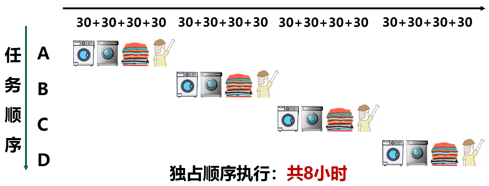​

​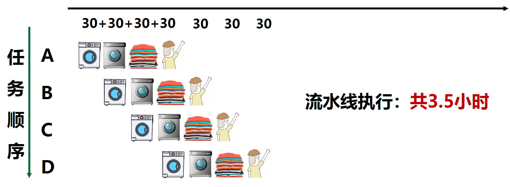​

由此我们可以看出，流水线虽然无法提升单个任务的延迟，但能减少多个任务的全部时间。

假如M个任务同时操作需要N个阶段，每段时间为T，那么宏观加速比$R=\lim_{M \to \infty}\frac {M \times N \times T}{(N+M-1)\times T}=N$  

流水线是一种提高复杂任务执行效率的通用方法。

流水线加速比约等于流水线段数，效率增加十分可观，流水线的速率受速度最慢的流水段限制，由于存在先后顺序，充满和排空流水线会影响执行效率。

### CPU的流水线设计

我们可以将一个指令的执行过程分为五段，形成五级流水线：

* IF取指令：从存储器取指令
* ID指令译码：产生指令执行的控制信号及操作数
* EX执行：执行部件根据指令完成运算
* MEM访存：从存储器中读取或写入数据
* WB写回：将运算结果写回寄存器

​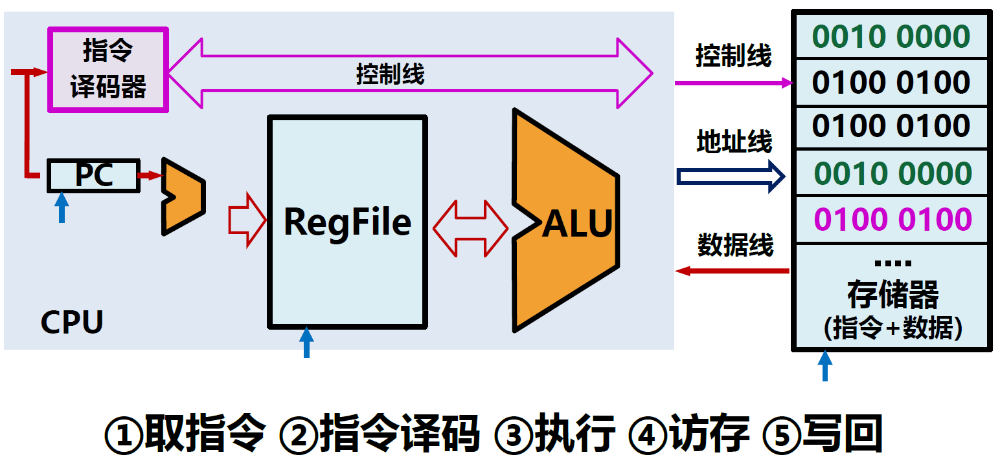​

一些指令的流水线：

​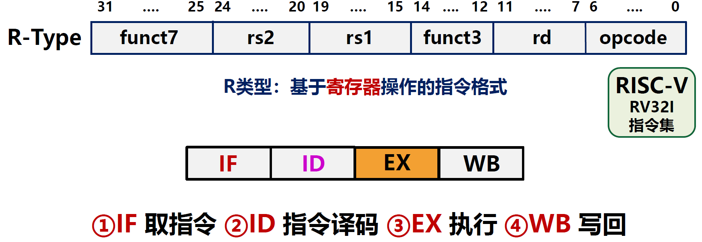​

​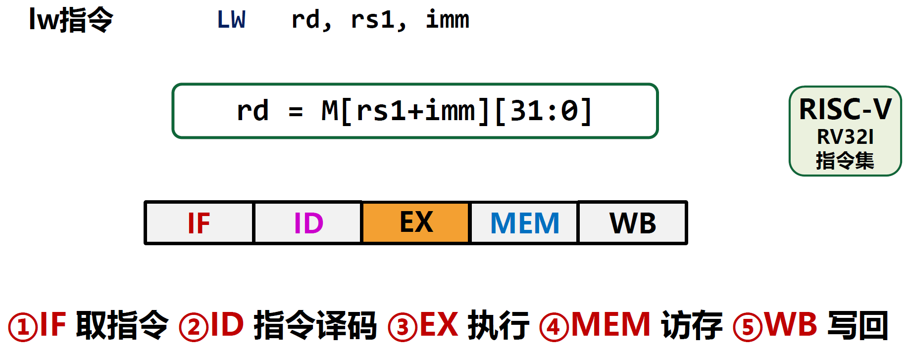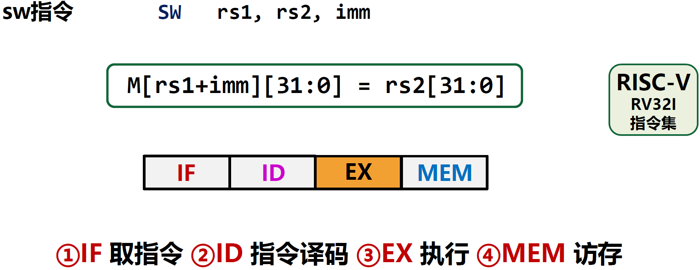​

​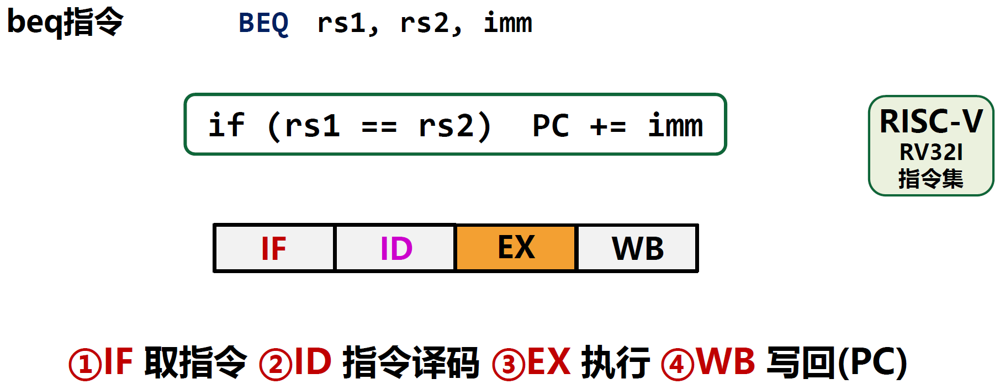​

​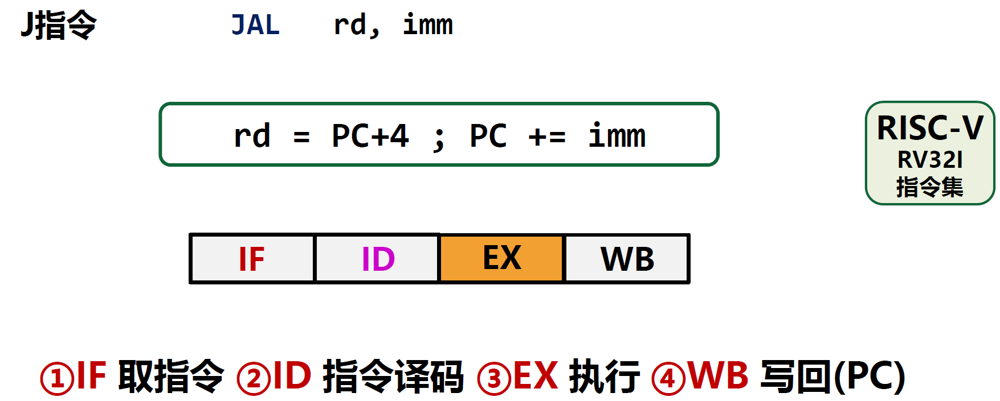​

从上面几条指令的流水线可以看出，CPU提供公共流水线，但并非所有指令都能利用各阶段。

指令集中所有指令的功能作为流水线设计的输入，最长的流水线级别作为输出。

以下面的指令执行为例：

​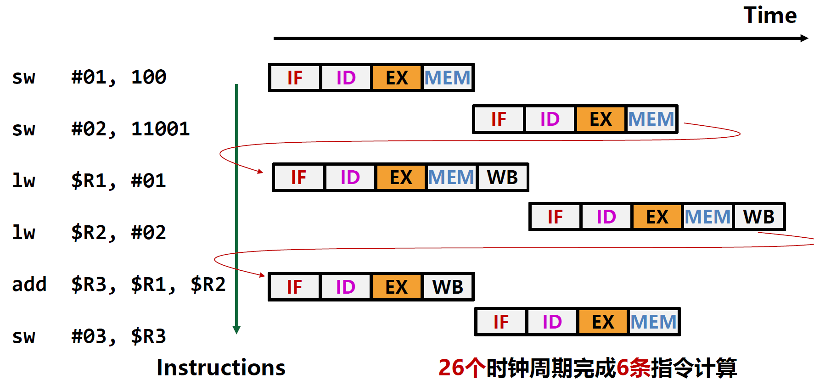​

​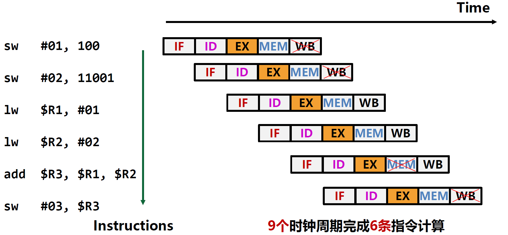​

​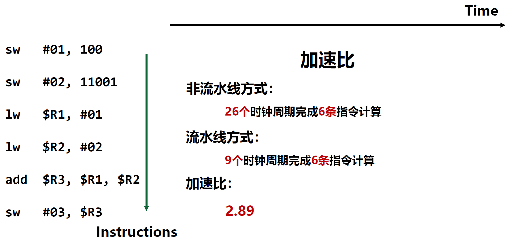​

在实际情况中，流水线划分不一定均匀，需要深度划分流水线。Intel CPU最多包含20+级流水线。

​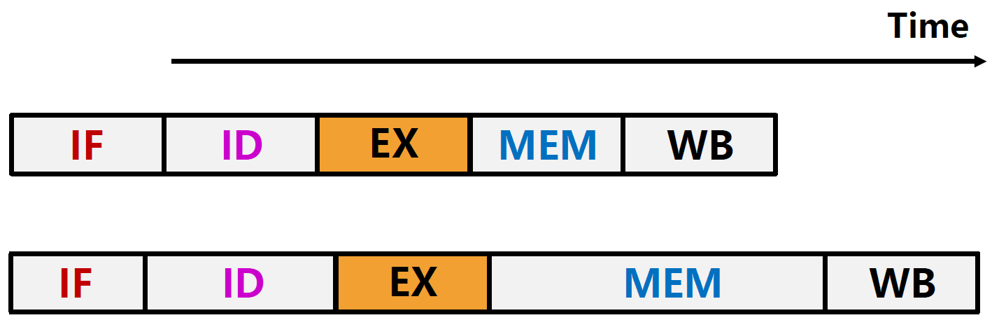​

​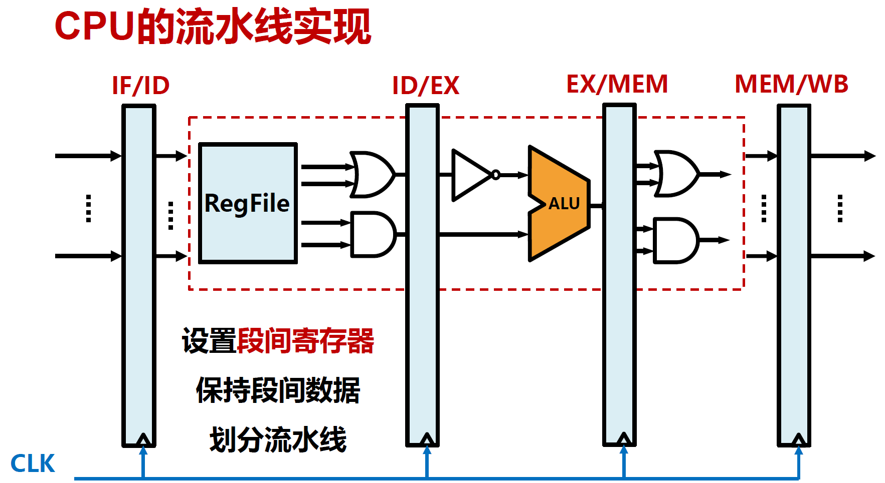​

## 流水线冒险

将指令拆解为流水线并行执行时，如果后续指令运行依赖前序指令的运算结果，那么后续指令会引起流水线阻塞或停顿（stall），这种情况被叫做流水线冒险。流水线冒险一共分为三种情况，分别是结构冒险（Structural hazards）、数据冒险（Data hazards）和控制冒险（Control hazards）。这是流水线结构的通用问题，即并行的约束。

### 结构冒险

硬件资源冲突造成的冒险。

同一部件被不同指令所用，由硬件资源竞争造成。

​​

消除结构冒险的方法：

* 增加多个部件或多个通道，如寄存器堆（同时读写）、ALU（多个运算部件）
* 借助高速缓存Cache

### 数据冒险

数据相关(Data Dependency)引起的冒险。

后续指令执行时前序指令的结果尚未产生。

​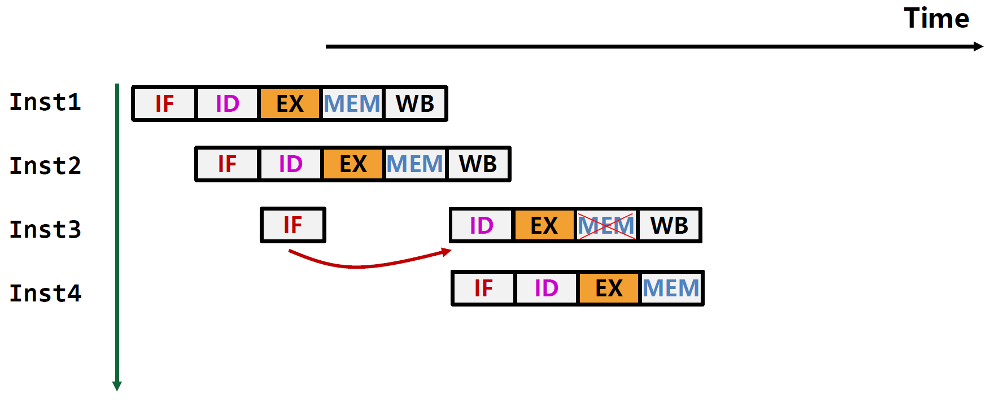​

​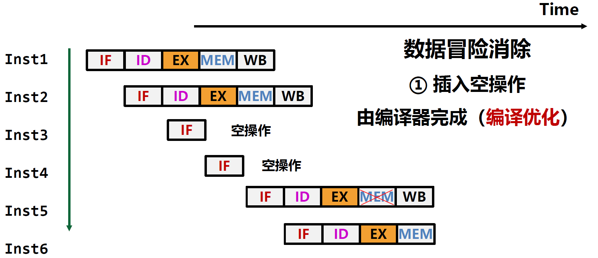​

​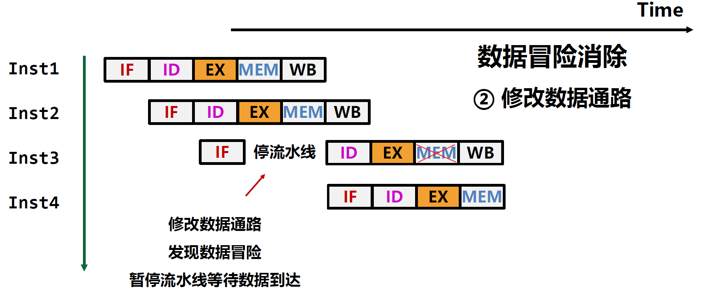​

### 控制冒险

指令执行顺序改变引起的冒险。

指令跳转等带来的指令顺序改变。

​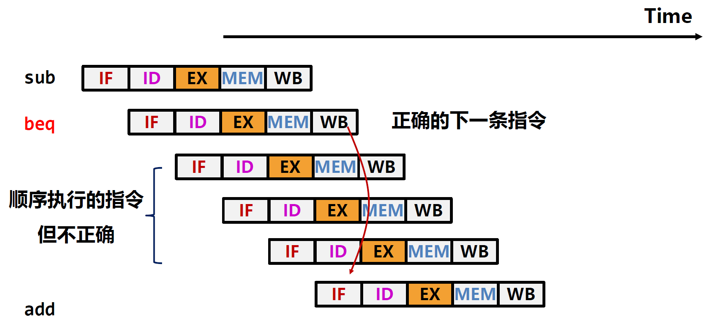​

​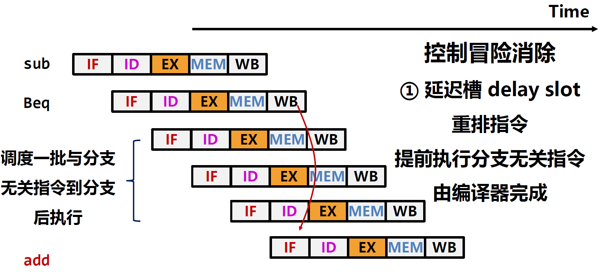​

​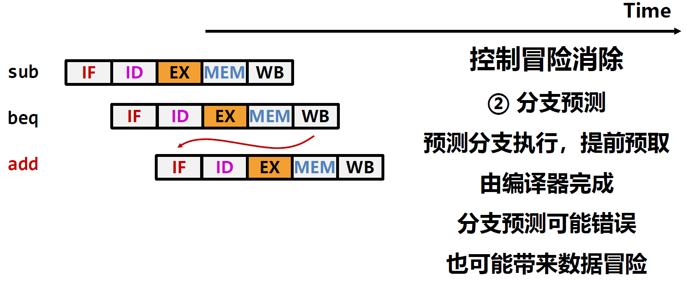​

## 程序并行

### 指令级并行

通过增加硬件冗余，并行执行多条指令。

主要方法：流水线、多发射

充分挖掘一个程序内部指令之间的并行性

受程序总体并行性的限制，存在性能提升瓶颈

### 线程级并行

通过增加线程维护上下文，同时执行多个程序。

主要方法：粗粒度多线程、细粒度多线程、并发多线程

充分挖掘多个程序之间的并行性

不受单个程序并行性限制，但受硬件并发冗余度的限制

### 多核并行

通过增加多CPU核，提供更多硬件资源，获取并行性。

由操作系统充分调度多个程序，实现程序并发执行

不受单个程序并行性限制，不依赖单个CPU核硬件限制

操作系统调度灵活、效果提升显著，但指令效率并不高
