# 2.3.链接

假如一个程序由sum.c和main.c两个文件构成，我们想将它们编译为一个可执行文件，可以使用指令`gcc -g -o p main.c sum.c`​。这个过程实际是：

1. 预处理：`cpp main.c -o main.i`​，运行C预处理器cpp，将C源程序翻译成ASCII中间源文件
2. 编译：`cc1 main.i -o main.s`​，运行C编译器cc1，它将main.i翻译成ASCII汇编语言文件main.s
3. 汇编：`as main.s -o main.o`​，运行汇编器as，它将main.s翻译成一个可重定位目标文件main.o
4. 链接：`ld main.o sum.op`​，运行链接器程序ld，将main.o和sum.o文件组合，创建可执行目标文件p

​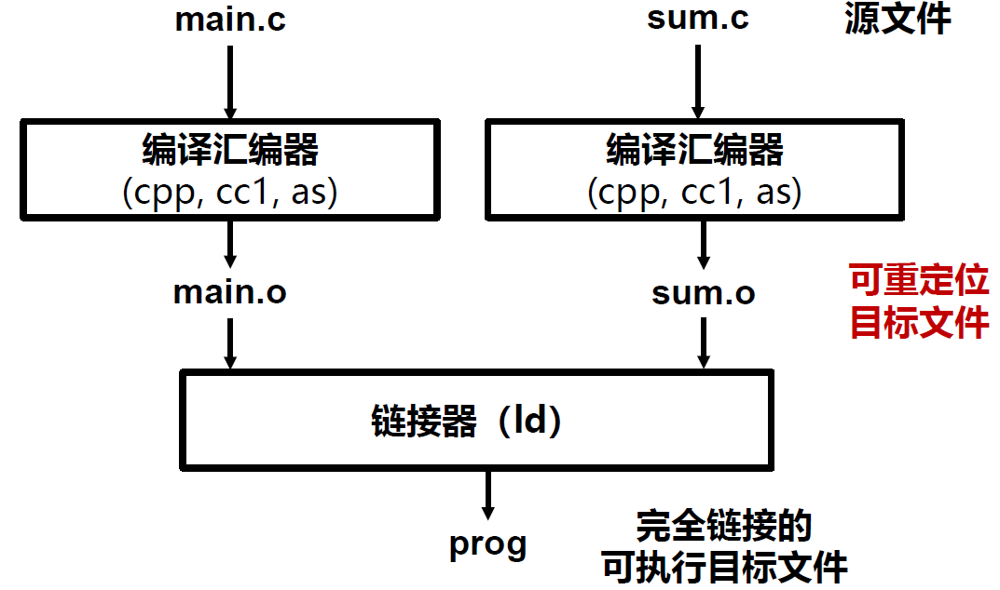​

由此我们发现，**链接**就是将各种代码和数据部分组合成一个文件的过程。链接使大型应用分解为多个模块，独立进行修改、编译，子程序间通过**符号**定义和引用。链接过程由**链接器**执行，合并时在符号引用处填入地址。

## 可重定位目标文件

目标文件一共分为三种：

* 可重定位目标文件（.o）：所包含代码和数据可与其他可重定位文件合并为可执行文件
* 可执行目标文件（默认为a.out）：所包含代码和数据可直接复制到内存并被执行
* 共享目标文件（.so）：特殊的可重定位目标文件，在加载或运行时装入内存并被链接

每个可重定位目标文件中的数据和代码都有自己的分类，链接将相应的部分合成一个新的节，然后分配地址，因此链接本质是合并相同的节。

* 程序头表：

  * 描述磁盘内容到内存的映射
  * 映射到虚拟地址空间
* 虚拟地址：

  * 包含读写数据段和只读代码段
  * 由磁盘中的可执行文件相应的节组成

### ELF

ELF代表Executable and Linkable Format，是一种对可执行文件、目标文件和库使用的文件格式，跟Windows下的PE文件格式类似。ELF格式是是UNIX系统实验室作为ABI（Application Binary Interface）而开发和发布的，早已经是Linux下的标准格式了。

下面是可执行目标文件、可重定位目标文件、共享目标文件的示例:

​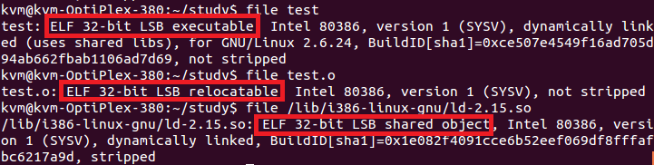​

一个典型的ELF可重定位目标文件的格式的结构为：

​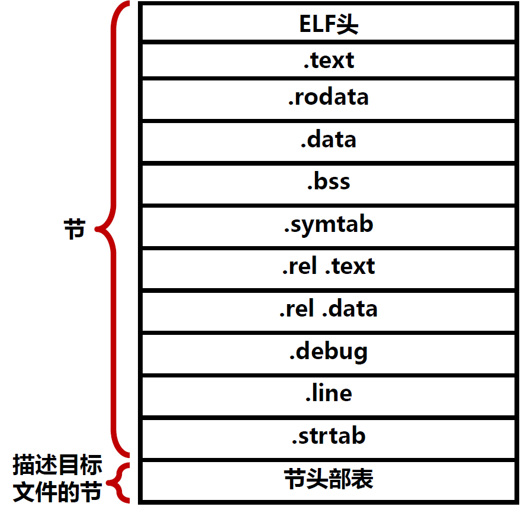​

* ELF头：描述文件的基本内容

  * 文件格式标识：File format identifier
  * 组织架构：Architecture
  * 大端/小端设定：Endianness
  * 对齐要求：Alignment requirements
  * 各节位置：Location of other sections
  * 代码起始地址：Code's starting address
* .text：程序的机器代码
* .rodata：只读数据
* .data：初始化的全局变量
* .bss：未初始化的全局变量，不占用实际空间
* .symtab：符号表，存放程序中定义和引用的函数和全局变量信息
* .rel.text：.text节中位置的列表
* .rel.data：被模块引用或定义的全局变量的重定位信息
* .debug：调试信息节，记录源代码与目标代码的关联信息
* .line：行号
* .strtab：一个字符串表，包含节头部中的节名字等
* 节头部表（Section header table）：重分配时需要的信息
* 其他节

  * 其他调试信息
  * 版本控制信息
  * 动态链接信息
  * C++初始化或回收代码

从加载的角度来看ELF文件，会增加一个程序头部表（Program header table），每一个表项提供了各段在虚拟地址空间和物理地址空间的大小、位置、标志、访问权限和执行所需库函数等。

​​

## 符号解析与重定位

### 符号解析

**符号**分为三种类型：

* 全局符号：当前模块定义的被其他模块引用的符号，对应于非静态函数和非静态的全局变量
* 外部符号：当前模块引用的被其他模块定义的全局符号
* 本地符号：只被当前模块定义和引用的符号

**符号表**：由汇编器构造，使用编译器输出的.s文件中的符号，由条目构成。符号引用和定义的信息存储在符号表中。

​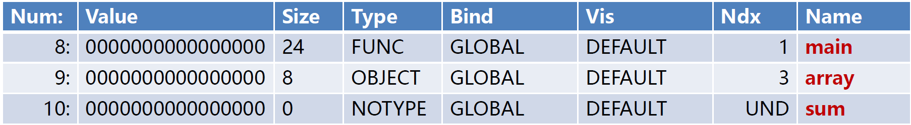​

* Num：条目序号
* Value：距离符号定义节的起始位置的偏移
* Size：符号目标的大小
* Type：符号是数据/函数
* Bind：表示符号是本地或全局
* Ndx：符号所在节的索引，1表示.text，3表示.data
* Name：符号名

**符号解析**：将每个符号引用和符号定义联系起来。

多重符号定义会带来一些问题，因此链接器如何解析多重定义的全局符号非常关键。

​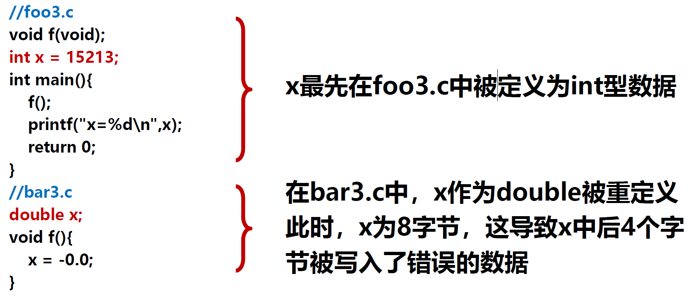​

有一个思路来解析多重定义的全局符号：

* **区分强弱**：每个全局符号是**强或弱**的。函数和已初始化的全局变量是**强**符号，未初始化的是**弱**符号。
* **定义规则**：Linux链接器采用以下规则处理多重定义符号  

  * **不允许**有多个**同名**的**强符号**
  * 如果有一个强符号和多个弱符号同名，那么**选择强符号**
  * 如果有多个弱符号同名，从这些弱符号中**任意选择**一个

### 重定位

符号解析之后，链接器会进行重定位：

* 重定位节和符号定义  

  * 链接器将相同类型的节合并为同一类型新的聚合节
  * 此时，每个节中的指令和全局变量都有唯一的运行时存储器地址
* 重定位节中的符号引用

  * 修改代码节和数据节中对每个符号的引用，指向正确的运行地址

重定位条目是重定位符的引用依据，存储在.rel.text和.rel.data中。

​​

* offset：需要重定位的引用的节偏移
* symbol：需要重定位的符号
* type：如何修改引用，即重定位的类型

重定位类型[一共有10种](https://bbs.kanxue.com/thread-246373.htm)，最基本的是：

* **R_386_PC32**：重定位一个使用32位PC地址的相对引用

  * PC相对地址是距程序计数器PC的当前运行值的偏移量
  * CPU执行PC相对寻址的指令时，给指令中的32位值加上当前PC得到有效地址
* **R_386_32**：重定位一个使用32位绝对地址的引用

  * 通过绝对寻址，CPU直接用指令中编码的32位值作为有效地址

假设s是节的地址，r是一个重定位条目，ADDR(s)是s的运行时存储器地址：

​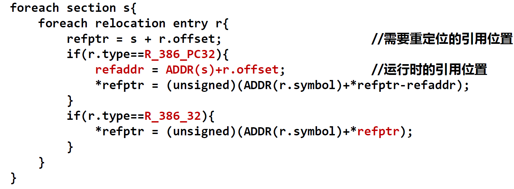​

### 静态库

编译系统支持将相关模块的一组可重定位目标文件打包为一个文件，用作链接器的输入，这个文件称为**静态库**。一些常用函数打包在一起，不需要在编译链接时添加太多文件名。

Linux系统中，静态库的文件格式是存档（archive）格式，是一组可重定位目标文件的集合，由一个头部结构描述每个成员目标文件的大小和位置。

可以使用以下命令创建库和使用库：

​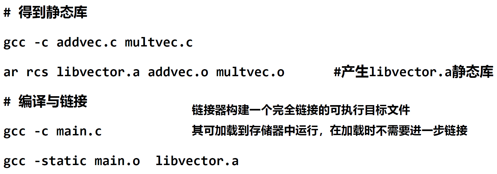​

## 动态链接与共享库

### 共享库

静态库需要定期维护更新，并显式将程序与更新的库重新链接，造成空间的较大浪费。为解决静态库的这些缺陷，有人提出了**共享库**。

共享库是一个目标模块，运行时可加载到任意存储器地址，不需要拷贝到使用它的可执行文件，在存储器中可以被不同的运行进程共享。

共享库的链接拷贝部分**重定位**和**符号表**信息，用于运行时解析引用。

当加载器加载可执行文件时，加载器根据可执行文件的`.interp`​节所记录的**动态链接器路径**，启动动态链接器完成重定位任务（重定位共享库的数据段和代码段到一个存储器段、重定位所有对共享库定义的符号的引用）。完成后，动态链接器将控制传递给应用程序正常执行。

Linux的共享库用`.so`​后缀表示，windows用`.dll`​表示。

### 动态链接

动态链接：加载后与**程序链接**，由**动态链接器**完成。

动态链接过程：

1. ​`gcc -shared -fpic -o libvector.so addvec.c multvec.c`​：构造共享库`libvector.so`​

    * ​`-fpic`​指示编译器生成与位置无关的代码
    * ​`-shared`​指示链接器创建一个共享的目标文件
2. ​`gcc –o prog21 main2.c libvector.so`​：创建一个可执行目标文件​`prog21`​，与​`libvector.so`在运行时动态链接
3. 当加载器加载和运行`prog21`​时，它根据`.interp`​节加载运行相应的动态链接器
4. 动态链接器执行重定位：

    * 重定位`libc.so`​的文本和数据到内存段
    * 重定位`libvector.so`​的文本和数据到另一内存段
    * 重定位`prog21`​中所有对由`libc.so`​和`libvector.so`​定义符号的引用
5. 动态链接将控制传递给应用程序，此后共享库位置固定，且在程序执行的过程中不会改变

​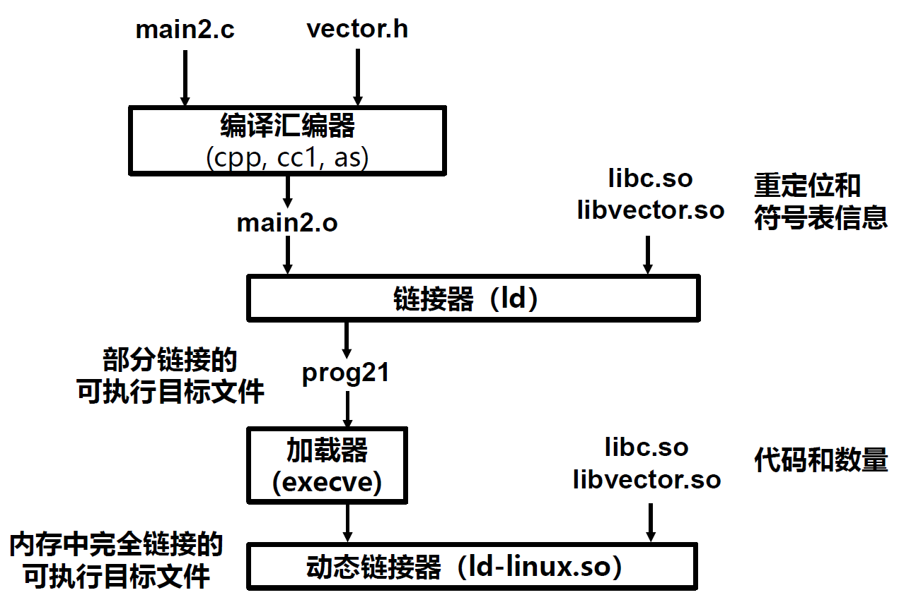​

## 程序的加载执行

### 可执行目标文件

可执行目标文件和可重定位目标文件的格式相似，但没有`.rel`​节，因为重定位已经完成，`.init`​节定义`_init`​函数，进行程序初始化。

可执行目标文件易于加载，连续节被映射到连续存储段。

​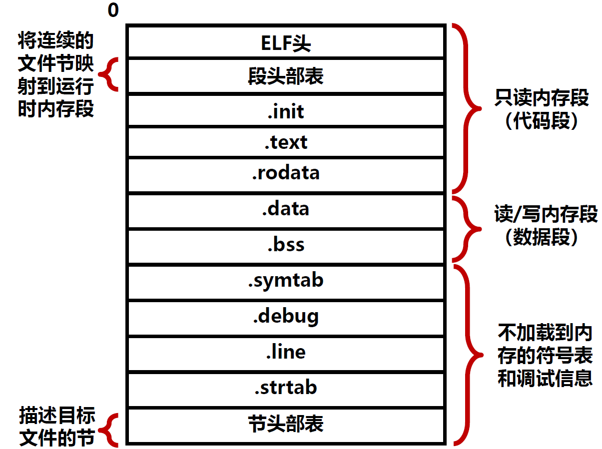​

#### 程序头部表

ELF可执行文件保存两个存储段的数据和代码映射，由程序头部表（program header table）描述。程序头部表对两个存储段（虚拟与物理）内容进行初始化。

​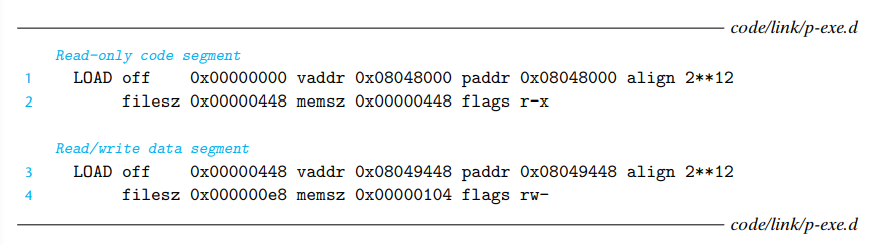​

* 第一个段（代码段）与4KB（212​）边界对齐，具有读权限，从虚拟地址0x08048000开始，总存储大小为0x448字节，用可执行目标文件的第一个0x448字节初始化
* 第二个段（数据段）与4KB边界对齐，具有读/写权限，从内存地址0x08049448开始，总存储大小为0x104字节，并用可执行目标文件偏移量0x448开始的0xe8字节进行初始化

### 加载可执行目标文件

要运行可执行目标文件`prog`​，可以在shell中输入`prog`​。运行时，shell会调用存储器来运行文件（execve函数调用加载器）。加载器将代码和数据拷贝到存储器，跳转到程序的入口开始执行。

​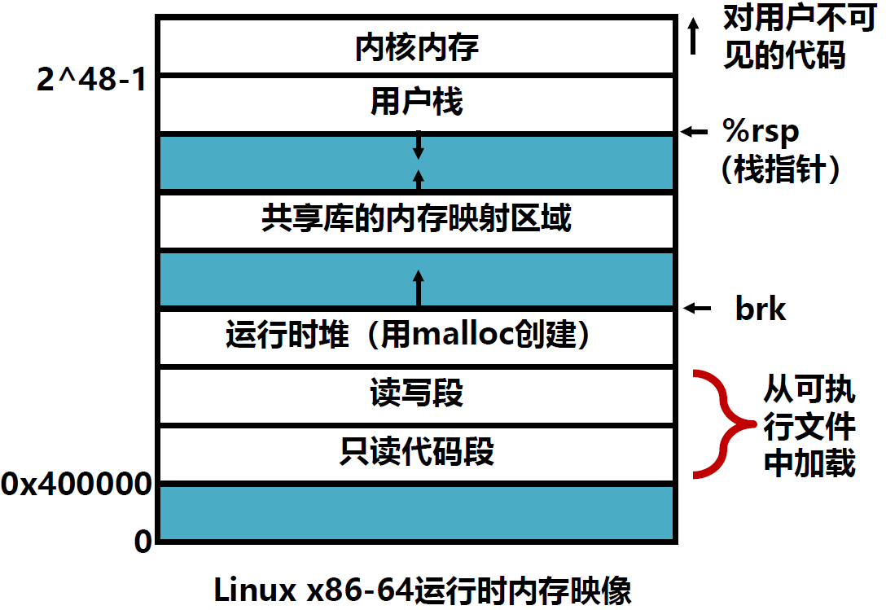​

加载器运行时，按照这个映像以及段头部表的信息，将相关内容拷贝到存储器，然后加载器跳转到符号`_start`​地址处的启动代码，所有C程序都有这个启动代码，调用一系列函数进行初始化等工作：

​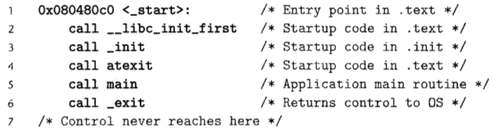​

​`atexit`​注册了一系列程序终止时应该调用的函数，执行结束后`_exit`​运行`atexit`​注册的函数，最后将控制交给操作系统。

‍
