# 2.4.程序的内存执行

> 程序运行的关键是内存布局与映射。

## 案例研究：Intel Core i7+Linux

我们将以一个运行Linux的Intel Core i7作为案例，学习地址翻译、虚拟内存。

### Intel Core i7

Intel Core i7芯片底层采用Haswell微体系结构，该结构支持完全的64位虚拟和物理地址空间，但现在的（以及可预见的未来的）Core i7 实现支持48位（256 TB）虚拟地址空间和52位（4 PB）物理地址空间，还有一个兼容模式，支持32位（4 GB）虚拟和物理地址空间。

​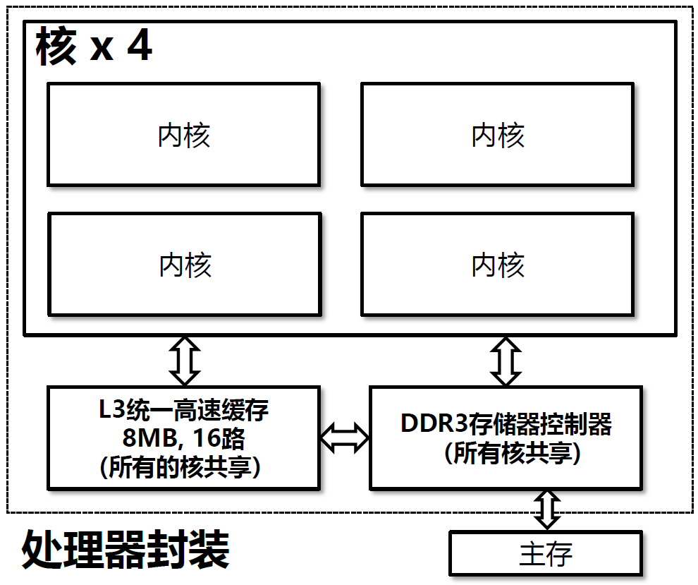​

Core i7的**处理器封装**（processor package）包括四个核、一个所有核共享的L3高速缓存，以及一个DDR3内存控制器。

​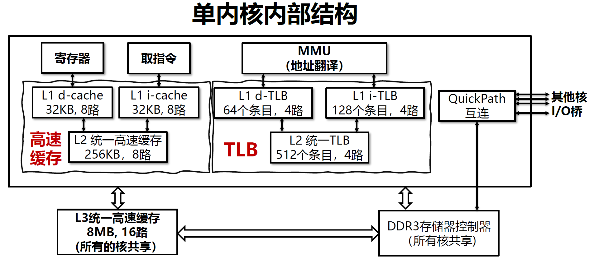​

每个核包含一个层次结构的 TLB、一个层次结构的数据和指令高速缓存，以及一组快速的点到点链路，这种链路基于QuickPath技术，是为了让一个核与其他核和外部I/O桥直接通信。

### 地址翻译

​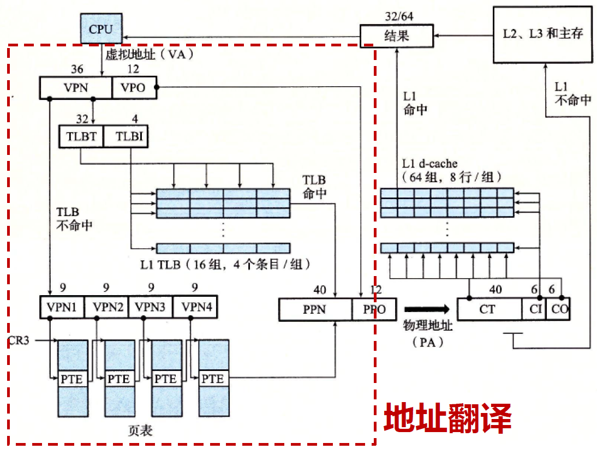​

上图展示了完整的Core i7地址翻译过程，从CPU产生虚拟地址一直到来自内存的数据字到达 CPU。Core i7采用**四级页表层次结构**，每个进程拥有**私有**的页表层次结构。当一个Linux进程在运行时，虽然Core i7允许页表换进换出，但是与已分配页相关联的页表都是驻留在内存中的。CR3控制寄存器指向**第一级页表**的起始位置。CR3的值是每个进程上下文的一部分，每次上下文切换时，CR3的值都会被恢复。

​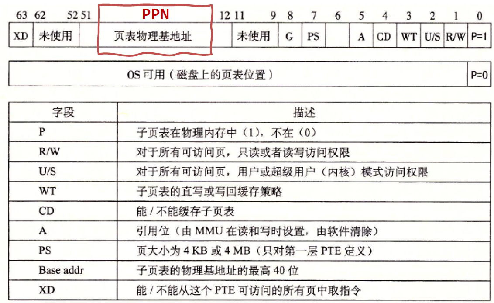​

上图展示了前3级**页表条目（PTE）** 格式，每个条目引用一个4KB子页表（即下一级的页表，假如一个条目是4B，那下一级页表就有1024个条目）。P=1时，地址字段包含一个40位物理页号（PPN），指向页表开始处。要求物理页表4KB对齐。

页表条目有3个权限位，控制对页的访问：

* R/W位：确定页的内容可读写还是只读
* U/S位：确定是否能够在用户模式中访问该页
* XD位：用来禁止从某些内存页取指令

​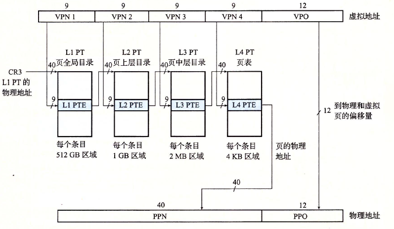​

上图展示了Core i7 MMU如何使用四级的页表来将虚拟地址翻译成物理地址。36位VPN被划分成四个9位的片，每个片被用作到一个页表的偏移量。CR3寄存器包含L1页表的物理地址。VPN 1提供到一个L1 PTE的偏移量，这个PTE包含L2页表的基地址。VPN 2提供到一个L2 PTE的偏移量，这个PTE包含L3页表的基地址，以此类推。

> L1-L4每个条目的512GB、1GB、2MB、4KB区域大小是如何计算得来的呢？
>
> 其实是有规律的。从L4往前看，L4每个条目有4KB区域，而VPN的一个片有9比特，可以表示2<sup>9</sup>个条目，也就是说L4一共有2<sup>9</sup>个条目，L3的每个条目都引用了一个L4，所以L3的每个条目有2<sup>9</sup>×4KB=2MB的区域，以此类推。

### Linux虚拟内存

Linux 为每个进程维护了一个单独的虚拟地址空间：

​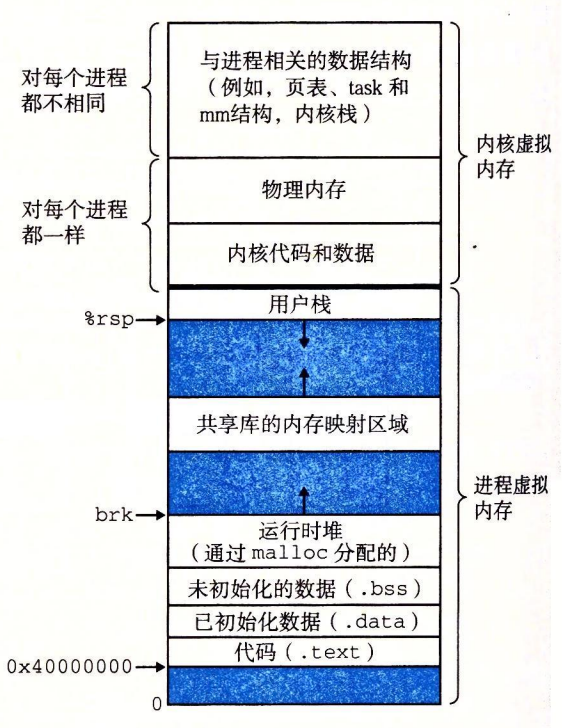​

内核虚拟内存包含内核中的代码和数据结构。内核虚拟内存的某些区域被映射到所有进程共享的物理页面。例如，每个进程共享内核的代码和全局数据结构。有趣的是，Linux 也将一组连续的虚拟页面（大小等于系统中 DRAM 的总量）映射到相应的一组连续的物理页面。这就为内核提供了一种便利的方法来访问物理内存中任何特定的位置，例如，当它需要访问页表，或在一些设备上执行内存映射的 I/O 操作，而这些设备被映射到特定的物理内存位置时。

内核虚拟内存的其他区域包含每个进程都不相同的数据。比如说，页表、内核在进程的上下文中执行代码时使用的栈，以及记录虚拟地址空间当前组织的各种数据结构。

​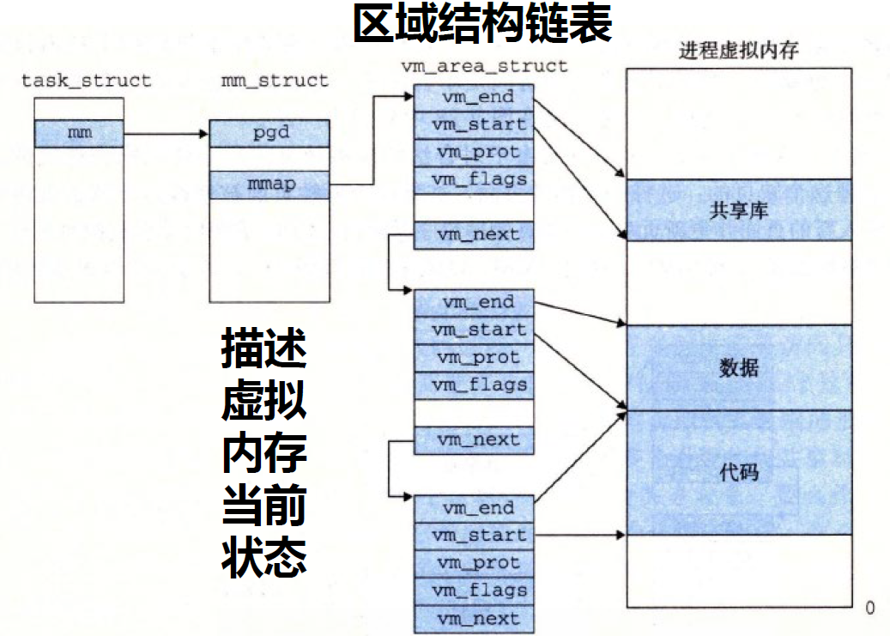​

上图展示了记录一个进程中虚拟内存区域的内核数据结构。内核为系统中的每个进程维护一个单独的任务结构（源代码中的taskstruct）。任务结构中的元素包含或者指向内核运行该进程所需要的所有信息（例如，PID、指向用户栈的指针、可执行目标文件的名字，以及程序计数器）。

区域：已存在的（已分配的）虚拟内存的连续片，片之间相互关联。

​​

#### 缺页异常处理

​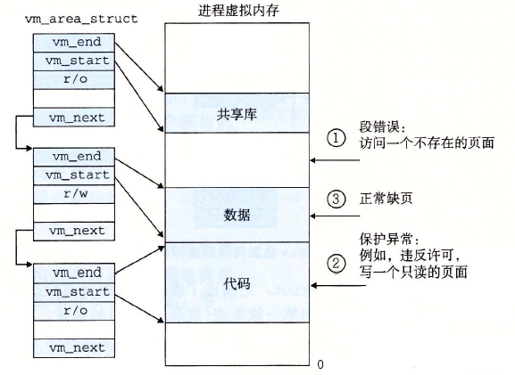​

假设MMU在试图翻译某个虚拟地址A时，触发了一个缺页。这个异常导致控制转移到内核的缺页处理程序，处理程序随后就执行下面的步骤：

1. 虚拟地址是否合法？

    * A在某个区域结构定义的区域内吗？为了回答这个问题，缺页处理程序搜索区域结构的链表，把A和每个区域结构中的vm_start和vm_end做比较。如果这个指令是不合法的，那么缺页处理程序就触发一个段错误，从而终止这个进程。
2. 试图进行的内存访问是否合法？

    * 进程是否有读、写或者执行这个区域内页面的权限？例如，这个缺页是不是由一条试图对这个代码段里的只读页面进行写操作的存储指令造成的?这个缺页是不是因为一个运行在用户模式中的进程试图从内核虚拟内存中读取字造成的? 如果试图进行的访问是不合法的，那么缺页处理程序会触发一个保护异常，从而终止这个进程。
3. 正常缺页处理

    * 此刻，内核知道了这个缺页是由于对合法的虚拟地址进行合法的操作造成的。它是这样来处理这个缺页的：选择一个牺牲页面，如果这个牺牲页面被修改过，那么就将它交换出去，换入新的页面并更新页表。当缺页处理程序返回时，CPU重新启动引起缺页的指令，这条指令将再次发送A到MMU。这次，MMU 就能正常地翻译A，而不会再产生缺页中断了。

## 程序内存映射

### 内存映射

**内存映射**将一个虚拟内存区域与一个磁盘上的对象关联起来，以初始化该虚拟内存区域的内容。

​​

无论在哪种情况中，一旦一个虚拟页面被初始化了，它就在一个由内核维护的专门的交换文件（swap file）之间换来换去。交换文件也叫做交换空间（swap space）或者交换区域。在任何时刻，交换空间都限制着当前运行着的进程能够分配的虚拟页面的总数。

### 共享区域

假设进程1将一个共享对象映射到它的虚拟内存的一个区域中，如左图。现在假设进程2将同一个共享对象映射到它的地址空间（并不一定要和进程1在相同的虚拟地址处）如右图。

​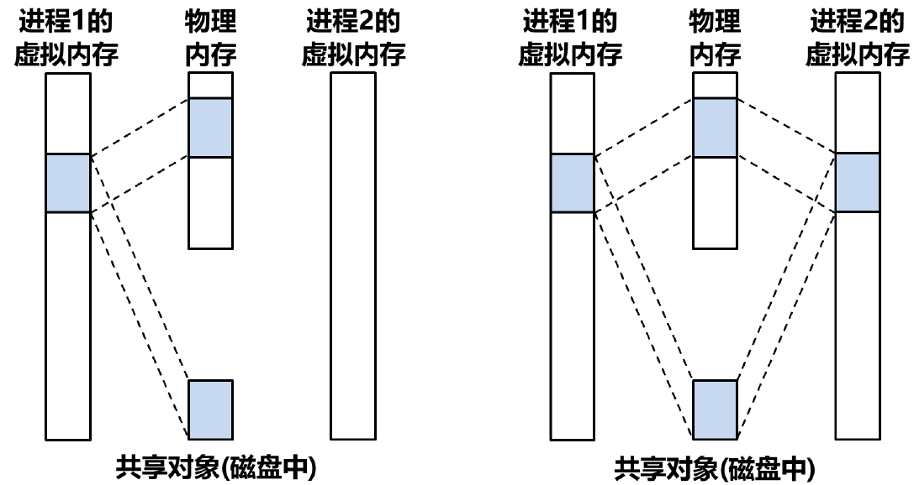​

**共享区域**：映射到共享对象的虚拟内存区域

因为每个对象都有一个唯一的文件名，内核可以迅速地判定进程1已经映射了这个对象，而且可以使进程2中的页表条目指向相应的物理页面。关键点在于即使对象被映射到了多个共享区域，物理内存中也只需要存放共享对象的一个副本。为了方便，我们将物理页面显示为连续的，但是在一般情况下当然不是这样的。

但是当进程1和进程2写入不同内容时，该怎么办？

### 私有区域

**私有区域**：与共享区域相对，基于“写时复制”实现映射

私有对象使用一种叫做写时复制（copy-on-write）的巧妙技术被映射到虚拟内存中。一个私有对象开始生命周期的方式基本上与共享对象的一样，在物理内存中只保存有私有对象的一份副本。

​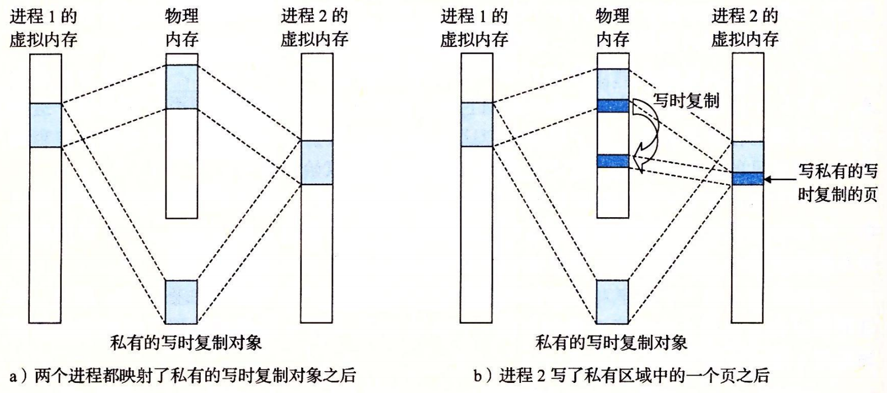​

比如，左图展示了一种情况，其中两个进程将一个私有对象映射到它们虚拟内存的不同区域，但是共享这个对象同一个物理副本。对于每个映射私有对象的进程，相应私有区域的页表条目都被标记为只读，并且区域结构被标记为私有的写时复制。只要没有进程试图写它自己的私有区域，它们就可以继续共享物理内存中对象的一个单独副本。然而，只要有一个进程试图写私有区域内的某个页面，那么这个写操作就会触发一个保护故障。

当故障处理程序注意到保护异常是由于进程试图写私有的写时复制区域中的一个页面而引起的，它就会在物理内存中创建这个页面的一个新副本，更新页表条目指向这个新的副本，然后恢复这个页面的可写权限，如右图所示。当故障处理程序返回时，CPU重新执行这个写操作，现在在新创建的页面上这个写操作就可以正常执行了。

### fork 函数

既然我们理解了虚拟内存和内存映射，那么我们可以清晰地知道 fork 函数是如何创建一个带有自己独立虚拟地址空间的新进程了。

当fork函数被当前进程调用时，内核为新进程创建数据结构，并分配唯一的PID。它将两个进程中的每个页面都标记为**只读**，并将两个进程中的每个区域结构都标记为**私有的写时复制**。

当fork在新进程中返回时，新进程现在的虚拟内存刚好和调用fork时存在的虚拟内存相同。当这两个进程中的任一个后来进行写操作时，写时复制机制就会创建新页面，因此，也就为每个进程保持了私有地址空间的抽象概念。

### execve函数

execve函数在父进程中fork一个子进程，在子进程中调用exec()函数启动新的程序，需要以下几个步骤：

1. **删除已存在的用户区域。** 删除当前进程虚拟地址的用户部分中的已存在的区域结构。
2. **映射私有区域。** 为新程序的代码、数据、bss 和栈区域创建新的区域结构。所有这些新的区域都是私有的、写时复制的。
3. **映射共享区域。**
4. **设置程序计数器（PC）。** 设置当前进程上下文中的程序计数器，使之指向代码区域的入口点。

​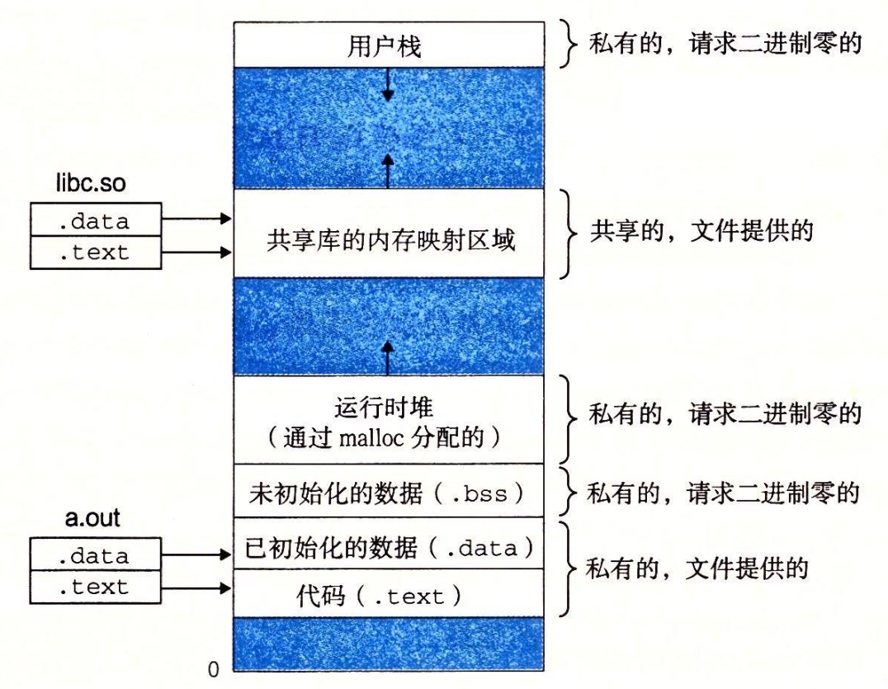​

## 动态内存分配

虽然可以使用低级的`mmap`​和`munmap`​函数来创建和删除虚拟内存的区域，但是C程序员还是会觉得当运行时需要额外虚拟内存时，用**动态内存分配器（dynamic memory allocator）** 更方便，也有更好的可移植性。

**动态内存分配**负责维护一个进程的**虚拟堆内存**区域。

堆：一组不同大小的块的集合  
块：连续的虚拟内存片，已分配/空闲两种状态  
已分配块：应用程序未使用  
空闲块：可用来分配

​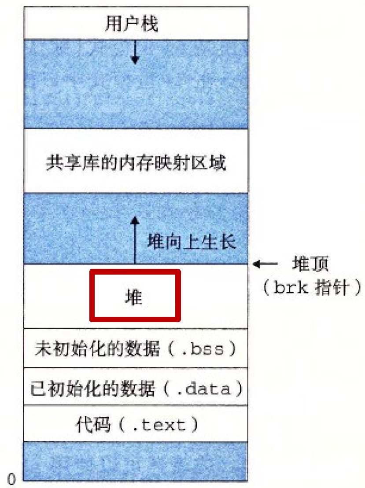​

分配器有两种基本风格，都要求应用显式地分配块，不同之处在于由哪个实体来负责释放已分配的块：

* **显式分配**：要求应用**显式释放**任何已分配的块。如C语言里的`malloc`​函数分配块、`free`​函数释放块。
* **隐式分配**：要求分配器检测已分配块何时不被程序所使用，然后释放块，**垃圾收集器**提供隐式分配功能。如Lisp、Java等语言依赖垃圾收集来释放已分配块。

### malloc函数

malloc函数负责显式分配块。

返回值：指向已分配块的指针，若分配失败则返回NULL

返回的指针指向大小至少为size字节的内存块

32/64位模式：块地址为8/16倍数

​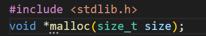​

### sbrk函数

sbrk函数负责改变堆的大小，原理是通过将内核的brk指针增加incr来扩展和收缩堆。

返回值：旧的brk指针，出错则为-1

返回-1时errno设置为ENOMEM

​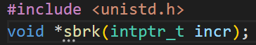​

### free函数

free函数负责显式释放已分配块。

返回值：无

ptr必须指向从malloc、calloc或realloc获得的已分配块的起始位置。

​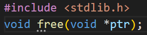​

### 显式堆管理

1. 程序请求一个4字的块。malloc的响应是：从空闲块的前部切出一个4字的块，并返回一个指向这个块的第一字的指针。  
    ​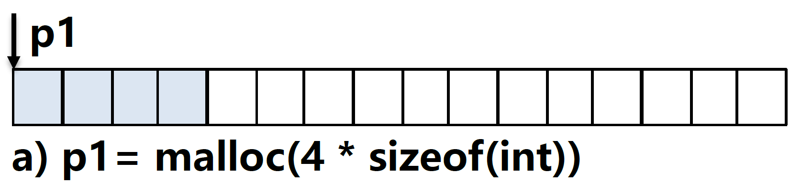​
2. 程序请求5字的块。malloc的响应是：从空闲块的前部分配一个6字的块。在本例中，malloc在块里填充了一个额外的字，是为了保持空闲块是双字边界对齐的。  
    ​​
3. 程序请求2字的块，而malloc就从空闲块的前部切出一个2字的块。  
    ​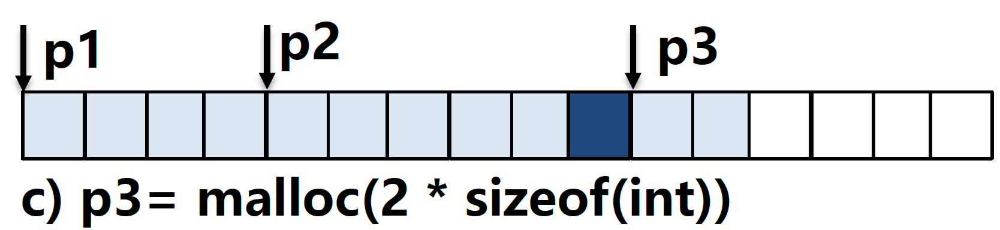​
4. 程序释放第2步中分配的块。注意，在调用free返回之后，指针p2仍然指向被释放了的块。应用有责任在它被一个新的malloc调用重新初始化之前，不再使用p2。  
    ​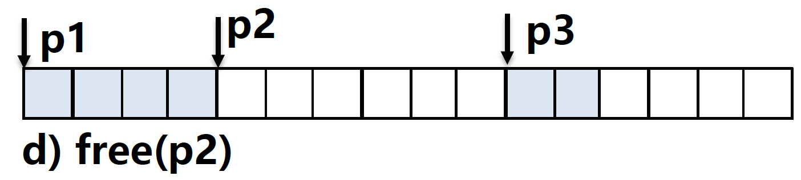​
5. 程序请求2字的块。在这种情况中，malloc分配在前一步中被释放了的块的一部分，并返回一个指向这个新块的指针。  
    ​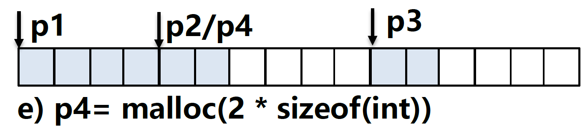

**为什么要使用动态内存分配？**

因为动态内存分配解决了**数据结构大小未知**的问题。

例如，如果使用硬编码数组分配：  
​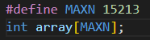  
拥有百万行代码及大量使用者的大型软件产品就会有维护问题。

但是如果使用动态内存分配：  
​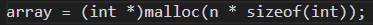  
数组大小的最大值只由可用的虚拟内存数量来限制。

动态分配的规则：

* 五个约束条件

  * 处理任意请求序列
  * 立即响应请求
  * 只使用堆
  * 对齐块
  * 不修改已分配的块
* 两个性能目标

  * 最大化吞吐率
  * 最大化内存利用率

动态分配的衡量指标：

**峰值利用率：** 给定n个分配和释放请求的某种顺序：R<sub>0,</sub> R<sub>1,</sub> ..., R<sub>k,</sub> ..., R<sub>n-1</sub>，请求R<sub>k</sub>完成之后聚集有效载荷为p<sub>k</sub>，为当前已分配的有效载荷之和，H<sub>k</sub>表示堆当前大小，则前k+1个请求的峰值利用率为$U_k=\frac{max_{i≤k}P_i}{H_k}$

### 堆碎片

**碎片**现象是造成**堆利用率低**的主要原因：

* 内部碎片（internal fragmentation）：已分配块比有效载荷大

  * 量化方法：已分配块大小和有效载荷大小之差的和。只取决于**以前请求的模式和动态分配的实现方法**。
* 外部碎片（external fragmentation）：总空闲内存满足分配请求，但没有一个单独空闲块足够大来处理该请求

  * 量化方法：取决于以前请求的模式、分配实现方法和**将来请求的模式**。通常采用**启发式策略**来试图维持少量大空闲块。

## 内存垃圾收集

**垃圾收集器**（garbage collector）是一种动态内存分配器，它自动释放程序不再需要的已分配块。这些块被称为**垃圾**（garbage）。自动回收堆存储的过程叫做**垃圾收集**（garbage collection）。

垃圾收集是Java、ML、Perl等现代语言系统的重要部分。

支持垃圾收集的系统应用可显式分配块，无需显式释放。

垃圾收集器将内存视为一张有向**可达图**（reachability graph）。该图的节点被分成一组**根节点**（root node）和一组**堆节点**（heap node）。每个堆节点对应于堆中的一个已分配块。有向边 p→q意味着块p中的某个位置指向块q中的某个位置。根节点对应于这样一种不在堆中的位置，它们中包含指向堆中的指针。这些位置可以是寄存器、栈里的变量，或者是虚拟内存中读写数据区域内的全局变量。

​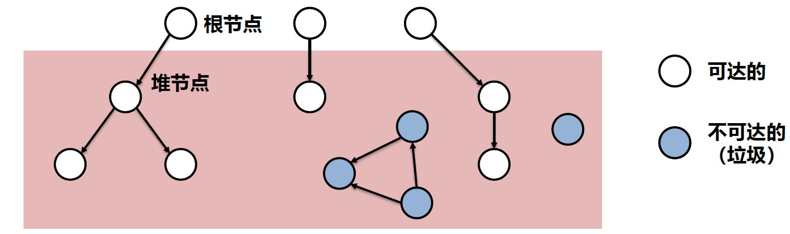​

当存在一条从任意根节点出发并到达p的有向路径时，我们说节点p是**可达的**（reachable）。在任何时刻，不可达节点对应于垃圾，是不能被应用再次使用的。垃圾收集器的角色是维护可达图的某种表示，并通过释放不可达节点且将它们返回给空闲链表，来定期地回收它们。

Java等语言能够维护可达图的精确表示，严格控制指针创建及使用。然而，诸如C和C++的收集器通常不能维持可达图的精确表示。这样的收集器也叫做**保守的垃圾收集器**（conservative garbage collector），即每个可达块都被正确地标记为可达了，而一些不可达节点却可能被错误地标记为可达。收集器可以按需提供它们的服务，或者它们可以作为一个和应用并行的独立线程，不断地更新可达图和回收垃圾。例如，考虑如何将一个 C 程序的保守的垃圾收集器加入到已存在的 malloc 包中。

### Mark&Sweep垃圾收集器

Mark&Sweep建立在malloc基础上，分为标记和清除两个阶段：

* Mark（标记）：该阶段标记出从根节点出发所有可达和已分配的后继
* Sweep（清除）：该阶段释放每个违背标记的已分配块

Mark&Sweep的描述假设使用下列函数，其中 ptr 定义为`typedef void* ptr`​：

|声明|描述|
| :-------------------------: | :---------------------------------------: |
|ptr isPtr(ptr p)|判断指针是否指向已分配块中某个字|
|int blockMarked(ptr b)|判断块b是否已标记|
|int blockAllocated(ptr b)|判断块b是否是已分配的|
|void markBlock(ptr b)|标记块b|
|int length(b)|返回块b的以字为单位的长度（不包括头部）|
|void unmarkBlock(ptr b)|将块b的状态从已标记改为未标记|
|ptr nextBlock(ptr b)|返回堆中块b的后续|

```C
void mark(ptr p) {
    if ((b = isPtr(p)) == NULL)
        return;
    if (blockMarked(b))
        return;
    markBlock(b);
    len = length(b);
    for (i = 0; i < len; i++)
        mark(b[i]);
    return;
}

void sweep(ptr b, ptr end) {
    while (b < end) {
        if (blockMarked(b))
            unmarkBlock(b);
        else if (blockAllocated(b))
            free(b);
        b = nextBlock(b);
    }
    return;
}
```

初始情况下，图中的堆由六个已分配块组成，每个块都是未标记的。块3包含一个指向块1的指针。块4包含指向块3和块6的指针。根指向块4。在标记阶段之后，块1、3、4和6被标记，因为它们可以从根访问到。块2和块5未被标记，因为它们无法访问。在清除阶段之后，这两个无法访问的块被回收到空闲列表中。

​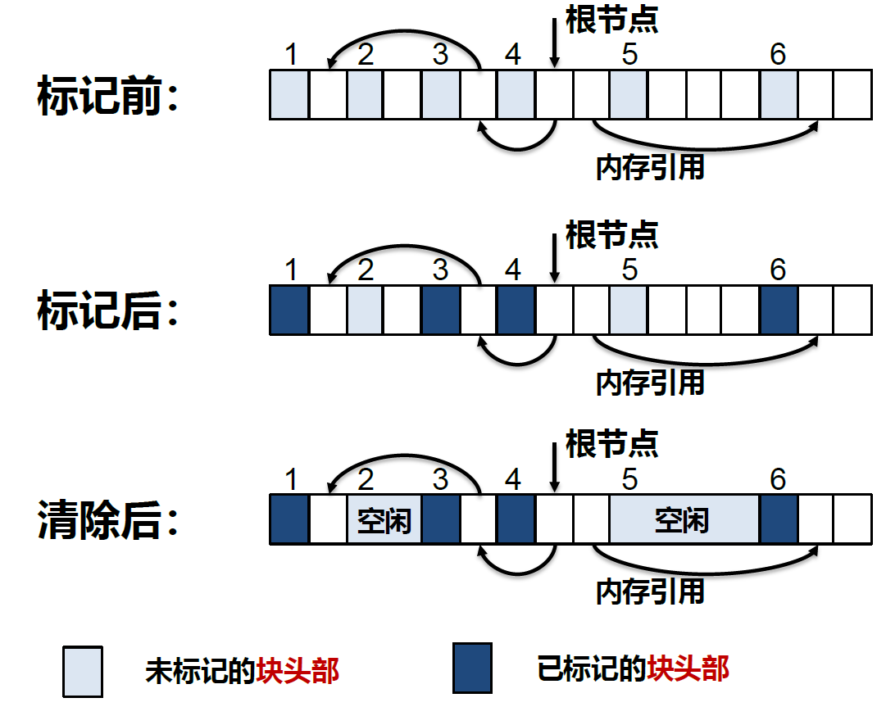​

#### C程序的保守Mark&Sweep

Mark&Sweep对C程序的垃圾收集是一种合适的方法，因为它可以就地工作，而不需要移动任何块。然而，C语言为isPtr函数的实现造成了一些挑战。

第一，C不会用任何类型信息来标记内存位置。因此，对无法判断isPtr的参数p是不是一个指针。第二，即使我们知道p是一个指针，对isPtr也没有明显的方式来判断p是否指向已分配块的有效载荷中的某个位置。

对后一问题的解决方法是将已分配块集合维护成一棵平衡二叉树，这棵树保持着这样一个属性：左子树中的所有块都放在较小的地址处，而右子树中的所有块都放在较大的地址处。这就要求每个已分配块的头部里有两个附加字段（left 和 right）。每个字段指向某个已分配块的头部。isPtr函数用树来执行对已分配块的二分查找。在每一步中，它依赖于块头部中的大小字段来判断p是否落在这个块的范围之内。

​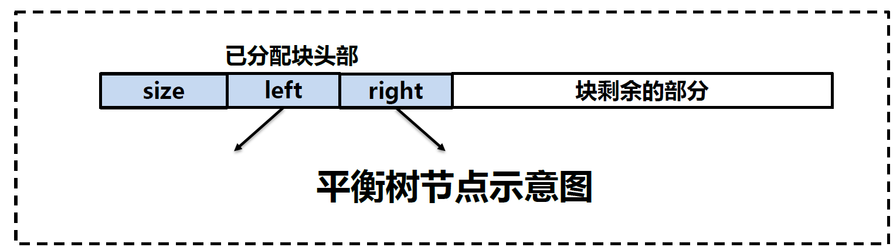​

C 程序的 Mark&Sweep 收集器必须是保守的，其根本原因是 C 语言不会用类型信息来标记内存位置。因此，像 int 或者 float 这样的标量可以伪装成指针。例如，假设某个可达的已分配块在它的有效载荷中包含一个 int，其值碰巧对应于某个其他已分配块 b 的有效载荷中的一个地址。对收集器而言，是没有办法推断出这个数据实际上是 int 而不是指针。因此，分配器必须保守地将块 b 标记为可达，尽管事实上它可能是不可达的。

## 常见内存错误

### 间接引用坏指针

* 试图间接引用指向没有映射有意义的数据区域的指针
* 试图对虚拟内存只读区域进行写入

常见示例：

假设我们想要使用 scanf 从 stdin 读一个整数到一个变量。正确的方法是传递给 scanf 一个格式串和变量的地址：`scanf("%d", &val)`​，而不是`scanf("%d", val)`​，在这种情况下scanf 将把 val 的内容解释为一个地址，并试图将一个字写到这个位置。

### 读未初始化的内存

* 假设堆内存被初始化为零，并直接进行操作

```C
/* Return y = Ax */
int *matvec(int **A, int *x, int n)
{
    int i, j;
  
    int *y = (int *)Malloc(n * sizeof(int));
  
    for (i = 0; i < n; i++)
        for (j = 0; j < n; j++)
            y[i] += A[i][j] * x[j];
    return y;
}
```

在这个示例中，程序员不正确地假设向量 y 被初始化为零。正确的实现方式是显式地将 y[i] 设置为零，或者使用 calloc：

```C
/* Return y = Ax */
int *matvec(int **A, int *x, int n)
{
    int i, j;
  
    int *y = (int *)Malloc(n * sizeof(int));
  
    for (i = 0; i < n; i++)
        for (j = 0; j < n; j++)
			y[i] = 0
            y[i] += A[i][j] * x[j];
    return y;
}
```

### 允许栈缓冲区溢出

* 不检查输入串大小就写入栈中目标缓冲区

```C
void bufoverflow()
{
    char buf[64];
    gets(buf); /* Here is the stack buffer overflow bug */
    return;
}
```

应使用fgets：`*fgets(char *str, int n, FILE *stream)`​

### 假设指针和他们指向的对象是相同大小的

* 不同机器上指针大小不同，空间分配时写错类型容易产生隐藏错误

错误：`int **A = (int **)malloc(n * sizeof(int));`​

正确：`int **A = (int **)malloc(n * sizeof(*int));`​

例如Core i7机器上指针大小大于int，将会导致错误。

### 错位错误

* 使用指针时，指针变化边界不明确容易导致覆写等错误

```C
/* Create an nxm array */
int **makeArray(int n, int m)
{
    int i;
    int **A = (int **)Malloc(n * sizeof(int *));
  
    for (i = 0; i <= n; i++)
        A[i] = (int *)Malloc(m * sizeof(int));
    return A;
}
```

数组索引超过数组边界。

### 引用指针，而非对象

* 未考虑C操作符的优先级和结合性，容易错误操作指针，而非指针所指对象

错误：

```C
binheap[0] = binheap[*size -1]
*size--;
```

正确：

```C
binheap[0] = binheap[*size -1]
(*size)--;
```

​`--`​优先级大于`*`​。

### 误解指针运算

* 指针的算数操作以所指向对象的大小为单位计算，该大小单位不一定为字节

例如，下面函数的目的是扫描一个 int 的数组，并返回一个指针，指向 val 的首次出现：

```C
int *search(int *p, int val)
{
    while (*p && *p != val)
        p += sizeof(int); /* Should be p++ */
    return p;
}
```

然而，因为每次循环时，第 4 行都把指针加了 4（一个整数的字节数），函数就不正确地扫描数组中每 4 个整数。

### 引用不存在的变量

* 引用不合法的本地变量导致的野指针存在

```C
int * ptr(){
	int val;
	return &val;
}
```

函数内部的本地变量在返回后会释放指针变为野指针

### 引用空闲堆块中的数据

* 引用已经被释放了的堆块中的数据

```c
x = (int *)malloc(n * sizeof(int));
free(x);
y = x[0] –1;
```

x已经被释放了。

### 引起内存泄漏

* 忘记释放已分配块并在堆中创建垃圾时会导致内存泄露

```C
void leak(int n){
	int *x = (int *)malloc(n * sizeof(int));
	return;
}
```

反复调用leak函数会导致堆内空间存在无法使用的垃圾

‍
